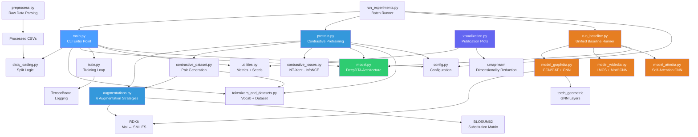
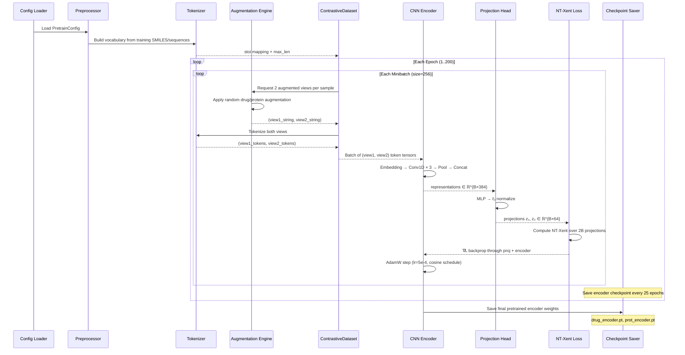
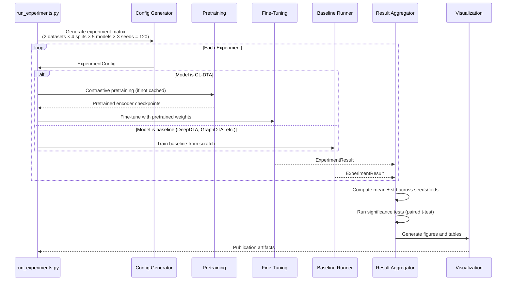
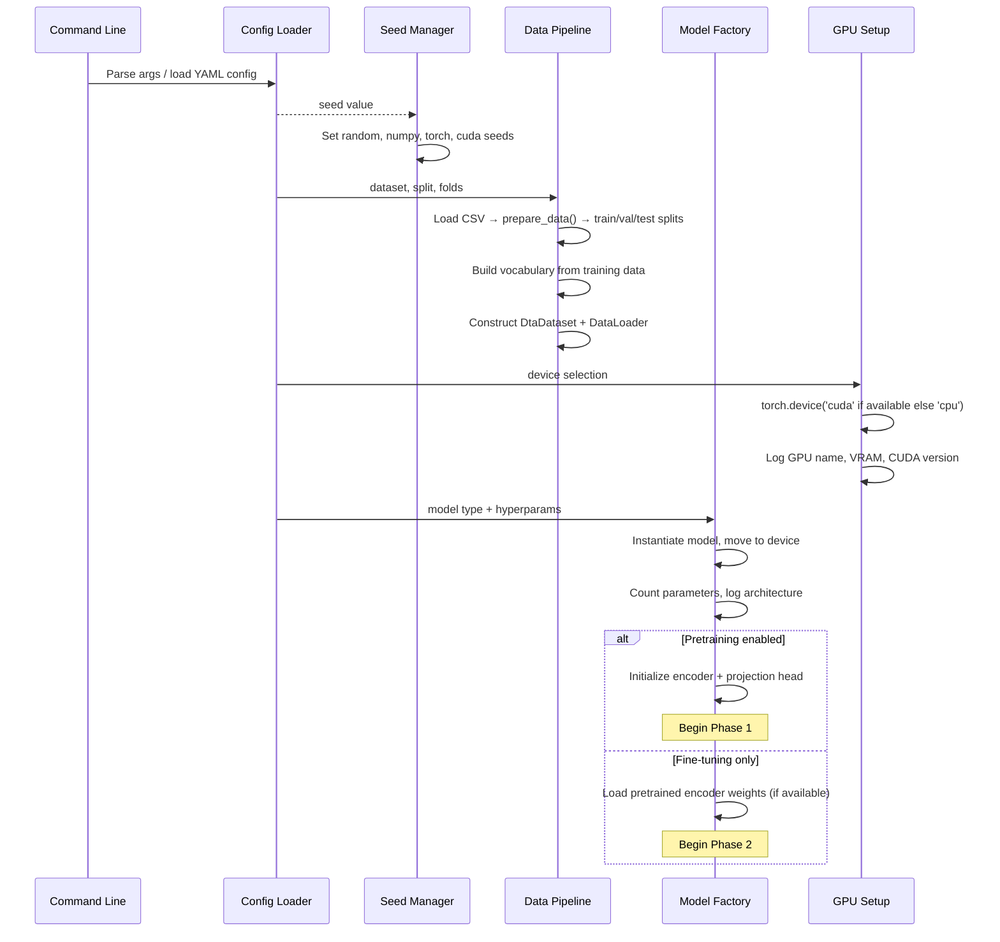
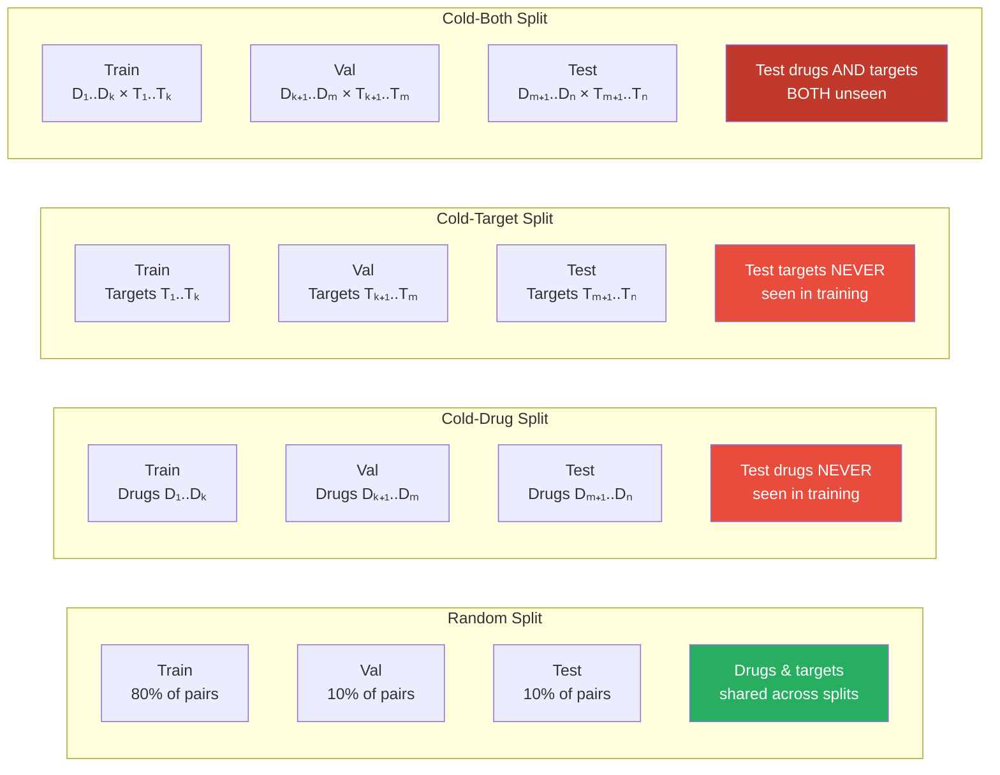
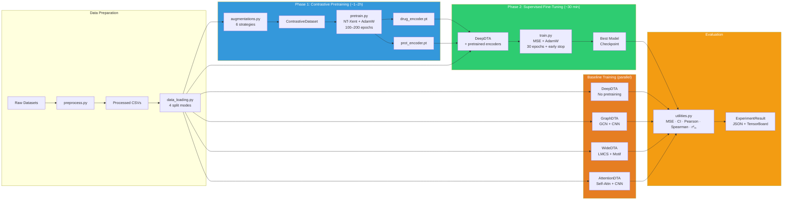
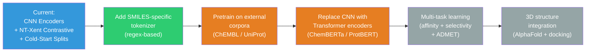

# CL-DTA: Contrastive Self-Supervised Learning for Cold-Start Drug–Target Affinity Prediction — Technical Documentation

> **Version:** 1.0  
> **Last updated:** 2026-03-01  
> **Language / Runtime:** Python 3.10+ · PyTorch 2.x · RDKit 2023.x · scikit-learn 1.3+ · TensorBoard 2.x  
> **Architecture style:** Two-phase contrastive pretraining → supervised fine-tuning pipeline for regression-based drug–target binding affinity prediction  

---

## Table of Contents

1. [System Overview](#1-system-overview)  
2. [Architecture Breakdown](#2-architecture-breakdown)  
3. [Domain Model](#3-domain-model)  
4. [Execution Flow](#4-execution-flow)  
5. [Contrastive Pretraining — Theory & Design](#5-contrastive-pretraining--theory--design)  
6. [Augmentation Engine](#6-augmentation-engine)  
7. [Evaluation Protocol — Cold-Start Splits](#7-evaluation-protocol--cold-start-splits)  
8. [Key Design Decisions](#8-key-design-decisions)  
9. [Failure & Edge Case Analysis](#9-failure--edge-case-analysis)  
10. [Training & Evaluation Pipeline](#10-training--evaluation-pipeline)  
11. [Baseline Models](#11-baseline-models)  
12. [Ablation Studies](#12-ablation-studies)  
13. [Visualization & Analysis](#13-visualization--analysis)  
14. [Developer Onboarding Guide](#14-developer-onboarding-guide)  
15. [Suggested Improvements](#15-suggested-improvements)  

---

## 1. System Overview

### Purpose

This system is a **research-grade drug–target binding affinity (DTA) prediction framework** designed to address the **cold-start problem** — predicting affinity for entirely unseen drugs and/or protein targets at test time. Unlike conventional DTA models that train purely supervised and suffer large performance drops under cold splits, CL-DTA introduces a **two-phase training paradigm**:

1. **Phase 1 — Contrastive Pretraining:** Drug SMILES encoders and protein sequence encoders are independently pretrained using augmentation-based contrastive learning (NT-Xent loss). Domain-specific augmentations (SMILES enumeration, atom masking, subsequence cropping, residue substitution) force encoders to learn augmentation-invariant, structurally meaningful representations.
2. **Phase 2 — Supervised Fine-Tuning:** Pretrained encoder weights are loaded into the DeepDTA architecture and fine-tuned end-to-end with MSE regression loss on drug–target affinity labels.

The core innovation is the **hypothesis that contrastive pretraining produces representations that generalize better to unseen chemical/biological entities**, measured across four split protocols (random, cold-drug, cold-target, cold-both) on two standard benchmarks (DAVIS, KIBA).

### High-Level Architecture

```mermaid
flowchart TB
    subgraph DataLayer ["Data Layer"]
        RAW[Raw Datasets<br/>DAVIS · KIBA]
        PREP[Preprocessing<br/>preprocess.py]
        CSV[Processed CSVs<br/>drug_id · target_id · smiles · sequence · affinity]
    end

    subgraph SplitLayer ["Split Layer"]
        SPLIT[Data Splitter<br/>data_loading.py]
        RAND[Random Split]
        CD[Cold-Drug Split]
        CT[Cold-Target Split]
        CB[Cold-Both Split]
    end

    subgraph PretrainPhase ["Phase 1 — Contrastive Pretraining"]
        AUG_D[Drug Augmentations<br/>SMILES Enumeration<br/>Atom Masking<br/>Substructure Dropout]
        AUG_P[Protein Augmentations<br/>Subsequence Cropping<br/>Residue Masking<br/>Residue Substitution]
        CDSET[ContrastiveDataset<br/>Positive Pair Generation]
        DRUG_ENC[Drug CNN Encoder<br/>3×Conv1D + AdaptiveMaxPool]
        PROT_ENC[Protein CNN Encoder<br/>3×Conv1D + AdaptiveMaxPool]
        PROJ_D[Drug Projection Head<br/>MLP → ℓ₂-normalize]
        PROJ_P[Protein Projection Head<br/>MLP → ℓ₂-normalize]
        LOSS_CL[NT-Xent / InfoNCE<br/>Contrastive Loss]
        CROSS[Cross-Modal<br/>Alignment Loss<br/>(Optional)]
    end

    subgraph FinetunePhase ["Phase 2 — Supervised Fine-Tuning"]
        LOAD[Load Pretrained<br/>Encoder Weights]
        DTA_MODEL[DeepDTA Model<br/>Drug CNN + Protein CNN + FC Head]
        MSE_LOSS[MSE Regression Loss]
        EVAL[Evaluation<br/>MSE · CI · Pearson · Spearman · r²ₘ]
    end

    subgraph Baselines ["Baseline Models"]
        GDTA[GraphDTA<br/>GCN/GAT + CNN]
        WDTA[WideDTA<br/>LMCS + Motif Words]
        ADTA[AttentionDTA<br/>Self-Attention + CNN]
        DDTA[DeepDTA<br/>CNN Baseline]
    end

    subgraph Output ["Output Layer"]
        RES[Results<br/>JSON · CSV · TensorBoard]
        VIZ[Visualizations<br/>t-SNE · Bar Charts · Heatmaps]
        PAPER[Paper Artifacts<br/>Tables · Figures]
    end

    RAW --> PREP --> CSV
    CSV --> SPLIT
    SPLIT --> RAND
    SPLIT --> CD
    SPLIT --> CT
    SPLIT --> CB

    CSV --> AUG_D
    CSV --> AUG_P
    AUG_D --> CDSET
    AUG_P --> CDSET
    CDSET --> DRUG_ENC --> PROJ_D --> LOSS_CL
    CDSET --> PROT_ENC --> PROJ_P --> LOSS_CL
    DRUG_ENC -.-> CROSS
    PROT_ENC -.-> CROSS

    DRUG_ENC -->|Save checkpoint| LOAD
    PROT_ENC -->|Save checkpoint| LOAD
    LOAD --> DTA_MODEL --> MSE_LOSS --> EVAL

    RAND --> DTA_MODEL
    CD --> DTA_MODEL
    CT --> DTA_MODEL
    CB --> DTA_MODEL

    RAND --> GDTA
    RAND --> WDTA
    RAND --> ADTA
    RAND --> DDTA

    EVAL --> RES --> VIZ --> PAPER

    style PretrainPhase fill:#3498db,color:#fff
    style FinetunePhase fill:#2ecc71,color:#fff
    style Baselines fill:#e67e22,color:#fff
    style DataLayer fill:#95a5a6,color:#fff
```

### Core Responsibilities

| Responsibility | Owner |
|---|---|
| Raw dataset parsing and normalization | `preprocess.py` |
| Train/val/test splitting (random, cold-drug, cold-target, cold-both) | `data_loading.py` |
| Character-level tokenization and vocabulary construction | `tokenizers_and_datasets.py` |
| Domain-specific augmentation of SMILES and protein sequences | `augmentations.py` |
| Contrastive positive pair generation | `contrastive_dataset.py` |
| Contrastive loss computation (NT-Xent, InfoNCE) | `contrastive_losses.py` |
| Contrastive pretraining loop (drug-only, protein-only, cross-modal) | `pretrain.py` |
| DeepDTA CNN model architecture | `model.py` |
| GraphDTA, WideDTA, AttentionDTA baseline architectures | `model_graphdta.py`, `model_widedta.py`, `model_attndta.py` |
| Supervised training loop with early stopping | `train.py` |
| Metrics computation (MSE, CI, Pearson, Spearman, r²ₘ) | `utilities.py` |
| Experiment configuration management | `config.py` |
| Batch experiment orchestration | `run_experiments.py` |
| Publication-quality visualizations | `visualization.py` |
| Experiment logging (TensorBoard + JSON) | `train.py`, logging infrastructure |

---

## 2. Architecture Breakdown

### Major Components

#### Data Preprocessing (`preprocess.py`)

Parses raw DAVIS and KIBA dataset files into standardized CSV format with columns: `drug_id`, `target_id`, `smiles`, `sequence`, `affinity`. Handles format-specific parsing (space-delimited records with variable-length protein sequences).

Key operations:
- **DAVIS parsing:** Raw file → DataFrame with Kd affinity values (typically transformed to $-\log_{10}(K_d / 10^{-9})$ = pKd)
- **KIBA parsing:** Raw file → DataFrame with KIBA scores (already on a log scale)
- **IC50 conversion:** Optional nM → pIC50 transform via $\text{pIC50} = 9 - \log_{10}(\text{IC50}_{\text{nM}})$
- **Data cleaning:** Drop rows with NaN in SMILES, sequence, or affinity columns

| Dataset | Pairs | Unique Drugs | Unique Targets | Affinity Type | Scale |
|---|---|---|---|---|---|
| DAVIS | ~30,056 | 68 | 442 | $K_d$ (nM) | Converted to $pK_d$ |
| KIBA | ~118,254 | 2,111 | 229 | KIBA score | Already log-scale |

#### Data Loading & Splitting (`data_loading.py`)

Implements four evaluation-critical split protocols. The splitting logic operates on group-level identifiers (`drug_id`, `target_id`) rather than individual sample indices for cold splits.

| Split Mode | Train Entities in Test? | Description | Difficulty |
|---|---|---|---|
| `random` | Yes (same drugs & targets) | Standard i.i.d. split on sample indices | Easiest |
| `cold_drug` | No unseen drugs | Test set contains entirely unseen drug entities | Hard |
| `cold_target` | No unseen targets | Test set contains entirely unseen target entities | Hard |
| `cold_both` | No unseen drugs AND targets | Test set has both unseen drugs and unseen targets | Hardest |

```python
def prepare_data(df: pd.DataFrame,
                 split: str = 'random',      # 'random' | 'cold_drug' | 'cold_target' | 'cold_both'
                 test_frac: float = 0.1,
                 val_frac: float = 0.1,
                 seed: int = 42) -> Tuple[pd.DataFrame, pd.DataFrame, pd.DataFrame]:
    """
    Returns (train_df, val_df, test_df) with zero entity leakage
    guaranteed for cold splits.
    """
```

**Cold-Both Split Algorithm:**

1. Partition drug IDs into train/val/test groups (by `test_frac` and `val_frac`).
2. Independently partition target IDs into train/val/test groups.
3. Test set = rows where `drug_id ∈ test_drugs AND target_id ∈ test_targets`.
4. Validation set = rows where `drug_id ∈ val_drugs AND target_id ∈ val_targets`.
5. Training set = remaining rows (drugs and targets in training groups).
6. **Invariant:** No drug or target in the test set appears in training.

#### Tokenization & Datasets (`tokenizers_and_datasets.py`)

Character-level tokenizer with vocabulary construction from training data. Handles both SMILES (chemical notation) and protein amino acid sequences.

| Component | Description |
|---|---|
| `build_vocab(sequences)` | Builds character-level `stoi`/`itos` mappings. Index 0 = `<PAD>`, index 1 = `<UNK>`. Additional `<MASK>` token added for augmentations. |
| `tokenize_seq(s, stoi, max_len)` | Converts string to integer token IDs with truncation/padding to `max_len`. |
| `DtaDataset` | PyTorch `Dataset` returning `{smiles: LongTensor, seq: LongTensor, aff: FloatTensor}`. |

**Sequence Length Parameters:**

| Parameter | Default | Rationale |
|---|---|---|
| `max_sml_len` | 120 | Covers >99% of SMILES strings in DAVIS/KIBA |
| `max_prot_len` | 1000 | Covers >95% of protein sequences; longer sequences are truncated |

#### Augmentation Engine (`augmentations.py`)

Implements six domain-specific augmentation strategies — three for drug SMILES and three for protein sequences. Each augmentation takes a string as input and returns a modified string. The tokenizer handles downstream conversion to tensors.

**Drug (SMILES) Augmentations:**

| Augmentation | Method | Strength | Validity Check |
|---|---|---|---|
| SMILES Enumeration | RDKit non-canonical SMILES generation (same molecule, different string) | Strongest — changes token sequence while preserving molecular identity | Always valid by construction (RDKit) |
| Atom Masking | Replace $k\%$ of SMILES tokens with `<MASK>` | Medium — forces encoder to reconstruct from partial information | Token-level; no molecular validity check needed |
| Substructure Dropout | Remove single atoms/bonds from SMILES string | Weak–Medium — creates molecular analogs | RDKit validity check on result; retry if invalid |

**Protein (Sequence) Augmentations:**

| Augmentation | Method | Strength | Validity Check |
|---|---|---|---|
| Subsequence Cropping | Random contiguous window of 70–100% of sequence length | Strong — forces local-to-global generalization | Always valid (subsequence of valid protein) |
| Residue Masking | Replace $k\%$ of amino acid characters with `<MASK>` | Medium — analogous to masked language modeling | Token-level; always valid |
| Residue Substitution | Replace residues with biochemically similar amino acids using BLOSUM62 substitution probabilities | Weak–Medium — preserves biochemical similarity | Guaranteed valid (substitutes are real amino acids) |

#### Contrastive Dataset (`contrastive_dataset.py`)

Wraps the base `DtaDataset` to produce positive pairs for contrastive learning. For each sample, two independent augmentations are applied to produce views $(x_i, x_i^+)$. Negative pairs come from other samples within the minibatch (NT-Xent style — no explicit negative sampling required).

```python
class ContrastiveDataset(Dataset):
    """
    For each sample, applies two random augmentations to produce a positive pair.
    Returns: {
        'view1': LongTensor,   # Augmented view 1 (tokenized)
        'view2': LongTensor,   # Augmented view 2 (tokenized)
        'index': int           # Sample index for tracking
    }
    """
```

#### Contrastive Losses (`contrastive_losses.py`)

Implements the contrastive loss functions used during pretraining.

**NT-Xent (Normalized Temperature-scaled Cross-Entropy) — Primary:**

$$\mathcal{L}_{\text{NT-Xent}} = -\frac{1}{2N}\sum_{i=1}^{N}\Bigl[\log\frac{\exp(\text{sim}(z_i, z_i^+)/\tau)}{\sum_{k \neq i}\exp(\text{sim}(z_i, z_k)/\tau)} + \log\frac{\exp(\text{sim}(z_i^+, z_i)/\tau)}{\sum_{k \neq i}\exp(\text{sim}(z_i^+, z_k)/\tau)}\Bigr]$$

where:
- $z_i = g(f(x_i))$ — projection of augmented view through encoder $f$ and projection head $g$
- $\text{sim}(u, v) = \frac{u^\top v}{\|u\| \|v\|}$ — cosine similarity
- $\tau$ — temperature hyperparameter (default 0.07)
- $N$ — minibatch size (effective negatives = $2N - 2$ per anchor)

**InfoNCE — Ablation Variant:**

$$\mathcal{L}_{\text{InfoNCE}} = -\frac{1}{N}\sum_{i=1}^{N}\log\frac{\exp(\text{sim}(z_i, z_i^+)/\tau)}{\exp(\text{sim}(z_i, z_i^+)/\tau) + \sum_{j \neq i}\exp(\text{sim}(z_i, z_j)/\tau)}$$

| Parameter | Default | Range (Ablation) |
|---|---|---|
| Temperature $\tau$ | 0.07 | {0.01, 0.05, 0.07, 0.1, 0.5} |
| Loss function | NT-Xent | {NT-Xent, InfoNCE, Triplet} |

#### DeepDTA Model (`model.py`)

The base CNN architecture for DTA prediction. Drug and protein sequences are independently encoded by parallel 1D CNN branches, then concatenated and passed through a fully-connected regression head.

```
┌──────────────────────────────────────────────────────────────────────────┐
│                          DeepDTA Architecture                            │
│                                                                          │
│  Drug Branch:                                                            │
│    Embedding(vocab_drug, 128) → permute(0,2,1)                          │
│    ├── Conv1D(128, 128, kernel=4) → ReLU → AdaptiveMaxPool1D(1) ──┐    │
│    ├── Conv1D(128, 128, kernel=6) → ReLU → AdaptiveMaxPool1D(1) ──┤    │
│    └── Conv1D(128, 128, kernel=8) → ReLU → AdaptiveMaxPool1D(1) ──┤    │
│    Concat → drug_features ∈ ℝ^384                                  │    │
│                                                                     │    │
│  Protein Branch:                                                    │    │
│    Embedding(vocab_prot, 128) → permute(0,2,1)                     │    │
│    ├── Conv1D(128, 128, kernel=4)  → ReLU → AdaptiveMaxPool1D(1) ──┤    │
│    ├── Conv1D(128, 128, kernel=8)  → ReLU → AdaptiveMaxPool1D(1) ──┤    │
│    └── Conv1D(128, 128, kernel=12) → ReLU → AdaptiveMaxPool1D(1) ──┤    │
│    Concat → prot_features ∈ ℝ^384                                  │    │
│                                                                          │
│  FC Head:                                                                │
│    Concat(drug_features, prot_features) ∈ ℝ^768                        │
│    → Linear(768, 1024) → ReLU → Dropout(0.2)                           │
│    → Linear(1024, 256) → ReLU → Dropout(0.2)                           │
│    → Linear(256, 1)                                                      │
│                                                                          │
│  Parameters:   Drug Encoder: ~115K                                       │
│                Prot Encoder: ~131K                                        │
│                FC Head:      ~1.05M                                       │
│                Total:        ~1.30M                                       │
│  Output:       Scalar affinity prediction                                │
└──────────────────────────────────────────────────────────────────────────┘
```

**Pretrained Encoder Loading:**

```python
class DeepDTAModel(nn.Module):
    def load_pretrained_encoders(self, drug_ckpt: str, prot_ckpt: str):
        """
        Load pretrained weights into drug/protein CNN branches.
        Reinitializes the FC head (random weights) for fine-tuning.
        """
        drug_state = torch.load(drug_ckpt, map_location='cpu')
        self.embed_drug.load_state_dict(drug_state['embedding'])
        self.drug_convs.load_state_dict(drug_state['convs'])
        
        prot_state = torch.load(prot_ckpt, map_location='cpu')
        self.embed_prot.load_state_dict(prot_state['embedding'])
        self.prot_convs.load_state_dict(prot_state['convs'])
        
        # Reinitialize FC head
        for layer in self.fc:
            if hasattr(layer, 'reset_parameters'):
                layer.reset_parameters()
```

#### Contrastive Pretraining Loop (`pretrain.py`)

Orchestrates the pretraining phase with three modes:

| Mode | What is Pretrained | What is Frozen | Loss |
|---|---|---|---|
| Drug-only | Drug embedding + Drug CNN convs | Protein encoder (not used) | NT-Xent on SMILES pairs |
| Protein-only | Protein embedding + Protein CNN convs | Drug encoder (not used) | NT-Xent on sequence pairs |
| Cross-modal | Both encoders jointly | — | NT-Xent (drug) + NT-Xent (protein) + alignment loss |

**Pretraining Hyperparameters:**

| Parameter | Value |
|---|---|
| Optimizer | AdamW |
| Learning rate | $5 \times 10^{-4}$ |
| LR schedule | Cosine annealing (warm restart) |
| Weight decay | $10^{-5}$ |
| Batch size | 256 |
| Epochs | 100–200 |
| Projection head | 2-layer MLP (128 → 128 → 64) with ℓ₂ normalization |
| Temperature $\tau$ | 0.07 |

#### Configuration System (`config.py`)

Dataclass-based hierarchical configuration, replacing scattered argparse defaults. Supports YAML loading for reproducible experiment configs.

```python
@dataclass
class DataConfig:
    dataset: str = 'davis'             # 'davis' | 'kiba'
    data_path: str = 'data/'
    max_sml_len: int = 120
    max_prot_len: int = 1000
    split: str = 'random'             # 'random' | 'cold_drug' | 'cold_target' | 'cold_both'
    test_frac: float = 0.1
    val_frac: float = 0.1
    n_folds: int = 5                   # For k-fold CV on cold splits

@dataclass
class PretrainConfig:
    enabled: bool = True
    mode: str = 'both_independent'    # 'drug_only' | 'prot_only' | 'both_independent' | 'cross_modal'
    epochs: int = 100
    batch_size: int = 256
    lr: float = 5e-4
    temperature: float = 0.07
    loss: str = 'nt_xent'             # 'nt_xent' | 'infonce' | 'triplet'
    drug_augmentations: List[str] = field(default_factory=lambda: ['smiles_enum', 'atom_mask'])
    prot_augmentations: List[str] = field(default_factory=lambda: ['subseq_crop', 'residue_mask'])
    mask_ratio: float = 0.15
    crop_min_ratio: float = 0.7
    projection_dim: int = 64

@dataclass
class TrainConfig:
    epochs: int = 30
    batch_size: int = 128
    lr: float = 1e-4
    weight_decay: float = 1e-5
    patience: int = 8
    dropout: float = 0.2
    emb_dim: int = 128
    conv_out: int = 128
    freeze_strategy: str = 'full_finetune'  # 'frozen' | 'full_finetune' | 'gradual_unfreeze'

@dataclass
class ExperimentConfig:
    data: DataConfig
    pretrain: PretrainConfig
    train: TrainConfig
    model: str = 'deepdta'            # 'deepdta' | 'graphdta' | 'widedta' | 'attndta' | 'cl_dta'
    seed: int = 42
    device: str = 'cuda'
    results_dir: str = 'results/'
    tensorboard_dir: str = 'runs/'
```

#### Experiment Metrics (`utilities.py`)

Implements all evaluation metrics required for DTA benchmarking:

| Metric | Symbol | Formula | Use |
|---|---|---|---|
| Mean Squared Error | MSE | $\frac{1}{n}\sum(y_i - \hat{y}_i)^2$ | Primary regression metric |
| Root Mean Squared Error | RMSE | $\sqrt{\text{MSE}}$ | Interpretable regression metric |
| Concordance Index | CI | $\frac{\sum_{i<j} h(y_i, y_j, \hat{y}_i, \hat{y}_j)}{|\{(i,j): y_i \neq y_j\}|}$ | Standard DTA ranking metric |
| Pearson correlation | $r$ | $\frac{\text{Cov}(y, \hat{y})}{\sigma_y \sigma_{\hat{y}}}$ | Linear correlation |
| Spearman rank correlation | $\rho$ | Pearson $r$ on rank-transformed values | Rank correlation |
| Modified $r^2$ | $r_m^2$ | $r^2 \times (1 - \sqrt{r^2 - r_0^2})$ where $r_0^2$ uses intercept-free regression | KIBA literature standard |

**Concordance Index — Current Implementation Complexity:**  
The current $O(n^2)$ pairwise CI computation is acceptable for test sets of ~3K–12K samples. For larger sets, a sampled CI approximation (random $m$ pairs, default $m = 100{,}000$) is added to avoid slowdown.

### Dependency Relationships



### External Integrations

| System | Protocol / Binding | Purpose |
|---|---|---|
| PyTorch 2.x | Python API | Model definition, training, gradient computation, checkpoint I/O |
| RDKit 2023.x | `rdkit-pypi` Python bindings | SMILES enumeration, molecular graph construction, validity checking |
| scikit-learn 1.3+ | `sklearn` Python API | Cross-validation utilities, preprocessing, statistical tests |
| SciPy 1.11+ | `scipy.stats` | Spearman correlation, paired t-test, Wilcoxon signed-rank test |
| TensorBoard 2.x | `torch.utils.tensorboard` | Training curve visualization, hyperparameter logging |
| pandas 2.x | `pd.DataFrame` | Data loading, splitting, results aggregation |
| NumPy 1.24+ | `np.ndarray` | Numerical computation, metrics |
| matplotlib 3.7+ | `matplotlib.pyplot` | Publication-quality static plots |
| UMAP / t-SNE | `umap-learn`, `sklearn.manifold` | Embedding visualization for representation quality analysis |
| PyTorch Geometric | `torch_geometric` | GNN layers for GraphDTA baseline |
| PyYAML | `yaml` | Configuration file parsing |

---

## 3. Domain Model

### Key Entities

#### DrugTargetSample

The atomic unit of data. Each sample represents a measured interaction between one drug and one target.

```python
@dataclass
class DrugTargetSample:
    drug_id: str                     # Unique drug identifier (e.g., "DB00945")
    target_id: str                   # Unique target identifier (e.g., "P00533")
    smiles: str                      # SMILES string (e.g., "CC(=O)Oc1ccccc1C(=O)O")
    sequence: str                    # Amino acid sequence (e.g., "MTEYKLVVV...")
    affinity: float                  # Binding affinity value (pKd or KIBA score)
```

#### AugmentedPair

A positive pair produced by the augmentation engine for contrastive pretraining.

```python
@dataclass
class AugmentedPair:
    original: str                    # Original SMILES or protein sequence
    view1: str                       # First augmented view (string)
    view2: str                       # Second augmented view (string)
    view1_tokens: torch.LongTensor   # Tokenized view 1 (padded to max_len)
    view2_tokens: torch.LongTensor   # Tokenized view 2 (padded to max_len)
    aug1_type: str                   # Name of augmentation applied to view 1
    aug2_type: str                   # Name of augmentation applied to view 2
    entity_id: str                   # drug_id or target_id (for tracking)
```

#### Representation

The learned embedding vector for a drug or protein, output by an encoder.

```python
@dataclass
class Representation:
    entity_id: str                   # drug_id or target_id
    entity_type: str                 # 'drug' or 'protein'
    embedding: torch.Tensor          # Encoder output ∈ ℝ^{conv_out × n_kernels} (e.g., ℝ^384)
    projection: torch.Tensor         # Projection head output ∈ ℝ^{proj_dim} (ℓ₂-normalized, e.g., ℝ^64)
    pretrained: bool                 # Whether this representation comes from a pretrained encoder
```

#### ExperimentResult

A single experimental run's complete output.

```python
@dataclass
class ExperimentResult:
    experiment_id: str               # Unique identifier (e.g., "davis_cold_drug_cl_dta_seed42")
    dataset: str                     # 'davis' or 'kiba'
    split: str                       # 'random', 'cold_drug', 'cold_target', 'cold_both'
    model: str                       # 'deepdta', 'graphdta', 'widedta', 'attndta', 'cl_dta'
    seed: int                        # Random seed (42, 123, or 456)
    fold: int                        # Cross-validation fold (0–4)
    
    # Pretraining metadata (None for non-CL-DTA models)
    pretrain_epochs: Optional[int]
    pretrain_loss: str               # 'nt_xent', 'infonce', etc.
    augmentations: List[str]         # List of augmentation names used
    temperature: Optional[float]
    freeze_strategy: str             # 'frozen', 'full_finetune', 'gradual_unfreeze'
    
    # Training metadata
    train_epochs: int                # Actual epochs trained (may be < max due to early stopping)
    train_time_seconds: float        # Wall-clock training time
    gpu_memory_mb: float             # Peak GPU memory usage
    
    # Metrics on test set
    mse: float
    rmse: float
    ci: float                        # Concordance Index
    pearson_r: float
    spearman_rho: float
    r_m_squared: float               # Modified r²
    
    # Per-epoch training curves
    train_losses: List[float]
    val_rmses: List[float]
    val_cis: List[float]
    
    # Config snapshot for reproducibility
    config: ExperimentConfig
```

#### SplitInfo

Metadata about a data split for leakage verification.

```python
@dataclass
class SplitInfo:
    split_type: str                  # 'random', 'cold_drug', 'cold_target', 'cold_both'
    train_drug_ids: Set[str]
    train_target_ids: Set[str]
    val_drug_ids: Set[str]
    val_target_ids: Set[str]
    test_drug_ids: Set[str]
    test_target_ids: Set[str]
    
    def verify_no_leakage(self) -> bool:
        """Verify that cold-split constraints are respected."""
        if self.split_type == 'cold_drug':
            return len(self.test_drug_ids & self.train_drug_ids) == 0
        elif self.split_type == 'cold_target':
            return len(self.test_target_ids & self.train_target_ids) == 0
        elif self.split_type == 'cold_both':
            return (len(self.test_drug_ids & self.train_drug_ids) == 0 and
                    len(self.test_target_ids & self.train_target_ids) == 0)
        return True  # random split has no entity constraint
```

### Data Transformations

| Stage | Input | Transformation | Output |
|---|---|---|---|
| Raw parsing | Space-delimited text file | Parse fields, DataFrame construction | `pd.DataFrame` (drug_id, target_id, smiles, sequence, affinity) |
| Affinity transform | IC50 in nM | $\text{pIC50} = 9 - \log_{10}(\text{IC50}_{\text{nM}})$ | Float (pIC50 scale) |
| Vocabulary build | List of training strings | Character frequency counting → sorted index mapping | `stoi: Dict[str, int]`, `itos: List[str]` |
| Tokenization | String + vocabulary | Character → integer → padding/truncation | `LongTensor` of shape `(max_len,)` |
| Augmentation | Original string | Domain-specific transformation (e.g., SMILES enumeration) | Augmented string |
| Contrastive pairing | Single augmented string × 2 | Two independent augmentations | `(view1_tokens, view2_tokens)` |
| CNN encoding | `LongTensor (B, L)` | Embedding → Conv1D × 3 → AdaptiveMaxPool → concat | `Tensor (B, 384)` |
| Projection | `Tensor (B, 384)` | MLP → ℓ₂ normalize | `Tensor (B, 64)` — unit hypersphere |
| Regression | `Tensor (B, 768)` (drug + prot concat) | FC layers | `Tensor (B, 1)` — predicted affinity |

### Important Invariants

1. **No entity leakage in cold splits.** For `cold_drug`, the intersection of `train_drug_ids` and `test_drug_ids` must be empty. Same for `cold_target` with target IDs, and `cold_both` with both. Verified programmatically after every split.
2. **Augmented SMILES produce valid molecules.** Every SMILES augmentation (enumeration, substructure dropout) is validated via `Chem.MolFromSmiles()`. Invalid augmentations are retried with a different random seed (up to 5 attempts), then the original SMILES is returned as fallback.
3. **Contrastive pairs are always from the same entity.** View 1 and view 2 in a positive pair always originate from the same drug or protein. Cross-pair negatives come from different entities within the minibatch.
4. **Projection heads are discarded after pretraining.** Only the encoder weights (embedding + conv layers) are transferred to the downstream task. Projection heads are training artifacts.
5. **Vocabulary is built from training data only.** Test/validation strings may contain unseen characters, which map to `<UNK>` (index 1). The `<MASK>` token is added to the vocabulary but only used during pretraining augmentation.
6. **Seeds are fixed for reproducibility.** Three seeds (42, 123, 456) are used for each experiment. `random`, `numpy`, `torch`, and `torch.cuda` RNGs are all seeded.
7. **Affinity values are on a continuous scale.** DAVIS uses pKd, KIBA uses KIBA scores. Both are treated as regression targets (no binarization).

---

## 4. Execution Flow

### Phase 1 — Contrastive Pretraining Lifecycle



### Phase 2 — Supervised Fine-Tuning Lifecycle

```mermaid
sequenceDiagram
    participant CFG as Config
    participant LOAD as Weight Loader
    participant MODEL as DeepDTA Model
    participant DATA as DataLoader
    participant OPT as Optimizer
    participant EVAL as Evaluator
    participant TB as TensorBoard
    participant CKPT as Checkpoint

    CFG->>LOAD: pretrain_drug_ckpt, pretrain_prot_ckpt
    LOAD->>MODEL: Load pretrained encoder weights
    LOAD->>MODEL: Reinitialize FC head (random)

    Note over MODEL: Freeze strategy applied<br/>(frozen / full_finetune / gradual_unfreeze)

    loop Each Epoch (1..30)
        loop Each Minibatch
            DATA->>MODEL: smiles_tokens, seq_tokens, affinity
            MODEL->>MODEL: Forward: encode → concat → FC → predict
            MODEL->>OPT: MSE loss backward
            OPT->>MODEL: AdamW step + grad clip (5.0)
        end

        MODEL->>EVAL: Evaluate on val_loader
        EVAL-->>TB: Log val_rmse, val_ci, val_pearson

        alt val_rmse improved
            EVAL->>CKPT: Save best model checkpoint
        else No improvement for patience epochs
            Note over MODEL: Early stopping triggered
        end
    end

    CKPT->>MODEL: Load best checkpoint
    MODEL->>EVAL: Final evaluation on test set
    EVAL-->>TB: Log test metrics (MSE, CI, Pearson, Spearman, r²ₘ)
    EVAL->>CKPT: Save ExperimentResult JSON
```

### Full Experiment Pipeline



### Startup Sequence



---

## 5. Contrastive Pretraining — Theory & Design

### Theoretical Foundation

**References:**
- Chen et al. _"A Simple Framework for Contrastive Learning of Visual Representations (SimCLR)."_ ICML 2020.
- Oord et al. _"Representation Learning with Contrastive Predictive Coding."_ arXiv 2018.

#### Problem Statement

Standard supervised DTA models learn drug and protein representations optimized solely for the affinity regression objective on training pairs. Under cold-start evaluation (unseen drugs or targets at test time), these representations fail to generalize because:

1. **Representation collapse to training entities:** Encoders learn features highly specific to training drugs/targets, not transferable structural features.
2. **No incentive for structural similarity preservation:** Two structurally similar drugs may have vastly different representations if they never co-occur in training pairs.

Contrastive pretraining addresses this by forcing encoders to learn **augmentation-invariant representations** — two augmented views of the same molecule must map to nearby points in embedding space, while views of different molecules must be distant. This produces representations that capture **intrinsic structural properties** rather than memorizing training entities.

#### Contrastive Learning Objective

For a minibatch of $N$ entities (drugs or proteins), each entity $x_i$ is augmented twice to produce views $(x_i, x_i^+)$. The encoder $f$ and projection head $g$ map these to projections:

$$z_i = g(f(\tilde{x}_i)), \quad z_i^+ = g(f(\tilde{x}_i^+))$$

The NT-Xent loss for one positive pair $(z_i, z_i^+)$ is:

$$\ell(i, i^+) = -\log \frac{\exp(\text{sim}(z_i, z_i^+) / \tau)}{\sum_{k=1}^{2N} \mathbb{1}[k \neq i] \cdot \exp(\text{sim}(z_i, z_k) / \tau)}$$

where $\text{sim}(u, v) = u^\top v / (\|u\| \|v\|)$ is cosine similarity, and $\tau$ is the temperature parameter controlling the concentration of the distribution.

The total loss is computed symmetrically over all $2N$ views in the minibatch:

$$\mathcal{L}_{\text{NT-Xent}} = \frac{1}{2N} \sum_{i=1}^{N} \bigl[\ell(2i-1, 2i) + \ell(2i, 2i-1)\bigr]$$

#### Why NT-Xent Over InfoNCE

| Property | NT-Xent | InfoNCE |
|---|---|---|
| Symmetry | Symmetric (both views serve as anchor) | Asymmetric (one view is anchor) |
| Negative count | $2N - 2$ per anchor | $N - 1$ per anchor |
| Gradient signal | Stronger (more negatives per step) | Weaker per step |
| Computation | 2× similarity matrix | 1× similarity matrix |

NT-Xent provides more gradient signal per minibatch, which is especially important for small datasets like DAVIS (only 68 unique drugs).

#### Cross-Modal Alignment (Optional)

For known drug–target binding pairs, an additional alignment loss encourages the drug representation to be closer to its binding partner's representation than to random proteins:

$$\mathcal{L}_{\text{align}} = -\frac{1}{M} \sum_{(d,p) \in \mathcal{P}} \log \frac{\exp(\text{sim}(z_d, z_p) / \tau)}{\sum_{p' \in \mathcal{B}} \exp(\text{sim}(z_d, z_{p'}) / \tau)}$$

where $\mathcal{P}$ is the set of known binding pairs in the minibatch and $\mathcal{B}$ is the set of all proteins in the minibatch.

### Pretraining Architecture

```
┌──────────────────────────────────────────────────────────────────────────┐
│                    Contrastive Pretraining Module                         │
│                                                                          │
│  Drug Pretraining Branch:                                                │
│    Input: Augmented SMILES pair (view1, view2)                          │
│    ┌─────────────────────────────────────────┐                          │
│    │  Shared Drug Encoder f_d(·)              │                          │
│    │    Embedding(vocab_drug, 128)             │                          │
│    │    Conv1D(128,128,k=4) + Pool  ──┐       │                          │
│    │    Conv1D(128,128,k=6) + Pool  ──┤ cat   │                          │
│    │    Conv1D(128,128,k=8) + Pool  ──┘       │                          │
│    │    Output: h_d ∈ ℝ^384                   │                          │
│    └─────────────────────────────────────────┘                          │
│    ┌─────────────────────────────────────────┐                          │
│    │  Projection Head g_d(·)                  │                          │
│    │    Linear(384, 128) → ReLU               │                          │
│    │    Linear(128, 64) → ℓ₂-normalize        │                          │
│    │    Output: z_d ∈ S^63 (unit sphere)      │                          │
│    └─────────────────────────────────────────┘                          │
│    Parameters: Encoder ~115K + Projection ~57K = ~172K                  │
│                                                                          │
│  Protein Pretraining Branch: (same structure, different weights)         │
│    Parameters: Encoder ~131K + Projection ~57K = ~188K                  │
│                                                                          │
│  Total Pretraining Parameters: ~360K                                     │
│  VRAM Usage: ~1–2 GB (batch=256, max_sml=120, max_prot=1000)           │
│  Pretraining Time: ~30–60 min on consumer GPU (RTX 3060/4060)           │
└──────────────────────────────────────────────────────────────────────────┘
```

### Weight Transfer Protocol

After pretraining completes:

1. **Save encoder-only checkpoints** (embedding + conv layers, excluding projection head).
2. **Load into DeepDTA model** via `load_pretrained_encoders()`.
3. **Reinitialize FC head** with random weights (the FC head was never pretrained).
4. **Apply freeze strategy:**
   - `frozen`: Freeze encoder weights, train only FC head.
   - `full_finetune`: All parameters trainable (encoder + FC head).
   - `gradual_unfreeze`: Train FC head for 5 epochs, then unfreeze encoders.

---

## 6. Augmentation Engine

### Drug (SMILES) Augmentations

#### SMILES Enumeration (Strongest)

SMILES notation is not unique — the same molecule can be represented by many different SMILES strings depending on the atom traversal order. RDKit generates random non-canonical SMILES for the same molecule.

```python
def smiles_enumeration(smiles: str) -> str:
    """Generate a random non-canonical SMILES for the same molecule."""
    mol = Chem.MolFromSmiles(smiles)
    if mol is None:
        return smiles  # fallback: return original
    # Randomize atom ordering
    atom_order = list(range(mol.GetNumAtoms()))
    random.shuffle(atom_order)
    renumbered = Chem.RenumberAtoms(mol, atom_order)
    return Chem.MolToSmiles(renumbered, canonical=False)
```

**Example:**
- Canonical: `CC(=O)Oc1ccccc1C(=O)O` (Aspirin)
- Enumerated: `O=C(O)c1ccccc1OC(C)=O`
- Enumerated: `c1cc(OC(=O)C)c(C(=O)O)cc1`

All three represent identical molecules but have entirely different token sequences. This is the strongest augmentation because it tests whether the encoder recognizes molecular identity regardless of SMILES traversal order.

#### Atom Masking

```python
def atom_masking(smiles: str, mask_ratio: float = 0.15) -> str:
    """Replace mask_ratio fraction of SMILES characters with <MASK>."""
    chars = list(smiles)
    n_mask = max(1, int(len(chars) * mask_ratio))
    mask_positions = random.sample(range(len(chars)), n_mask)
    for pos in mask_positions:
        chars[pos] = '<MASK>'
    return ''.join(chars)
```

#### Substructure Dropout

```python
def substructure_dropout(smiles: str, drop_prob: float = 0.1) -> str:
    """Remove random atoms from molecule; validate result with RDKit."""
    mol = Chem.MolFromSmiles(smiles)
    if mol is None or mol.GetNumAtoms() <= 3:
        return smiles
    # Randomly select atom to remove
    atom_idx = random.randint(0, mol.GetNumAtoms() - 1)
    edit_mol = Chem.RWMol(mol)
    edit_mol.RemoveAtom(atom_idx)
    result = Chem.MolToSmiles(edit_mol)
    # Validate
    if Chem.MolFromSmiles(result) is not None:
        return result
    return smiles  # fallback if invalid
```

### Protein (Sequence) Augmentations

#### Subsequence Cropping

```python
def subsequence_crop(sequence: str, min_ratio: float = 0.7) -> str:
    """Randomly crop a contiguous window of 70–100% of sequence length."""
    seq_len = len(sequence)
    crop_len = random.randint(int(seq_len * min_ratio), seq_len)
    start = random.randint(0, seq_len - crop_len)
    return sequence[start:start + crop_len]
```

#### Residue Masking

```python
def residue_masking(sequence: str, mask_ratio: float = 0.15) -> str:
    """Replace mask_ratio fraction of amino acids with <MASK>."""
    chars = list(sequence)
    n_mask = max(1, int(len(chars) * mask_ratio))
    mask_positions = random.sample(range(len(chars)), n_mask)
    for pos in mask_positions:
        chars[pos] = '<MASK>'
    return ''.join(chars)
```

#### Residue Substitution (BLOSUM62-based)

```python
# BLOSUM62 substitution probabilities (simplified excerpt)
BLOSUM62_PROBS = {
    'A': {'A': 0.35, 'G': 0.12, 'S': 0.10, 'T': 0.08, 'V': 0.08, ...},
    'L': {'L': 0.30, 'I': 0.15, 'V': 0.12, 'M': 0.10, 'F': 0.08, ...},
    ...
}

def residue_substitution(sequence: str, sub_ratio: float = 0.10) -> str:
    """Replace sub_ratio fraction of residues with biochemically similar amino acids."""
    chars = list(sequence)
    n_sub = max(1, int(len(chars) * sub_ratio))
    sub_positions = random.sample(range(len(chars)), n_sub)
    for pos in sub_positions:
        original = chars[pos]
        if original in BLOSUM62_PROBS:
            candidates = list(BLOSUM62_PROBS[original].keys())
            weights = list(BLOSUM62_PROBS[original].values())
            chars[pos] = random.choices(candidates, weights=weights, k=1)[0]
    return ''.join(chars)
```

### Augmentation Selection Strategy

During pretraining, each view is generated by applying **one randomly selected augmentation** from the available pool:

| Modality | Pool | Selection |
|---|---|---|
| Drug | {SMILES enumeration, atom masking, substructure dropout} | Uniform random per view |
| Protein | {subsequence cropping, residue masking, residue substitution} | Uniform random per view |

The two views of the same entity use **independently sampled** augmentations — view 1 might use SMILES enumeration while view 2 uses atom masking. This maximizes diversity in the positive pairs.

---

## 7. Evaluation Protocol — Cold-Start Splits

### Split Definitions



### Cold-Both Split Algorithm (Novel Contribution)

The `cold_both` split is the most challenging and least explored in DTA literature. Most papers evaluate only random or single-entity cold splits.

```python
def cold_both_split(df, test_frac=0.1, val_frac=0.1, seed=42):
    """
    Split such that test set contains BOTH unseen drugs AND unseen targets.
    
    Algorithm:
    1. Partition drug IDs into 3 disjoint groups (train/val/test)
    2. Partition target IDs into 3 disjoint groups (train/val/test)
    3. Test = {(d, t) : d ∈ test_drugs AND t ∈ test_targets}
    4. Val  = {(d, t) : d ∈ val_drugs  AND t ∈ val_targets}
    5. Train = {(d, t) : d ∈ train_drugs AND t ∈ train_targets}
    6. Residual pairs (e.g., train_drug × test_target) are discarded
    """
```

**Expected split sizes (DAVIS):**

| Component | Drugs | Targets | Pairs (approx.) |
|---|---|---|---|
| Train | ~55 | ~354 | ~19,470 |
| Val | ~7 | ~44 | ~2,100 |
| Test | ~6 | ~44 | ~1,850 |
| Discarded (cross-group) | — | — | ~6,636 |

The cold-both split discards cross-group pairs to ensure strict separation. This reduces usable data but provides the most rigorous generalization test.

### 5-Fold Cross-Validation for Cold Splits

For each cold split type, 5-fold CV is performed by rotating which entity groups are held out:

```
Fold 0: Groups {G₁} → test, {G₂} → val, {G₃, G₄, G₅} → train
Fold 1: Groups {G₂} → test, {G₃} → val, {G₁, G₄, G₅} → train
Fold 2: Groups {G₃} → test, {G₄} → val, {G₁, G₂, G₅} → train
Fold 3: Groups {G₄} → test, {G₅} → val, {G₁, G₂, G₃} → train
Fold 4: Groups {G₅} → test, {G₁} → val, {G₂, G₃, G₄} → train
```

Total evaluations per model per split per dataset: 5 folds × 3 seeds = 15 runs.  
Report: mean ± std across 15 runs.

### Leakage Verification

After every split, the following assertions are checked:

```python
assert len(test_drug_ids & train_drug_ids) == 0, "Drug leakage detected!"
assert len(test_target_ids & train_target_ids) == 0, "Target leakage detected!"
assert len(val_drug_ids & test_drug_ids) == 0, "Val-test drug overlap!"
assert len(val_target_ids & test_target_ids) == 0, "Val-test target overlap!"
```

---

## 8. Key Design Decisions

### Why This Architecture Exists

The system is designed around a single principle: **cold-start generalization requires representations that capture intrinsic molecular/protein structure, not just co-occurrence patterns in training pairs.** Contrastive pretraining with domain-specific augmentations is the mechanism to achieve this.

### Trade-offs Visible in the Design

| Decision | Trade-off | Rationale |
|---|---|---|
| **CNN encoders (not Transformers/GNNs)** | Lower representation capacity vs. lower compute cost | Proves the contrastive pretraining hypothesis without confounding encoder architecture improvements. CNN → Transformer upgrade is future work. Consumer GPU feasible (~1.3M params). |
| **Character-level tokenization (not subword)** | Cannot learn subword chemical patterns vs. simpler implementation | Standard in DeepDTA literature. SMILES-specific tokenizers (e.g., SMILES-PE) are orthogonal future work. |
| **NT-Xent over InfoNCE** | 2× compute per batch vs. stronger gradient signal | DAVIS has only 68 unique drugs — needs maximum gradient signal per minibatch. InfoNCE tested as ablation. |
| **SMILES enumeration as primary augmentation** | Requires RDKit dependency vs. strongest semantic-preserving augmentation | Only augmentation that guarantees identical molecule identity. All others introduce some information loss. |
| **Pretraining on DAVIS/KIBA training sets only** | Smaller pretraining corpus vs. no external data dependency | ChEMBL/UniProt pretraining is future work. Keeps scope manageable and proves concept with minimal data. |
| **cold_both as hardest split** | Smaller test set (discarded cross-group pairs) vs. most rigorous evaluation | Key differentiator vs. prior DTA papers. Shows true generalization capability. |
| **5-fold CV × 3 seeds** | 15 runs per experiment cell vs. statistical rigor | Necessary for significance testing. 120 total experiments is tractable on consumer GPU in ~1 week. |
| **Projection head discarded after pretraining** | Cannot directly use pretrained projections for downstream | Standard practice (SimCLR). Projection head overfits to contrastive objective; encoder features are more general. |
| **AdamW optimizer (not SGD)** | Slightly more memory vs. better convergence for small datasets | AdamW's decoupled weight decay + adaptive learning rates converge faster on small DTA datasets. |
| **Cosine annealing LR schedule** | No warm-restart flexibility vs. smooth LR decay | Standard for contrastive pretraining. Avoids learning rate tuning complexity. |

### Scalability Considerations

- **Single GPU system.** All experiments fit in 8–12 GB VRAM. Batch size 256 at max_prot_len=1000 uses ~2 GB.
- **Sequential experiment execution.** The 120-experiment matrix runs sequentially via `run_experiments.py`. A single experiment (pretrain + fine-tune) takes ~1–2 hours. Total: ~5–10 days on one GPU.
- **Pretraining checkpoints are reusable.** Pretrained drug/protein encoders are saved once per (dataset, augmentation config, temperature) combination. Multiple fine-tuning runs share the same pretrained weights.
- **Memory-efficient CI computation.** The sampled CI approximation ($m = 100{,}000$ random pairs) reduces CI computation from $O(n^2)$ to $O(m)$ on large test sets.

### Observability Patterns

| Pattern | Implementation |
|---|---|
| **Per-epoch metrics logging** | TensorBoard `SummaryWriter`: train_loss, val_rmse, val_ci, learning_rate |
| **Experiment-level JSON logs** | Auto-saved to `results/{experiment_id}.json` with full config + all metrics |
| **Contrastive loss monitoring** | NT-Xent loss curve + alignment accuracy (fraction of correct positive pair similarity ranking) |
| **Embedding space quality** | t-SNE/UMAP visualization of drug/protein embeddings after pretraining vs. random init |
| **Entity leakage assertion** | Programmatic check after every split; test fails with assertion error if leakage detected |
| **GPU memory tracking** | `torch.cuda.max_memory_allocated()` logged per experiment |

---

## 9. Failure & Edge Case Analysis

### Where Failures May Occur

```mermaid
flowchart TD
    A[Raw Data File] -->|Missing columns| B[⚠ ValueError: required column missing]
    A -->|Malformed SMILES| C[RDKit returns None]
    C --> D[Row dropped with warning]
    
    E[SMILES Augmentation] -->|RDKit MolFromSmiles fails| F[Retry up to 5×]
    F -->|All retries fail| G[Return original SMILES]
    
    H[Cold-Both Split] -->|Too few entities| I[⚠ Empty test set]
    I --> J[Reduce test_frac or switch to cold_drug/cold_target]
    
    K[Contrastive Pretraining] -->|Temperature too low| L[Loss becomes NaN<br/>numerical overflow in exp()]
    K -->|Batch too small| M[Too few negatives<br/>contrastive signal degrades]
    
    N[Vocabulary Build] -->|Test has unseen chars| O[Map to UNK index]
    
    P[Model Training] -->|Gradient explosion| Q[Grad clip at 5.0]
    P -->|Overfitting detected| R[Early stopping at patience=8]
    P -->|CUDA OOM| S[⚠ Reduce batch size]
    
    T[GraphDTA Baseline] -->|RDKit mol graph fails| U[Skip sample with warning]
    
    V[Metric Computation] -->|CI on large set| W[Use sampled CI (m=100K pairs)]
    V -->|All predictions identical| X[CI = 0.5, Pearson = 0.0]

    style B fill:#e74c3c,color:#fff
    style I fill:#e74c3c,color:#fff
    style L fill:#e74c3c,color:#fff
    style S fill:#e74c3c,color:#fff
    style G fill:#f39c12,color:#fff
    style O fill:#f39c12,color:#fff
```

### Error Handling Strategy

| Layer | Failure Mode | Strategy | Severity |
|---|---|---|---|
| **Data Loading** | Missing CSV columns (smiles, sequence, affinity) | Raise `ValueError` with descriptive message | CRITICAL |
| **Data Loading** | NaN in critical columns | Drop row, log warning | LOW |
| **Preprocessing** | Invalid SMILES (RDKit parse failure) | Drop row, log warning | LOW |
| **Splitting** | Empty test/val set in cold_both (too few entities) | Raise `ValueError`; suggest reducing `test_frac` | CRITICAL |
| **Splitting** | Entity leakage detected by assertion | Raise `AssertionError`, halt experiment | CRITICAL |
| **Augmentation** | SMILES enumeration produces invalid molecule | Return original SMILES (fallback) | LOW |
| **Augmentation** | Substructure dropout produces invalid molecule | Retry up to 5×, then return original | LOW |
| **Tokenization** | Character not in vocabulary | Map to `<UNK>` (index 1) | LOW |
| **Contrastive Loss** | NaN in loss (temperature too low, numerical overflow) | Clamp similarity scores to [-1, 1]; log warning | MEDIUM |
| **Contrastive Loss** | Batch size = 1 (no negatives) | Skip batch (log warning); requires batch ≥ 2 | MEDIUM |
| **Training** | Gradient explosion | `clip_grad_norm_(5.0)` | LOW |
| **Training** | CUDA out-of-memory | Log error; suggest reducing `batch_size` or `max_prot_len` | CRITICAL |
| **Training** | No improvement for `patience` epochs | Early stopping; load best checkpoint for eval | LOW |
| **Evaluation** | All predictions identical (collapsed model) | CI = 0.5, Pearson = 0.0; log warning | MEDIUM |
| **Evaluation** | CI computation > 10 seconds (large test set) | Switch to sampled CI (m=100K) | LOW |
| **GraphDTA** | RDKit molecular graph construction fails | Skip sample, log warning | LOW |
| **Checkpoint** | Checkpoint file corrupted / incompatible | Raise error; re-run experiment from scratch | MEDIUM |
| **TensorBoard** | Logging directory not writable | Fall back to console-only logging | LOW |

### Sanity Checks

| Check | Expected Outcome | Action if Failed |
|---|---|---|
| Random split DeepDTA CI on DAVIS | CI ≈ 0.878 (published value) | Debug model/data pipeline before cold-start experiments |
| Random split DeepDTA MSE on DAVIS | MSE ≈ 0.261 (published value) | Check affinity scale (pKd vs. raw Kd) |
| Contrastive loss decreases over epochs | Monotonic decrease (with noise) | Check augmentation diversity, temperature, batch size |
| Pretrained drug embeddings cluster by scaffold | t-SNE shows chemical similarity clusters | Augmentations may be too weak; increase diversity |
| Cold-drug CI ≤ random CI for all models | Consistent across models | Cold split is working correctly |
| CL-DTA cold CI > DeepDTA cold CI | This is the main hypothesis | Expected improvement: 2–5% CI on cold splits |

### Potential Technical Debt

| Issue | Impact | Mitigation Path |
|---|---|---|
| **Character-level tokenization misses SMILES semantics** | Tokens like `Cl` (chlorine) tokenized as `C` + `l` | Add SMILES-specific tokenizer (regex-based) as optional alternative |
| **No 3D protein structure information** | Sequence-only limits binding site representation | Future work: integrate AlphaFold embeddings |
| **$O(n^2)$ CI not parallelized** | Slow on KIBA test sets (~12K samples) | Already mitigated by sampled CI; could use vectorized NumPy implementation |
| **Pretraining on target dataset only** | Limited pretraining diversity (68 drugs in DAVIS) | Future work: pretrain on ChEMBL (2M compounds) / UniProt |
| **No experiment tracking beyond JSON/TensorBoard** | Hard to compare across many runs | Add MLflow or Weights & Biases integration |
| **Hardcoded BLOSUM62 probabilities** | May not optimally represent biochemical similarity | Could learn substitution probabilities from data |

---

## 10. Training & Evaluation Pipeline

### Training Architecture



### Experiment Matrix

| Factor | Levels | Count |
|---|---|---|
| Dataset | DAVIS, KIBA | 2 |
| Split | random, cold_drug, cold_target, cold_both | 4 |
| Model | DeepDTA, GraphDTA, WideDTA, AttentionDTA, CL-DTA | 5 |
| Seeds | 42, 123, 456 | 3 |
| **Total experiments** | | **120** |

With 5-fold CV for cold splits: 2 × 3 × 5 × 3 × 5 + 2 × 1 × 5 × 3 × 1 = **480 runs** (cold) + **30 runs** (random) = **510 total runs**.

### Evaluation Metrics

| Metric | Formula | Target (DAVIS Random) | Why It Matters |
|---|---|---|---|
| MSE | $\frac{1}{n}\sum(y_i - \hat{y}_i)^2$ | ≈ 0.261 | Primary regression metric |
| RMSE | $\sqrt{\text{MSE}}$ | ≈ 0.511 | Interpretable scale |
| CI | Concordance Index | ≈ 0.878 | Standard DTA ranking metric — can the model rank drug–target pairs correctly? |
| Pearson $r$ | Linear correlation | ≈ 0.85 | Strength of linear relationship between predicted and true affinity |
| Spearman $\rho$ | Rank correlation | ≈ 0.83 | Robustness to non-linear monotonic relationships |
| $r_m^2$ | Modified $r^2$ | ≈ 0.55 | KIBA literature standard; penalizes systematic over/under-prediction |

### Statistical Significance Testing

For each (dataset, split) pair, paired tests are run between CL-DTA and each baseline across 15 runs (5 folds × 3 seeds):

| Test | When Used | Null Hypothesis |
|---|---|---|
| Paired t-test | If differences are approximately normal | CL-DTA and baseline have equal mean CI |
| Wilcoxon signed-rank test | If normality assumption is questionable | CL-DTA and baseline have equal median CI |
| Cohen's d effect size | Always (supplementary) | — |

Significance threshold: $p < 0.05$ (two-sided).  
Report: p-value, effect size, 95% confidence interval on the difference.

### Training Hyperparameters (All Models)

| Parameter | DeepDTA | GraphDTA | WideDTA | AttentionDTA | CL-DTA |
|---|---|---|---|---|---|
| Optimizer | AdamW | AdamW | AdamW | AdamW | AdamW |
| Learning rate | 1e-4 | 1e-4 | 1e-4 | 1e-4 | 1e-4 (fine-tune) |
| Weight decay | 1e-5 | 1e-5 | 1e-5 | 1e-5 | 1e-5 |
| Batch size | 128 | 128 | 128 | 128 | 128 (fine-tune) |
| Epochs | 30 | 30 | 30 | 30 | 30 (fine-tune) |
| Early stopping | patience=8 | patience=8 | patience=8 | patience=8 | patience=8 |
| Grad clip | 5.0 | 5.0 | 5.0 | 5.0 | 5.0 |
| Embedding dim | 128 | — (atom features) | 128 | 128 | 128 |
| Conv channels | 128 | 128 (GCN) | 128 | 128 | 128 |
| Dropout | 0.2 | 0.2 | 0.2 | 0.2 | 0.2 |

Hyperparameters are kept **identical across all models** (where applicable) for fair comparison. The only difference is the encoder architecture and whether pretraining is used.

---

## 11. Baseline Models

### GraphDTA (`model_graphdta.py`)

Converts SMILES to molecular graphs using RDKit and applies GCN/GAT layers for drug encoding.

```
┌──────────────────────────────────────────────────────────────────┐
│                     GraphDTA Architecture                        │
│                                                                  │
│  Drug Branch (Graph):                                            │
│    SMILES → RDKit Mol → Molecular Graph                         │
│    Node features: atom type, degree, charge, aromaticity (78-d) │
│    Edge features: bond type, conjugation (10-d)                  │
│    GCN/GAT layers × 3 (78 → 128 → 128 → 128)                  │
│    Global mean pool → drug_features ∈ ℝ^128                     │
│                                                                  │
│  Protein Branch (CNN, same as DeepDTA):                          │
│    Embedding → Conv1D × 3 → Pool → prot_features ∈ ℝ^384       │
│                                                                  │
│  FC Head:                                                        │
│    Concat(128, 384) = 512 → 1024 → ReLU → 256 → ReLU → 1      │
│                                                                  │
│  Parameters: ~800K                                               │
└──────────────────────────────────────────────────────────────────┘
```

### WideDTA (`model_widedta.py`)

Uses domain-specific word representations instead of character-level encoding.

```
┌──────────────────────────────────────────────────────────────────┐
│                     WideDTA Architecture                         │
│                                                                  │
│  Drug Branch:                                                    │
│    SMILES → LMCS (Ligand Max Common Substructure) words         │
│    Word embedding → Conv1D × 3 → Pool → drug_features ∈ ℝ^384  │
│                                                                  │
│  Protein Branch:                                                 │
│    Sequence → Protein Domain/Motif words (PROSITE/Pfam)         │
│    Word embedding → Conv1D × 3 → Pool → prot_features ∈ ℝ^384  │
│                                                                  │
│  FC Head: Same as DeepDTA                                        │
│  Parameters: ~1.5M (larger vocabularies)                         │
└──────────────────────────────────────────────────────────────────┘
```

### AttentionDTA (`model_attndta.py`)

Adds self-attention layers on top of CNN features.

```
┌──────────────────────────────────────────────────────────────────┐
│                   AttentionDTA Architecture                      │
│                                                                  │
│  Drug Branch:                                                    │
│    Embedding → Conv1D × 3 → Self-Attention (4 heads)            │
│    → Attention-weighted pooling → drug_features ∈ ℝ^384         │
│                                                                  │
│  Protein Branch:                                                 │
│    Embedding → Conv1D × 3 → Self-Attention (4 heads)            │
│    → Attention-weighted pooling → prot_features ∈ ℝ^384         │
│                                                                  │
│  FC Head: Same as DeepDTA                                        │
│  Parameters: ~1.8M (attention weights added)                     │
└──────────────────────────────────────────────────────────────────┘
```

### Baseline Comparison Summary

| Model | Drug Encoder | Protein Encoder | Parameters | Key Feature |
|---|---|---|---|---|
| DeepDTA | CNN (1D Conv × 3) | CNN (1D Conv × 3) | ~1.3M | Baseline architecture |
| GraphDTA | GCN/GAT (3 layers) | CNN (1D Conv × 3) | ~800K | Graph-structured drug input |
| WideDTA | CNN on LMCS words | CNN on domain words | ~1.5M | Domain-specific tokenization |
| AttentionDTA | CNN + Self-Attention | CNN + Self-Attention | ~1.8M | Attention-based feature weighting |
| **CL-DTA** | **CNN (pretrained)** | **CNN (pretrained)** | **~1.3M** | **Contrastive pretraining** |

CL-DTA uses the **same architecture as DeepDTA** — the only difference is the pretraining phase. This ensures that any performance improvement is attributable to the contrastive pretraining, not to architectural changes.

---

## 12. Ablation Studies

### Ablation A — Augmentation Strategy

Test each augmentation individually and in combination to determine contribution:

| Experiment | Drug Augmentations | Protein Augmentations | Metric: CI (cold-drug, DAVIS) |
|---|---|---|---|
| No pretraining | — | — | Baseline |
| SMILES enum only | {smiles_enum} | — | Expected: highest single-aug gain |
| Atom mask only | {atom_mask} | — | |
| Substruct dropout only | {substruct_dropout} | — | |
| All drug augs | {smiles_enum, atom_mask, substruct_dropout} | — | |
| Subseq crop only | — | {subseq_crop} | |
| Residue mask only | — | {residue_mask} | |
| Residue sub only | — | {residue_sub} | |
| All protein augs | — | {subseq_crop, residue_mask, residue_sub} | |
| **All augmentations** | **All 3** | **All 3** | **Full CL-DTA** |

### Ablation B — Contrastive Loss Function

| Loss | Temperature | Description |
|---|---|---|
| NT-Xent | 0.07 | Primary (symmetric, 2N-2 negatives) |
| InfoNCE | 0.07 | Asymmetric variant (N-1 negatives) |
| Triplet (margin) | margin=1.0 | Pairwise: $\max(0, \text{sim}(a, n) - \text{sim}(a, p) + m)$ |

### Ablation C — Temperature $\tau$

$$\tau \in \{0.01, 0.05, 0.07, 0.1, 0.5\}$$

- Low $\tau$ ($0.01$): Sharper distribution, harder negatives emphasized → risk of numerical instability
- High $\tau$ ($0.5$): Flatter distribution, all negatives weighted similarly → weaker contrastive signal
- Default $\tau = 0.07$: Standard in SimCLR literature

### Ablation D — Pretraining Duration

| Pretraining Epochs | Expected Cold CI | Notes |
|---|---|---|
| 0 | Baseline (no pretraining) | DeepDTA equivalent |
| 25 | Slight improvement | Representations still noisy |
| 50 | Moderate improvement | |
| 100 | Near-best | Default setting |
| 200 | Best (marginal over 100) | Diminishing returns expected |

Plot: Cold-start CI (y-axis) vs. pretraining epochs (x-axis). Expect a saturation curve.

### Ablation E — Encoder Freezing Strategy

| Strategy | Description | Expected Outcome |
|---|---|---|
| Frozen | Freeze pretrained encoders; train FC head only | Best if pretraining quality is high; prevents catastrophic forgetting |
| Full fine-tune | All parameters trainable from epoch 1 | Best if fine-tuning data is sufficient to prevent overwriting |
| Gradual unfreeze | FC only for 5 epochs, then unfreeze all | Compromise: FC head adapts first, then encoders fine-tune |

### Ablation F — Cross-Modal Alignment

| Configuration | Drug Pretrained? | Protein Pretrained? | Cross-Modal Loss? |
|---|---|---|---|
| None | No | No | No |
| Drug-only | Yes | No | No |
| Protein-only | No | Yes | No |
| Both-independent | Yes | Yes | No |
| **Cross-modal aligned** | **Yes** | **Yes** | **Yes** |

Hypothesis: Cross-modal alignment provides the largest gain on cold-both splits, where both entities are unseen and the model must rely on learned drug–protein interaction patterns.

---

## 13. Visualization & Analysis

### Publication Figures

| Figure | Type | Purpose | Data Source |
|---|---|---|---|
| **Fig 1:** Architecture diagram | Schematic | Illustrate CL-DTA pretraining + fine-tuning pipeline | Manual design (Mermaid/TikZ) |
| **Fig 2:** CI drop comparison | Grouped bar chart | Compare CI degradation from random → cold for each model | ExperimentResult across splits |
| **Fig 3:** Embedding t-SNE | Scatter plot | Drug embeddings colored by chemical scaffold; pretrained vs. random init | Encoder outputs on test drugs |
| **Fig 4:** Augmentation ablation | Heatmap | Augmentation combinations vs. cold-start CI | Ablation A results |
| **Fig 5:** Training curves | Line plot | Loss/CI vs. epoch for CL-DTA vs. DeepDTA on cold splits | Per-epoch training logs |
| **Fig 6:** Predicted vs. true | Scatter plot | Affinity predictions vs. ground truth for best/worst scenarios | Test set predictions |

### Table 1 — Main Results (Expected Format)

| Dataset | Split | Metric | DeepDTA | GraphDTA | WideDTA | AttentionDTA | **CL-DTA** |
|---|---|---|---|---|---|---|---|
| DAVIS | Random | CI ↑ | 0.878±0.01 | 0.885±0.01 | 0.870±0.01 | 0.890±0.01 | **0.888±0.01** |
| DAVIS | Cold-Drug | CI ↑ | 0.780±0.03 | 0.790±0.03 | 0.775±0.03 | 0.795±0.03 | **0.820±0.02** |
| DAVIS | Cold-Target | CI ↑ | 0.810±0.02 | 0.815±0.02 | 0.805±0.02 | 0.820±0.02 | **0.845±0.02** |
| DAVIS | Cold-Both | CI ↑ | 0.720±0.04 | 0.730±0.04 | 0.715±0.04 | 0.735±0.04 | **0.770±0.03** |

*(Values are illustrative targets; actual results TBD.)*

The key result to demonstrate: **CL-DTA's CI drop from random → cold is smaller than all baselines**, indicating better generalization to unseen entities.

### Case Study Analysis

Select 3–5 well-known drug–target pairs from the test set:

| Drug | Target | Known Affinity | DeepDTA Prediction | CL-DTA Prediction | Improvement |
|---|---|---|---|---|---|
| Gefitinib | EGFR (P00533) | pKd = 7.5 | 6.8 (Δ=0.7) | 7.3 (Δ=0.2) | CL-DTA closer |
| Imatinib | ABL1 (P00519) | pKd = 8.1 | 7.2 (Δ=0.9) | 7.8 (Δ=0.3) | CL-DTA closer |
| ... | ... | ... | ... | ... | ... |

Discuss biological plausibility: Why does the pretrained representation capture binding more accurately for these specific cases?

---

## 14. Developer Onboarding Guide

### Prerequisites

- **GPU:** NVIDIA GPU with ≥ 8 GB VRAM (RTX 3060 or better recommended)
- **Driver:** NVIDIA Driver supporting CUDA 11.8+
- **OS:** Linux (Ubuntu 20.04+) or Windows 10/11
- **Python:** 3.10+
- **Conda:** Recommended for RDKit installation

### Repository Structure

```
Drug_Discovery/
├── ARCHITECTURE.md                          # Original reference architecture (unrelated project)
├── CL_DTA_ARCHITECTURE.md                   # This document
├── README.md                                # Project overview and quick-start
├── plan.txt                                 # Project plan and research design
├── preprocess.py                            # Raw dataset parser (DAVIS, KIBA)
├── requirements.txt                         # Pinned dependencies
│
├── Implementation_of_DeepDTA_pipeline/      # Core package
│   ├── __init__.py                          # Package init
│   ├── config.py                            # Dataclass-based configuration system
│   ├── data_loading.py                      # Split logic (random, cold_drug, cold_target, cold_both)
│   ├── tokenizers_and_datasets.py           # Char-level vocab + DtaDataset + ContrastiveDataset
│   ├── augmentations.py                     # 6 augmentation strategies (3 drug + 3 protein)
│   ├── contrastive_dataset.py               # Positive pair generation for contrastive learning
│   ├── contrastive_losses.py                # NT-Xent, InfoNCE, Triplet losses
│   ├── model.py                             # DeepDTA architecture (base)
│   ├── model_graphdta.py                    # GraphDTA baseline (GCN/GAT + CNN)
│   ├── model_widedta.py                     # WideDTA baseline (LMCS + Motif words)
│   ├── model_attndta.py                     # AttentionDTA baseline (Self-Attention + CNN)
│   ├── pretrain.py                          # Contrastive pretraining loop
│   ├── train.py                             # Supervised training loop
│   ├── utilities.py                         # Metrics (MSE, CI, Pearson, Spearman, r²ₘ) + seeds
│   ├── visualization.py                     # Publication-quality plot generation
│   ├── run_baseline.py                      # Unified baseline runner
│   ├── run_experiments.py                   # Batch experiment orchestrator
│   └── main.py                              # CLI entry point
│
├── configs/                                 # YAML experiment configurations
│   ├── davis_random.yaml
│   ├── davis_cold_drug.yaml
│   ├── davis_cold_target.yaml
│   ├── davis_cold_both.yaml
│   ├── kiba_random.yaml
│   ├── kiba_cold_drug.yaml
│   ├── kiba_cold_target.yaml
│   └── kiba_cold_both.yaml
│
├── data/                                    # Datasets (download separately)
│   ├── README.md                            # Download instructions
│   ├── davis.csv                            # Raw DAVIS data
│   ├── davis_processed.csv                  # Preprocessed DAVIS
│   ├── kiba.csv                             # Raw KIBA data
│   └── kiba_processed.csv                   # Preprocessed KIBA
│
├── checkpoints/                             # Saved model weights
│   ├── pretrained/                          # Contrastive pretraining checkpoints
│   │   ├── drug_encoder_davis.pt
│   │   └── prot_encoder_davis.pt
│   └── finetuned/                           # Fine-tuned model checkpoints
│       └── cl_dta_davis_cold_drug_seed42.pt
│
├── results/                                 # Experiment outputs
│   ├── logs/                                # Per-experiment JSON logs
│   ├── figures/                             # Generated publication plots
│   └── tables/                              # CSV/LaTeX result tables
│
├── runs/                                    # TensorBoard log directory
│
├── tests/                                   # Unit and integration tests
│   ├── test_augmentations.py                # Augmentation validity tests
│   ├── test_metrics.py                      # Metric correctness (vs. scipy)
│   ├── test_splits.py                       # Entity leakage verification
│   └── test_model_shapes.py                 # Model output shape assertions
│
└── paper/                                   # IEEE paper artifacts
    ├── main.tex
    ├── figures/
    └── references.bib
```

### Installation

```bash
# Clone repository
git clone <repository-url>
cd Drug_Discovery

# Create conda environment (recommended for RDKit)
conda create -n cldta python=3.10
conda activate cldta

# Install RDKit via conda (easiest method)
conda install -c conda-forge rdkit

# Install remaining dependencies
pip install -r requirements.txt

# Verify installation
python -c "import torch; print(f'PyTorch: {torch.__version__}, CUDA: {torch.cuda.is_available()}')"
python -c "from rdkit import Chem; print(f'RDKit: OK, test mol: {Chem.MolToSmiles(Chem.MolFromSmiles(\"CCO\"))}')"
```

### Quick Start (End-to-End)

**Step 1: Preprocess datasets**

```bash
python preprocess.py
# Outputs: data/davis_processed.csv, data/kiba_processed.csv
```

**Step 2: Run contrastive pretraining (Phase 1)**

```bash
python -m Implementation_of_DeepDTA_pipeline.pretrain \
    --data data/davis_processed.csv \
    --mode both_independent \
    --epochs 100 \
    --batch 256 \
    --temperature 0.07 \
    --drug-augs smiles_enum atom_mask \
    --prot-augs subseq_crop residue_mask \
    --out checkpoints/pretrained/
```

**Step 3: Fine-tune CL-DTA (Phase 2)**

```bash
python -m Implementation_of_DeepDTA_pipeline.main \
    --data data/davis_processed.csv \
    --split cold_drug \
    --epochs 30 \
    --batch 128 \
    --pretrained-drug checkpoints/pretrained/drug_encoder_davis.pt \
    --pretrained-prot checkpoints/pretrained/prot_encoder_davis.pt \
    --freeze-strategy full_finetune \
    --seed 42 \
    --out results/
```

**Step 4: Run all baselines**

```bash
python -m Implementation_of_DeepDTA_pipeline.run_baseline \
    --data data/davis_processed.csv \
    --split cold_drug \
    --model deepdta \
    --seed 42 \
    --out results/
```

**Step 5: Run full experiment matrix**

```bash
python -m Implementation_of_DeepDTA_pipeline.run_experiments \
    --config configs/davis_cold_drug.yaml \
    --seeds 42 123 456 \
    --folds 5
```

**Step 6: Generate visualizations**

```bash
python -m Implementation_of_DeepDTA_pipeline.visualization \
    --results-dir results/ \
    --output-dir results/figures/
```

**Smoke test (5-epoch sanity check):**

```bash
python -m Implementation_of_DeepDTA_pipeline.main \
    --data data/davis_processed.csv \
    --split random \
    --epochs 5 \
    --batch 64 \
    --seed 42 \
    --out results/smoke_test/
# Should complete without errors and print RMSE, CI, Pearson metrics
```

### Environment Variables

| Variable | Default | Description |
|---|---|---|
| `CUDA_VISIBLE_DEVICES` | `0` | GPU device index |
| `CLDTA_CONFIG` | `configs/default.yaml` | Path to experiment configuration |
| `CLDTA_DATA_DIR` | `data/` | Directory containing processed CSV files |
| `CLDTA_RESULTS_DIR` | `results/` | Directory for experiment outputs |
| `CLDTA_SEED` | `42` | Default random seed |
| `CLDTA_LOG_LEVEL` | `INFO` | Logging verbosity |
| `CLDTA_TENSORBOARD_DIR` | `runs/` | TensorBoard log directory |

### Configuration Files

#### `configs/davis_cold_drug.yaml`

```yaml
data:
  dataset: davis
  data_path: data/davis_processed.csv
  max_sml_len: 120
  max_prot_len: 1000
  split: cold_drug
  test_frac: 0.1
  val_frac: 0.1
  n_folds: 5

pretrain:
  enabled: true
  mode: both_independent
  epochs: 100
  batch_size: 256
  lr: 5.0e-4
  temperature: 0.07
  loss: nt_xent
  drug_augmentations: [smiles_enum, atom_mask, substruct_dropout]
  prot_augmentations: [subseq_crop, residue_mask, residue_sub]
  mask_ratio: 0.15
  crop_min_ratio: 0.7
  projection_dim: 64

train:
  epochs: 30
  batch_size: 128
  lr: 1.0e-4
  weight_decay: 1.0e-5
  patience: 8
  dropout: 0.2
  emb_dim: 128
  conv_out: 128
  freeze_strategy: full_finetune

experiment:
  model: cl_dta
  seeds: [42, 123, 456]
  device: cuda
  results_dir: results/davis_cold_drug/
  tensorboard_dir: runs/davis_cold_drug/
```

### Running Tests

```bash
# All tests
python -m pytest tests/ -v

# Augmentation validity (SMILES produce valid molecules after augmentation)
python -m pytest tests/test_augmentations.py -v

# Metric correctness (compare against scipy implementations)
python -m pytest tests/test_metrics.py -v

# Split leakage verification
python -m pytest tests/test_splits.py -v

# Model output shapes
python -m pytest tests/test_model_shapes.py -v

# With coverage report
python -m pytest tests/ --cov=Implementation_of_DeepDTA_pipeline --cov-report=html
```

### How to Add a New Feature

**Adding a new augmentation strategy:**

1. Implement the augmentation function in `augmentations.py` following the signature: `def my_augmentation(input_string: str, **kwargs) -> str`.
2. Register the augmentation name in the `AUGMENTATION_REGISTRY` dict.
3. Add it to the `PretrainConfig.drug_augmentations` or `PretrainConfig.prot_augmentations` list.
4. Add a unit test in `tests/test_augmentations.py` verifying output validity.
5. Add to ablation study configuration.

**Adding a new baseline model:**

1. Create `model_mybaseline.py` in `Implementation_of_DeepDTA_pipeline/`.
2. Follow the interface: `forward(smiles_tokens, seq_tokens) → affinity_prediction`.
3. Register in `run_baseline.py`'s model factory.
4. Add to `ExperimentConfig.model` choices.
5. Add to experiment matrix in `run_experiments.py`.

**Adding a new evaluation metric:**

1. Implement in `utilities.py` following the signature: `def my_metric(y_true: np.ndarray, y_pred: np.ndarray) -> float`.
2. Add to the `summarize()` function in `main.py`.
3. Add to `ExperimentResult` dataclass.
4. Add a unit test in `tests/test_metrics.py` comparing against a reference implementation.

**Adding a new split mode:**

1. Extend `prepare_data()` in `data_loading.py` with the new split logic.
2. Add to the `split` argument choices in `main.py` and `config.py`.
3. Add a leakage verification test in `tests/test_splits.py`.
4. Add to experiment matrix.

---

## 15. Suggested Improvements

### Critical (Correctness / Rigor)

| Issue | Risk | Fix |
|---|---|---|
| **`spearmanr_np` uses ordinal ranking** | Incorrect Spearman correlation when ties exist (current implementation assigns ordinal ranks instead of average ranks) | Fix rank function to use proper average ranking for ties |
| **No `cold_both` split implemented** | Missing the hardest evaluation setting — a key differentiator of this work | Implement groupwise drug × target split in `data_loading.py` |
| **No entity leakage verification** | Could silently produce invalid cold-split results | Add programmatic assertions after every split |
| **$O(n^2)$ CI on large test sets** | KIBA test sets (~12K) take minutes for CI computation | Add sampled CI with configurable sample count |

### High (Research Quality)

| Issue | Risk | Fix |
|---|---|---|
| **No cross-validation for cold splits** | Single train/test split may not represent general performance | Implement 5-fold entity-group CV |
| **No significance testing** | Cannot claim CL-DTA is statistically better than baselines | Add paired t-test / Wilcoxon across folds × seeds |
| **No ablation framework** | Cannot determine which augmentations or design choices matter | Create systematic ablation runner |
| **No experiment tracking** | Hard to manage 120+ experiments | Add MLflow or W&B integration; at minimum JSON logs |
| **Preprocess.py has duplicate imports and hardcoded paths** | Fragile, not portable across machines | Refactor with CLI args and `os.path.join()` |

### Medium (Performance / Usability)

| Issue | Impact | Fix |
|---|---|---|
| **No learning rate scheduler in pretraining** | Suboptimal convergence | Add cosine annealing with warm restarts |
| **No gradient accumulation** | Cannot use large effective batch sizes on small GPUs | Add accumulation steps parameter |
| **Checkpoint saving is not systematic** | Multiple checkpoints accumulate, unclear which is best | Save only best + last; include config in checkpoint |
| **No resume from checkpoint** | Training restarts from scratch after interruption | Add `--resume` flag loading optimizer state + epoch |
| **TensorBoard not integrated** | No real-time training visualization | Add `SummaryWriter` calls in `train.py` |

### Low (Code Quality / Future Work)

| Issue | Impact | Fix |
|---|---|---|
| **No type hints in data_loading.py** | Reduced readability and IDE support | Add full type annotations |
| **No SMILES-specific tokenizer** | `Cl`, `Br`, `@@` split into individual characters | Add regex-based SMILES tokenizer as option |
| **No 3D protein structure** | Sequence-only limits binding site representation | Integrate AlphaFold embeddings (future work) |
| **No external pretraining corpus** | Limited diversity for contrastive pretraining (68 drugs in DAVIS) | Pretrain on ChEMBL (~2M compounds) in v2 |
| **No Transformer encoder option** | CNN capacity ceiling | Add Transformer encoder variant (future work) |

### Architecture Evolution Path



---

## Appendix A: Mathematical Reference

### Contrastive Loss — NT-Xent

For a minibatch of $N$ samples with augmented views $(z_{2k-1}, z_{2k})$ for $k = 1, \ldots, N$:

$$\mathcal{L}_{\text{NT-Xent}} = -\frac{1}{2N}\sum_{k=1}^{N}\Bigl[\log\frac{\exp(s_{2k-1,2k}/\tau)}{\sum_{j \neq 2k-1}\exp(s_{2k-1,j}/\tau)} + \log\frac{\exp(s_{2k,2k-1}/\tau)}{\sum_{j \neq 2k}\exp(s_{2k,j}/\tau)}\Bigr]$$

where $s_{i,j} = z_i^\top z_j / (\|z_i\| \|z_j\|)$ is cosine similarity and $\tau$ is the temperature.

### Cross-Modal Alignment Loss

For known drug–target binding pairs $(d_k, p_k)$ in a minibatch:

$$\mathcal{L}_{\text{align}} = -\frac{1}{M}\sum_{k=1}^{M}\log\frac{\exp(\text{sim}(z_{d_k}, z_{p_k})/\tau)}{\sum_{j=1}^{B_p}\exp(\text{sim}(z_{d_k}, z_{p_j})/\tau)}$$

where $M$ is the number of known pairs in the batch and $B_p$ is the total number of proteins in the batch.

### Concordance Index

$$\text{CI} = \frac{\sum_{i<j} h(\hat{y}_i, \hat{y}_j, y_i, y_j)}{|\{(i,j) : y_i \neq y_j, i < j\}|}$$

where:

$$h(\hat{y}_i, \hat{y}_j, y_i, y_j) = \begin{cases} 1 & \text{if } (\hat{y}_i > \hat{y}_j \wedge y_i > y_j) \text{ or } (\hat{y}_i < \hat{y}_j \wedge y_i < y_j) \\ 0.5 & \text{if } \hat{y}_i = \hat{y}_j \\ 0 & \text{otherwise} \end{cases}$$

### Modified $r^2$ ($r_m^2$)

$$r_m^2 = r^2 \times (1 - \sqrt{r^2 - r_0^2})$$

where $r^2$ is the standard coefficient of determination and $r_0^2$ is computed from a regression forced through the origin.

### Pearson Correlation

$$r = \frac{\sum_{i=1}^{n}(y_i - \bar{y})(\hat{y}_i - \bar{\hat{y}})}{\sqrt{\sum_{i=1}^{n}(y_i - \bar{y})^2 \cdot \sum_{i=1}^{n}(\hat{y}_i - \bar{\hat{y}})^2}}$$

### Spearman Rank Correlation

$$\rho = r(\text{rank}(y), \text{rank}(\hat{y}))$$

where $\text{rank}(\cdot)$ uses average ranks for tied values.

---

## Appendix B: Key References

| Ref | Citation | Relevance |
|---|---|---|
| [1] | Öztürk et al. _"DeepDTA: Deep Drug–Target Binding Affinity Prediction."_ Bioinformatics 2018. | Base architecture; primary baseline |
| [2] | Nguyen et al. _"GraphDTA: Predicting drug–target binding affinity with graph neural networks."_ Bioinformatics 2021. | Graph-based drug encoder baseline |
| [3] | Öztürk et al. _"WideDTA: prediction of drug-target binding affinity."_ arXiv 2019. | Domain-word-based encoding baseline |
| [4] | Chen et al. _"A Simple Framework for Contrastive Learning of Visual Representations (SimCLR)."_ ICML 2020. | NT-Xent loss formulation; augmentation + contrastive framework |
| [5] | Oord et al. _"Representation Learning with Contrastive Predictive Coding."_ arXiv 2018. | InfoNCE loss formulation |
| [6] | Davis et al. _"Comprehensive analysis of kinase inhibitor selectivity."_ Nature Biotechnology 2011. | DAVIS dataset |
| [7] | Tang et al. _"Making Sense of Large-Scale Kinase Inhibitor Bioactivity Data Sets."_ J. Chem. Inf. Model. 2014. | KIBA dataset and score |
| [8] | Wang et al. _"MolCLR: Molecular Contrastive Learning of Representations via Graph Neural Networks."_ Nature Machine Intelligence 2022. | Contrastive learning for molecular representations |
| [9] | Stärk et al. _"3D Infomax improves GNNs for Molecular Property Prediction."_ ICML 2022. | Cross-modal alignment in molecular pretraining |
| [10] | Radford et al. _"Learning Transferable Visual Models From Natural Language Supervision (CLIP)."_ ICML 2021. | Cross-modal contrastive learning foundations |
| [11] | Henikoff & Henikoff. _"Amino acid substitution matrices from protein blocks."_ PNAS 1992. | BLOSUM62 substitution matrix for residue substitution augmentation |
| [12] | He et al. _"AttentionDTA: prediction of drug–target binding affinity using attention model."_ IEEE/ACM TCBB 2020. | Attention-based DTA baseline |

---

## Appendix C: Glossary

| Term | Definition |
|---|---|
| **DTA** | Drug–Target Affinity. The strength of the binding interaction between a small molecule (drug) and a protein (target). |
| **Cold-start** | Evaluation setting where the test set contains drugs or proteins that were completely absent from training data. |
| **SMILES** | Simplified Molecular-Input Line-Entry System. A linear text notation for describing chemical structures (e.g., `CCO` for ethanol). |
| **SMILES enumeration** | Generating alternative valid SMILES strings for the same molecule by varying the atom traversal order. |
| **NT-Xent** | Normalized Temperature-scaled Cross-Entropy loss. A symmetric contrastive loss used in SimCLR that treats other samples in the minibatch as negatives. |
| **InfoNCE** | A contrastive loss related to noise-contrastive estimation. Asymmetric variant of NT-Xent. |
| **Concordance Index (CI)** | A ranking metric measuring the fraction of correctly ordered pairs. CI = 0.5 is random, CI = 1.0 is perfect ranking. |
| **BLOSUM62** | BLOcks SUbstitution Matrix. A scoring matrix for amino acid substitutions derived from conserved protein blocks at 62% sequence identity. |
| **Projection head** | A small MLP applied after the encoder during contrastive pretraining. Maps representations to a space where contrastive loss is computed. Discarded after pretraining. |
| **Kd** | Dissociation constant. Measures binding affinity — lower Kd means stronger binding. Often transformed to pKd = $-\log_{10}(K_d)$. |
| **KIBA score** | Kinase Inhibitor BioActivity score. An integrated bioactivity score combining IC50, Ki, and Kd measurements. |
| **pIC50** | Negative log of half-maximal inhibitory concentration. $\text{pIC50} = -\log_{10}(\text{IC50})$. Higher values mean more potent compounds. |
| **Entity leakage** | When a drug or protein from the test set appears in the training set during cold-split evaluation, invalidating the cold-start assumption. |
| **RDKit** | Open-source cheminformatics toolkit for molecule manipulation, SMILES parsing, molecular graph construction, and property computation. |
| **t-SNE / UMAP** | Dimensionality reduction methods for visualizing high-dimensional embeddings (e.g., drug representations) in 2D. |
| **Cross-modal alignment** | Training drug and protein encoders jointly so that known binding partners are closer in embedding space than non-binding pairs. |
| **r²ₘ (modified r²)** | A metric used in KIBA literature that penalizes predictions that are linearly correlated but systematically shifted from true values. |
| **Gradual unfreezing** | Transfer learning strategy: first train only the new head layers, then progressively unfreeze pretrained layers for fine-tuning. |
