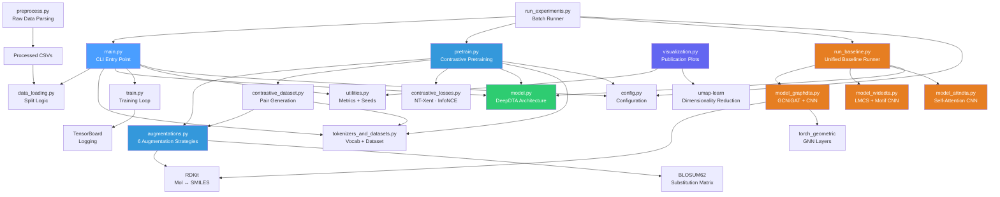
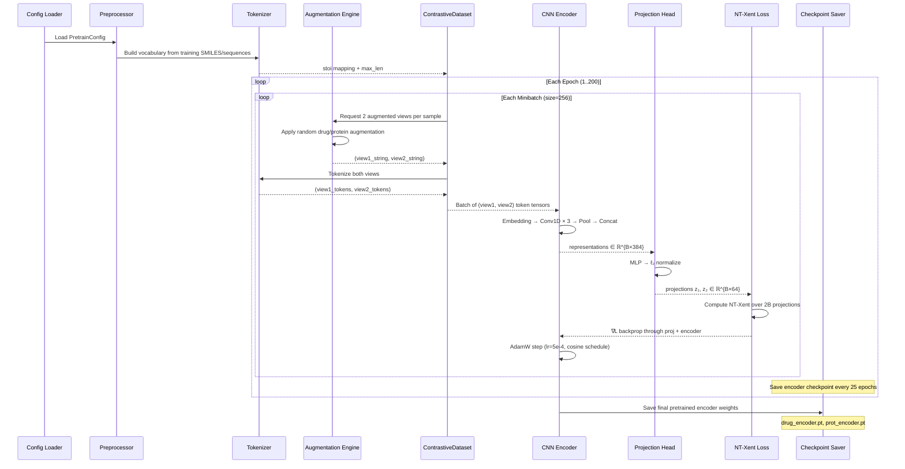
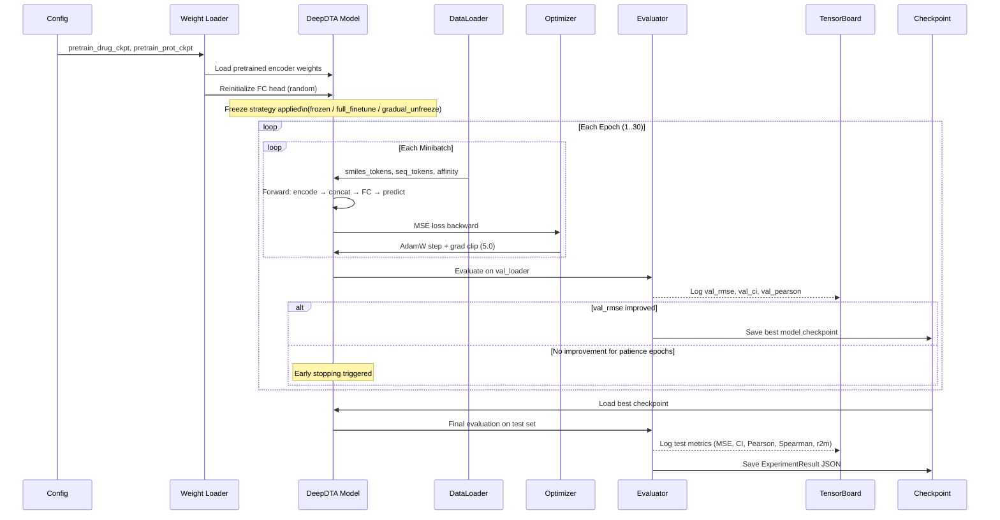
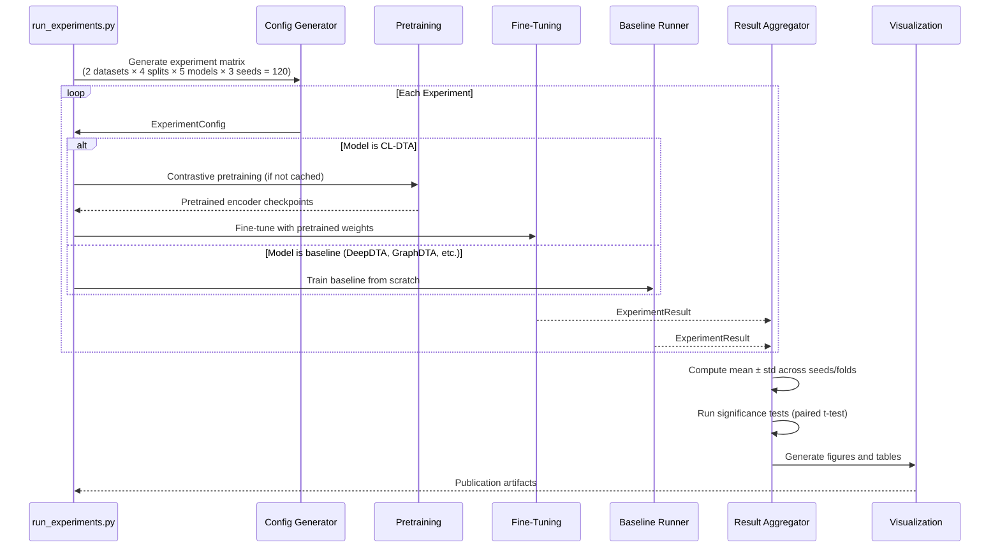
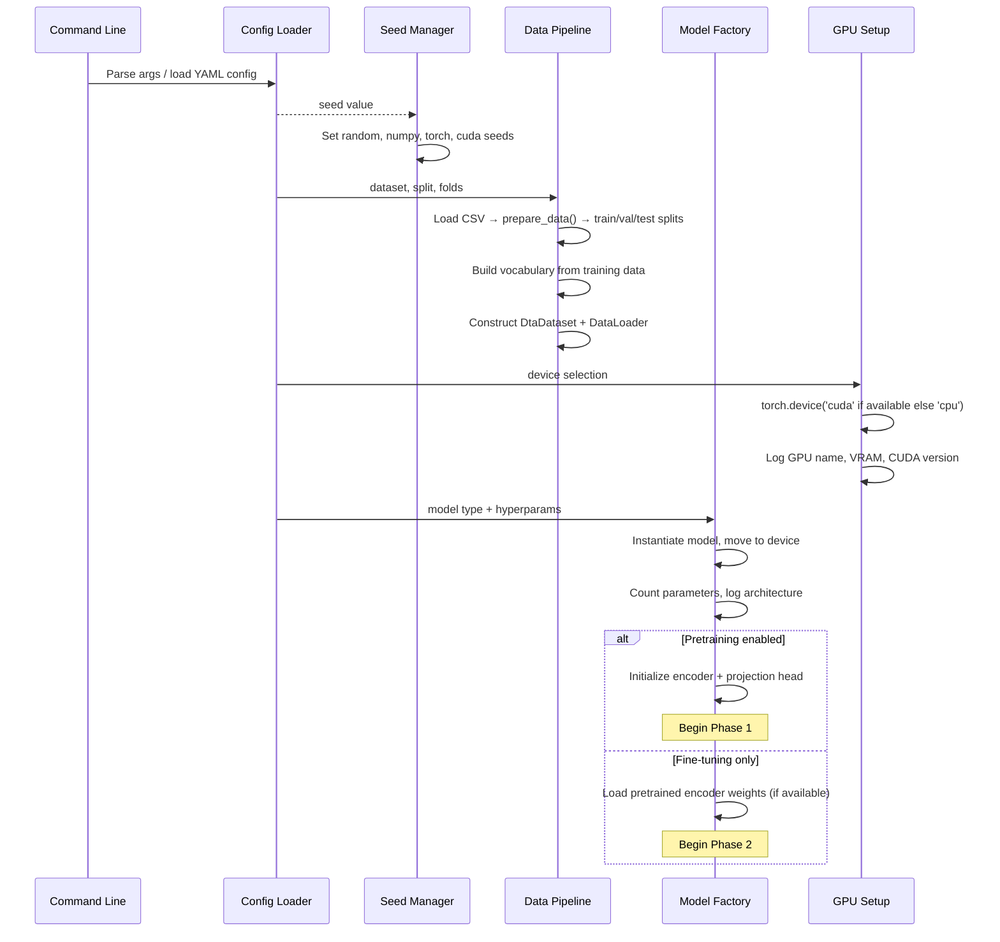
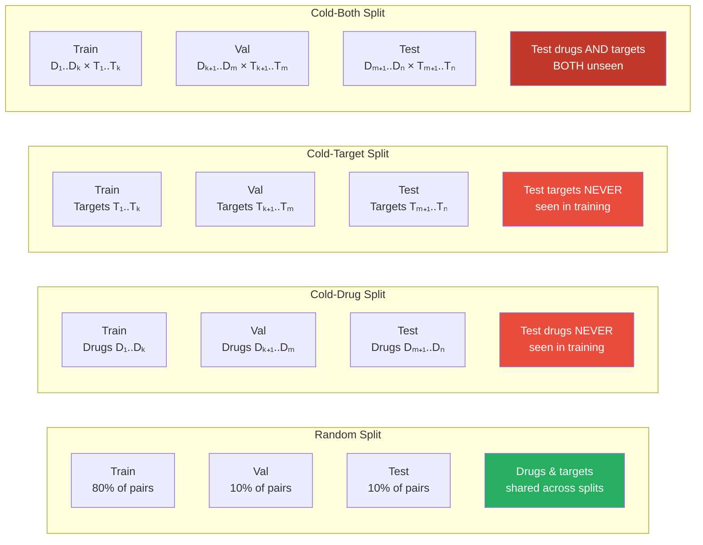
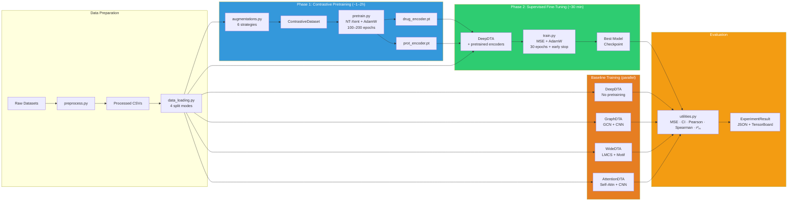
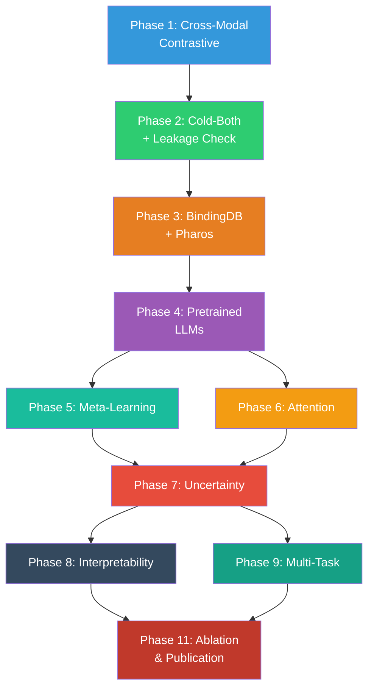

# CL-DTA++: Advanced Contrastive Self-Supervised Learning for Cold-Start Drug–Target Affinity Prediction — Technical Documentation

> **Version:** 2.0 (Enhanced)
> **Last updated:** 2026-03-26
> **Language / Runtime:** Python 3.10+ · PyTorch 2.x · RDKit 2023.x · scikit-learn 1.3+ · TensorBoard 2.x · Hugging Face Transformers 4.x
> **Architecture style:** Cross-modal contrastive pretraining with pretrained LLMs → meta-learning → uncertainty-aware supervised fine-tuning pipeline for drug–target binding affinity prediction with interpretability and multi-task support  

---

## Table of Contents

1. [System Overview](#1-system-overview)
2. [Architecture Breakdown](#2-architecture-breakdown)
3. [Domain Model](#3-domain-model)
4. [Execution Flow](#4-execution-flow)
5. [Cross-Modal Contrastive Pretraining — Theory & Design](#5-cross-modal-contrastive-pretraining--theory--design)
6. [Augmentation Engine](#6-augmentation-engine)
7. [Evaluation Protocol — Cold-Start Splits & Leakage Verification](#7-evaluation-protocol--cold-start-splits--leakage-verification)
8. [Large-Scale Datasets — BindingDB & Pharos Dark Proteins](#8-large-scale-datasets--bindingdb--pharos-dark-proteins)
9. [Pretrained LLM Integration — ESM & ChemBERTa](#9-pretrained-llm-integration--esm--chemberta)
10. [Meta-Learning for Few-Shot Adaptation](#10-meta-learning-for-few-shot-adaptation)
11. [Pocket-Guided Attention Mechanism](#11-pocket-guided-attention-mechanism)
12. [Uncertainty Estimation — Evidential Regression](#12-uncertainty-estimation--evidential-regression)
13. [Multi-Task Learning Framework](#13-multi-task-learning-framework)
14. [Interpretability & Theoretical Analysis](#14-interpretability--theoretical-analysis)
15. [Key Design Decisions](#15-key-design-decisions)
16. [Failure & Edge Case Analysis](#16-failure--edge-case-analysis)
17. [Training & Evaluation Pipeline](#17-training--evaluation-pipeline)
18. [Baseline Models & SOTA Comparisons](#18-baseline-models--sota-comparisons)
19. [Comprehensive Ablation Framework](#19-comprehensive-ablation-framework)
20. [Statistical Rigor & Reproducibility](#20-statistical-rigor--reproducibility)
21. [Developer Onboarding Guide](#21-developer-onboarding-guide)
22. [Implementation Roadmap](#22-implementation-roadmap)  

---

## 1. System Overview

### Purpose

This system is an **advanced research-grade drug–target binding affinity (DTA) prediction framework** designed to address the **cold-start problem** — predicting affinity for entirely unseen drugs and/or protein targets at test time. CL-DTA++ extends the original CL-DTA architecture with state-of-the-art techniques to achieve publication-quality novelty suitable for top-tier venues.

### Core Innovation & Training Paradigm

CL-DTA++ implements a **multi-phase training pipeline** combining:

1. **Phase 1 — Cross-Modal Contrastive Pretraining (Default):**
   - **Intra-modal learning:** Drug–drug and protein–protein contrastive learning via NT-Xent loss
   - **Cross-modal alignment:** Drug–protein binding pair alignment loss to learn joint representations
   - **Pretrained LLM initialization:** ESM (protein) and ChemBERTa (drug) encoders with projection layers
   - **Alignment loss:** Consistency regularization between LLM embeddings and learned representations
   - **Scale:** Trained on large-scale BindingDB (~millions of samples) plus DAVIS/KIBA

2. **Phase 2 — Meta-Learning (MAML-style):**
   - Few-shot adaptation framework for rapid generalization to unseen entities
   - Inner loop: Task-specific adaptation on support sets (1–10 shots)
   - Outer loop: Meta-update for cross-task generalization
   - Enables adaptation to cold-drug, cold-target, and cold-both scenarios

3. **Phase 3 — Uncertainty-Aware Supervised Fine-Tuning:**
   - **Multi-task head:** Simultaneous prediction of affinity (regression), binary interaction (classification), and mechanism of action (MoA)
   - **Evidential uncertainty estimation:** Outputs prediction intervals and confidence scores
   - **Pocket-guided attention:** Cross-attention mechanism focusing on binding-relevant protein regions
   - **Calibrated predictions:** Expected Calibration Error (ECE) tracking for reliability

The core hypothesis: **Cross-modal contrastive pretraining + pretrained biological/chemical LLMs + meta-learning + uncertainty quantification produces representations that generalize significantly better to unseen entities**, validated across five split protocols (random, cold-drug, cold-target, cold-both, cold-pharos) on DAVIS, KIBA, and BindingDB/Pharos benchmarks.

### High-Level Architecture

```mermaid
flowchart TB
    subgraph DataLayer ["Data Layer"]
        RAW[Raw Datasets\nDAVIS · KIBA]
        PREP[Preprocessing\npreprocess.py]
        CSV[Processed CSVs\ndrug_id · target_id · smiles · sequence · affinity]
    end

    subgraph SplitLayer ["Split Layer"]
        SPLIT[Data Splitter\ndata_loading.py]
        RAND[Random Split]
        CD[Cold-Drug Split]
        CT[Cold-Target Split]
        CB[Cold-Both Split]
    end

    subgraph PretrainPhase ["Phase 1 — Contrastive Pretraining"]
        AUG_D[Drug Augmentations\nSMILES Enumeration\nAtom Masking\nSubstructure Dropout]
        AUG_P[Protein Augmentations\nSubsequence Cropping\nResidue Masking\nResidue Substitution]
        CDSET[ContrastiveDataset\nPositive Pair Generation]
        DRUG_ENC[Drug CNN Encoder\n3×Conv1D + AdaptiveMaxPool]
        PROT_ENC[Protein CNN Encoder\n3×Conv1D + AdaptiveMaxPool]
        PROJ_D[Drug Projection Head\nMLP → ℓ₂-normalize]
        PROJ_P[Protein Projection Head\nMLP → ℓ₂-normalize]
        LOSS_CL[NT-Xent / InfoNCE\nContrastive Loss]
        CROSS[Cross-Modal\nAlignment Loss\n(Optional)]
    end

    subgraph FinetunePhase ["Phase 2 — Supervised Fine-Tuning"]
        LOAD[Load Pretrained\nEncoder Weights]
        DTA_MODEL[DeepDTA Model\nDrug CNN + Protein CNN + FC Head]
        MSE_LOSS[MSE Regression Loss]
        EVAL[Evaluation\nMSE · CI · Pearson · Spearman · r²ₘ]
    end

    subgraph Baselines ["Baseline Models"]
        GDTA[GraphDTA\nGCN/GAT + CNN]
        WDTA[WideDTA\nLMCS + Motif Words]
        ADTA[AttentionDTA\nSelf-Attention + CNN]
        DDTA[DeepDTA\nCNN Baseline]
    end

    subgraph Output ["Output Layer"]
        RES[Results\nJSON · CSV · TensorBoard]
        VIZ[Visualizations\nt-SNE · Bar Charts · Heatmaps]
        PAPER[Paper Artifacts\nTables · Figures]
    end

    RAW --> PREP --> CSV
    CSV --> SPLIT
    SPLIT --> RAND
    SPLIT --> CD
    SPLIT --> CT
    SPLIT --> CB

    CSV --> AUG_D
    CSV --> AUG_P
    AUG_D --> CDSET
    AUG_P --> CDSET
    CDSET --> DRUG_ENC --> PROJ_D --> LOSS_CL
    CDSET --> PROT_ENC --> PROJ_P --> LOSS_CL
    DRUG_ENC -.-> CROSS
    PROT_ENC -.-> CROSS

    DRUG_ENC -->|Save checkpoint| LOAD
    PROT_ENC -->|Save checkpoint| LOAD
    LOAD --> DTA_MODEL --> MSE_LOSS --> EVAL

    RAND --> DTA_MODEL
    CD --> DTA_MODEL
    CT --> DTA_MODEL
    CB --> DTA_MODEL

    RAND --> GDTA
    RAND --> WDTA
    RAND --> ADTA
    RAND --> DDTA

    EVAL --> RES --> VIZ --> PAPER

    style PretrainPhase fill:#3498db,color:#fff
    style FinetunePhase fill:#2ecc71,color:#fff
    style Baselines fill:#e67e22,color:#fff
    style DataLayer fill:#95a5a6,color:#fff
```

### Core Responsibilities

| Responsibility | Owner |
|---|---|
| Raw dataset parsing and normalization | `preprocess.py` |
| Train/val/test splitting (random, cold-drug, cold-target, cold-both) | `data_loading.py` |
| Character-level tokenization and vocabulary construction | `tokenizers_and_datasets.py` |
| Domain-specific augmentation of SMILES and protein sequences | `augmentations.py` |
| Contrastive positive pair generation | `contrastive_dataset.py` |
| Contrastive loss computation (NT-Xent, InfoNCE) | `contrastive_losses.py` |
| Contrastive pretraining loop (drug-only, protein-only, cross-modal) | `pretrain.py` |
| DeepDTA CNN model architecture | `model.py` |
| GraphDTA, WideDTA, AttentionDTA baseline architectures | `model_graphdta.py`, `model_widedta.py`, `model_attndta.py` |
| Supervised training loop with early stopping | `train.py` |
| Metrics computation (MSE, CI, Pearson, Spearman, r²ₘ) | `utilities.py` |
| Experiment configuration management | `config.py` |
| Batch experiment orchestration | `run_experiments.py` |
| Publication-quality visualizations | `visualization.py` |
| Experiment logging (TensorBoard + JSON) | `train.py`, logging infrastructure |

---

## 2. Architecture Breakdown

### Major Components

#### Data Preprocessing (`preprocess.py`)

Parses raw DAVIS and KIBA dataset files into standardized CSV format with columns: `drug_id`, `target_id`, `smiles`, `sequence`, `affinity`. Handles format-specific parsing (space-delimited records with variable-length protein sequences).

Key operations:
- **DAVIS parsing:** Raw file → DataFrame with Kd affinity values (typically transformed to $-\log_{10}(K_d / 10^{-9})$ = pKd)
- **KIBA parsing:** Raw file → DataFrame with KIBA scores (already on a log scale)
- **IC50 conversion:** Optional nM → pIC50 transform via $\text{pIC50} = 9 - \log_{10}(\text{IC50}_{\text{nM}})$
- **Data cleaning:** Drop rows with NaN in SMILES, sequence, or affinity columns

| Dataset | Pairs | Unique Drugs | Unique Targets | Affinity Type | Scale |
|---|---|---|---|---|---|
| DAVIS | ~30,056 | 68 | 442 | $K_d$ (nM) | Converted to $pK_d$ |
| KIBA | ~118,254 | 2,111 | 229 | KIBA score | Already log-scale |

#### Data Loading & Splitting (`data_loading.py`)

Implements four evaluation-critical split protocols. The splitting logic operates on group-level identifiers (`drug_id`, `target_id`) rather than individual sample indices for cold splits.

| Split Mode | Train Entities in Test? | Description | Difficulty |
|---|---|---|---|
| `random` | Yes (same drugs & targets) | Standard i.i.d. split on sample indices | Easiest |
| `cold_drug` | No unseen drugs | Test set contains entirely unseen drug entities | Hard |
| `cold_target` | No unseen targets | Test set contains entirely unseen target entities | Hard |
| `cold_both` | No unseen drugs AND targets | Test set has both unseen drugs and unseen targets | Hardest |

```python
def prepare_data(df: pd.DataFrame,
                 split: str = 'random',      # 'random' | 'cold_drug' | 'cold_target' | 'cold_both'
                 test_frac: float = 0.1,
                 val_frac: float = 0.1,
                 seed: int = 42) -> Tuple[pd.DataFrame, pd.DataFrame, pd.DataFrame]:
    """
    Returns (train_df, val_df, test_df) with zero entity leakage
    guaranteed for cold splits.
    """
```

**Cold-Both Split Algorithm:**

1. Partition drug IDs into train/val/test groups (by `test_frac` and `val_frac`).
2. Independently partition target IDs into train/val/test groups.
3. Test set = rows where `drug_id ∈ test_drugs AND target_id ∈ test_targets`.
4. Validation set = rows where `drug_id ∈ val_drugs AND target_id ∈ val_targets`.
5. Training set = remaining rows (drugs and targets in training groups).
6. **Invariant:** No drug or target in the test set appears in training.

#### Tokenization & Datasets (`tokenizers_and_datasets.py`)

Character-level tokenizer with vocabulary construction from training data. Handles both SMILES (chemical notation) and protein amino acid sequences.

| Component | Description |
|---|---|
| `build_vocab(sequences)` | Builds character-level `stoi`/`itos` mappings. Index 0 = `<PAD>`, index 1 = `<UNK>`. Additional `<MASK>` token added for augmentations. |
| `tokenize_seq(s, stoi, max_len)` | Converts string to integer token IDs with truncation/padding to `max_len`. |
| `DtaDataset` | PyTorch `Dataset` returning `{smiles: LongTensor, seq: LongTensor, aff: FloatTensor}`. |

**Sequence Length Parameters:**

| Parameter | Default | Rationale |
|---|---|---|
| `max_sml_len` | 120 | Covers >99% of SMILES strings in DAVIS/KIBA |
| `max_prot_len` | 1000 | Covers >95% of protein sequences; longer sequences are truncated |

#### Augmentation Engine (`augmentations.py`)

Implements six domain-specific augmentation strategies — three for drug SMILES and three for protein sequences. Each augmentation takes a string as input and returns a modified string. The tokenizer handles downstream conversion to tensors.

**Drug (SMILES) Augmentations:**

| Augmentation | Method | Strength | Validity Check |
|---|---|---|---|
| SMILES Enumeration | RDKit non-canonical SMILES generation (same molecule, different string) | Strongest — changes token sequence while preserving molecular identity | Always valid by construction (RDKit) |
| Atom Masking | Replace $k\%$ of SMILES tokens with `<MASK>` | Medium — forces encoder to reconstruct from partial information | Token-level; no molecular validity check needed |
| Substructure Dropout | Remove single atoms/bonds from SMILES string | Weak–Medium — creates molecular analogs | RDKit validity check on result; retry if invalid |

**Protein (Sequence) Augmentations:**

| Augmentation | Method | Strength | Validity Check |
|---|---|---|---|
| Subsequence Cropping | Random contiguous window of 70–100% of sequence length | Strong — forces local-to-global generalization | Always valid (subsequence of valid protein) |
| Residue Masking | Replace $k\%$ of amino acid characters with `<MASK>` | Medium — analogous to masked language modeling | Token-level; always valid |
| Residue Substitution | Replace residues with biochemically similar amino acids using BLOSUM62 substitution probabilities | Weak–Medium — preserves biochemical similarity | Guaranteed valid (substitutes are real amino acids) |

#### Contrastive Dataset (`contrastive_dataset.py`)

Wraps the base `DtaDataset` to produce positive pairs for contrastive learning. For each sample, two independent augmentations are applied to produce views $(x_i, x_i^+)$. Negative pairs come from other samples within the minibatch (NT-Xent style — no explicit negative sampling required).

```python
class ContrastiveDataset(Dataset):
    """
    For each sample, applies two random augmentations to produce a positive pair.
    Returns: {
        'view1': LongTensor,   # Augmented view 1 (tokenized)
        'view2': LongTensor,   # Augmented view 2 (tokenized)
        'index': int           # Sample index for tracking
    }
    """
```

#### Contrastive Losses (`contrastive_losses.py`)

Implements the contrastive loss functions used during pretraining.

**NT-Xent (Normalized Temperature-scaled Cross-Entropy) — Primary:**

$$\mathcal{L}_{\text{NT-Xent}} = -\frac{1}{2N}\sum_{i=1}^{N}\Bigl[\log\frac{\exp(\text{sim}(z_i, z_i^+)/\tau)}{\sum_{k \neq i}\exp(\text{sim}(z_i, z_k)/\tau)} + \log\frac{\exp(\text{sim}(z_i^+, z_i)/\tau)}{\sum_{k \neq i}\exp(\text{sim}(z_i^+, z_k)/\tau)}\Bigr]$$

where:
- $z_i = g(f(x_i))$ — projection of augmented view through encoder $f$ and projection head $g$
- $\text{sim}(u, v) = \frac{u^\top v}{\|u\| \|v\|}$ — cosine similarity
- $\tau$ — temperature hyperparameter (default 0.07)
- $N$ — minibatch size (effective negatives = $2N - 2$ per anchor)

**InfoNCE — Ablation Variant:**

$$\mathcal{L}_{\text{InfoNCE}} = -\frac{1}{N}\sum_{i=1}^{N}\log\frac{\exp(\text{sim}(z_i, z_i^+)/\tau)}{\exp(\text{sim}(z_i, z_i^+)/\tau) + \sum_{j \neq i}\exp(\text{sim}(z_i, z_j)/\tau)}$$

| Parameter | Default | Range (Ablation) |
|---|---|---|
| Temperature $\tau$ | 0.07 | {0.01, 0.05, 0.07, 0.1, 0.5} |
| Loss function | NT-Xent | {NT-Xent, InfoNCE, Triplet} |

#### DeepDTA Model (`model.py`)

The base CNN architecture for DTA prediction. Drug and protein sequences are independently encoded by parallel 1D CNN branches, then concatenated and passed through a fully-connected regression head.

```
┌──────────────────────────────────────────────────────────────────────────┐
│                          DeepDTA Architecture                            │
│                                                                          │
│  Drug Branch:                                                            │
│    Embedding(vocab_drug, 128) → permute(0,2,1)                          │
│    ├── Conv1D(128, 128, kernel=4) → ReLU → AdaptiveMaxPool1D(1) ──┐    │
│    ├── Conv1D(128, 128, kernel=6) → ReLU → AdaptiveMaxPool1D(1) ──┤    │
│    └── Conv1D(128, 128, kernel=8) → ReLU → AdaptiveMaxPool1D(1) ──┤    │
│    Concat → drug_features ∈ ℝ^384                                  │    │
│                                                                     │    │
│  Protein Branch:                                                    │    │
│    Embedding(vocab_prot, 128) → permute(0,2,1)                     │    │
│    ├── Conv1D(128, 128, kernel=4)  → ReLU → AdaptiveMaxPool1D(1) ──┤    │
│    ├── Conv1D(128, 128, kernel=8)  → ReLU → AdaptiveMaxPool1D(1) ──┤    │
│    └── Conv1D(128, 128, kernel=12) → ReLU → AdaptiveMaxPool1D(1) ──┤    │
│    Concat → prot_features ∈ ℝ^384                                  │    │
│                                                                          │
│  FC Head:                                                                │
│    Concat(drug_features, prot_features) ∈ ℝ^768                        │
│    → Linear(768, 1024) → ReLU → Dropout(0.2)                           │
│    → Linear(1024, 256) → ReLU → Dropout(0.2)                           │
│    → Linear(256, 1)                                                      │
│                                                                          │
│  Parameters:   Drug Encoder: ~115K                                       │
│                Prot Encoder: ~131K                                        │
│                FC Head:      ~1.05M                                       │
│                Total:        ~1.30M                                       │
│  Output:       Scalar affinity prediction                                │
└──────────────────────────────────────────────────────────────────────────┘
```

**Pretrained Encoder Loading:**

```python
class DeepDTAModel(nn.Module):
    def load_pretrained_encoders(self, drug_ckpt: str, prot_ckpt: str):
        """
        Load pretrained weights into drug/protein CNN branches.
        Reinitializes the FC head (random weights) for fine-tuning.
        """
        drug_state = torch.load(drug_ckpt, map_location='cpu')
        self.embed_drug.load_state_dict(drug_state['embedding'])
        self.drug_convs.load_state_dict(drug_state['convs'])
        
        prot_state = torch.load(prot_ckpt, map_location='cpu')
        self.embed_prot.load_state_dict(prot_state['embedding'])
        self.prot_convs.load_state_dict(prot_state['convs'])
        
        # Reinitialize FC head
        for layer in self.fc:
            if hasattr(layer, 'reset_parameters'):
                layer.reset_parameters()
```

#### Contrastive Pretraining Loop (`pretrain.py`)

Orchestrates the pretraining phase with three modes:

| Mode | What is Pretrained | What is Frozen | Loss |
|---|---|---|---|
| Drug-only | Drug embedding + Drug CNN convs | Protein encoder (not used) | NT-Xent on SMILES pairs |
| Protein-only | Protein embedding + Protein CNN convs | Drug encoder (not used) | NT-Xent on sequence pairs |
| Cross-modal | Both encoders jointly | — | NT-Xent (drug) + NT-Xent (protein) + alignment loss |

**Pretraining Hyperparameters:**

| Parameter | Value |
|---|---|
| Optimizer | AdamW |
| Learning rate | $5 \times 10^{-4}$ |
| LR schedule | Cosine annealing (warm restart) |
| Weight decay | $10^{-5}$ |
| Batch size | 256 |
| Epochs | 100–200 |
| Projection head | 2-layer MLP (128 → 128 → 64) with ℓ₂ normalization |
| Temperature $\tau$ | 0.07 |

#### Configuration System (`config.py`)

Dataclass-based hierarchical configuration, replacing scattered argparse defaults. Supports YAML loading for reproducible experiment configs. **Enhanced for CL-DTA++ with all Phase 1-11 features.**

```python
@dataclass
class DataConfig:
    dataset: str = 'davis'             # 'davis' | 'kiba' | 'bindingdb' | 'pharos'
    data_path: str = 'data/'
    max_sml_len: int = 120
    max_prot_len: int = 1000
    split: str = 'random'             # 'random' | 'cold_drug' | 'cold_target' | 'cold_both' | 'cold_pharos'
    test_frac: float = 0.1
    val_frac: float = 0.1
    n_folds: int = 5                   # For k-fold entity-group CV on cold splits
    verify_no_leakage: bool = True     # Programmatic leakage verification (Phase 2)
    use_cached_dataset: bool = True    # Use preprocessed .pt files for large datasets (Phase 3)
    min_samples_threshold: int = 100   # Minimum samples per split
    max_retry_attempts: int = 5        # Retry split if constraints violated

@dataclass
class PretrainConfig:
    enabled: bool = True
    mode: str = 'cross_modal'         # 'drug_only' | 'prot_only' | 'both_independent' | 'cross_modal' (Phase 1)
    epochs: int = 100
    batch_size: int = 256
    lr: float = 5e-4
    temperature: float = 0.07
    loss: str = 'nt_xent'             # 'nt_xent' | 'infonce' | 'triplet'

    # Cross-modal alignment (Phase 1)
    use_cross_modal: bool = True
    align_loss_weight: float = 0.5    # Weight for cross-modal alignment loss

    # Augmentations
    drug_augmentations: List[str] = field(default_factory=lambda: ['smiles_enum', 'atom_mask'])
    prot_augmentations: List[str] = field(default_factory=lambda: ['subseq_crop', 'residue_mask'])
    mask_ratio: float = 0.15
    crop_min_ratio: float = 0.7
    projection_dim: int = 64

    # Pretrained LLM integration (Phase 4)
    use_pretrained_embeddings: bool = True
    pretrained_drug_model: str = 'seyonec/ChemBERTa-zinc-base-v1'  # Hugging Face model ID
    pretrained_prot_model: str = 'facebook/esm2_t6_8M_UR50D'       # ESM-2 model
    freeze_pretrained: bool = True
    unfreeze_last_k_layers: int = 0
    llm_alignment_weight: float = 0.1  # Weight for LLM-learned embedding alignment
    cache_llm_embeddings: bool = True  # Cache to avoid recomputation

@dataclass
class MetaLearningConfig:
    """Meta-learning configuration (Phase 5)"""
    enabled: bool = False
    meta_lr: float = 1e-3
    inner_lr: float = 1e-2
    num_inner_steps: int = 5
    meta_batch_size: int = 4
    k_support: int = 5                # Number of support samples
    k_query: int = 10                 # Number of query samples
    adaptation_scope: str = 'head_only'  # 'head_only' | 'partial_encoder' | 'full'
    algorithm: str = 'maml'           # 'maml' | 'reptile'

@dataclass
class AttentionConfig:
    """Pocket-guided attention configuration (Phase 6)"""
    enabled: bool = False
    num_heads: int = 4
    attention_dropout: float = 0.1
    use_pocket_mask: bool = False
    residual_connection: bool = True

@dataclass
class UncertaintyConfig:
    """Uncertainty estimation configuration (Phase 7)"""
    enabled: bool = False
    method: str = 'evidential'        # 'evidential' | 'conformal' | 'ensemble'
    calibration_metric: str = 'ece'   # Expected Calibration Error
    compute_reliability: bool = True

@dataclass
class MultiTaskConfig:
    """Multi-task learning configuration (Phase 9)"""
    enabled: bool = False
    tasks: List[str] = field(default_factory=lambda: ['affinity'])  # 'affinity' | 'interaction' | 'moa'
    loss_weights: Dict[str, float] = field(default_factory=lambda: {
        'affinity': 1.0,
        'interaction': 1.0,
        'moa': 1.0
    })
    dynamic_weighting: bool = False   # Use GradNorm or uncertainty-based weighting
    num_moa_classes: int = 10

@dataclass
class TrainConfig:
    epochs: int = 30
    batch_size: int = 128
    lr: float = 1e-4
    weight_decay: float = 1e-5
    patience: int = 8
    dropout: float = 0.2
    emb_dim: int = 128
    conv_out: int = 128
    freeze_strategy: str = 'full_finetune'  # 'frozen' | 'full_finetune' | 'gradual_unfreeze'
    lr_scheduler: str = 'cosine'      # 'cosine' | 'plateau' | 'step' | 'none'
    gradient_accumulation_steps: int = 1
    mixed_precision: bool = True      # Use automatic mixed precision

@dataclass
class ExperimentConfig:
    data: DataConfig
    pretrain: PretrainConfig
    train: TrainConfig
    meta: MetaLearningConfig
    attention: AttentionConfig
    uncertainty: UncertaintyConfig
    multitask: MultiTaskConfig

    model: str = 'cl_dta++'           # 'deepdta' | 'graphdta' | 'widedta' | 'attndta' | 'cl_dta' | 'cl_dta++'
    seed: int = 42
    device: str = 'cuda'
    results_dir: str = 'results/'
    tensorboard_dir: str = 'runs/'

    # Ablation and experiment tracking (Phase 11)
    experiment_name: str = 'default'
    ablation_mode: str = 'none'       # 'none' | 'cross_modal_weight' | 'llm_init' | etc.
    track_with_mlflow: bool = False
    track_with_wandb: bool = False

@dataclass
class AblationConfig:
    """Systematic ablation configuration (Phase 11)"""
    enabled: bool = False
    ablation_type: str = 'grid'       # 'grid' | 'random' | 'sequential'
    num_seeds: int = 5                # Repeat each config with N seeds
    parameters: Dict[str, List] = field(default_factory=dict)
    compute_effect_sizes: bool = True
    generate_latex_tables: bool = True
```

#### Experiment Metrics (`utilities.py`)

Implements all evaluation metrics required for DTA benchmarking:

| Metric | Symbol | Formula | Use |
|---|---|---|---|
| Mean Squared Error | MSE | $\frac{1}{n}\sum(y_i - \hat{y}_i)^2$ | Primary regression metric |
| Root Mean Squared Error | RMSE | $\sqrt{\text{MSE}}$ | Interpretable regression metric |
| Concordance Index | CI | $\frac{\sum_{i<j} h(y_i, y_j, \hat{y}_i, \hat{y}_j)}{|\{(i,j): y_i \neq y_j\}|}$ | Standard DTA ranking metric |
| Pearson correlation | $r$ | $\frac{\text{Cov}(y, \hat{y})}{\sigma_y \sigma_{\hat{y}}}$ | Linear correlation |
| Spearman rank correlation | $\rho$ | Pearson $r$ on rank-transformed values | Rank correlation |
| Modified $r^2$ | $r_m^2$ | $r^2 \times (1 - \sqrt{r^2 - r_0^2})$ where $r_0^2$ uses intercept-free regression | KIBA literature standard |

**Concordance Index — Current Implementation Complexity:**  
The current $O(n^2)$ pairwise CI computation is acceptable for test sets of ~3K–12K samples. For larger sets, a sampled CI approximation (random $m$ pairs, default $m = 100{,}000$) is added to avoid slowdown.

### Dependency Relationships



### External Integrations

| System | Protocol / Binding | Purpose |
|---|---|---|
| PyTorch 2.x | Python API | Model definition, training, gradient computation, checkpoint I/O |
| RDKit 2023.x | `rdkit-pypi` Python bindings | SMILES enumeration, molecular graph construction, validity checking |
| scikit-learn 1.3+ | `sklearn` Python API | Cross-validation utilities, preprocessing, statistical tests |
| SciPy 1.11+ | `scipy.stats` | Spearman correlation, paired t-test, Wilcoxon signed-rank test |
| TensorBoard 2.x | `torch.utils.tensorboard` | Training curve visualization, hyperparameter logging |
| pandas 2.x | `pd.DataFrame` | Data loading, splitting, results aggregation |
| NumPy 1.24+ | `np.ndarray` | Numerical computation, metrics |
| matplotlib 3.7+ | `matplotlib.pyplot` | Publication-quality static plots |
| UMAP / t-SNE | `umap-learn`, `sklearn.manifold` | Embedding visualization for representation quality analysis |
| PyTorch Geometric | `torch_geometric` | GNN layers for GraphDTA baseline |
| PyYAML | `yaml` | Configuration file parsing |

---

## 3. Domain Model

### Key Entities

#### DrugTargetSample

The atomic unit of data. Each sample represents a measured interaction between one drug and one target.

```python
@dataclass
class DrugTargetSample:
    drug_id: str                     # Unique drug identifier (e.g., "DB00945")
    target_id: str                   # Unique target identifier (e.g., "P00533")
    smiles: str                      # SMILES string (e.g., "CC(=O)Oc1ccccc1C(=O)O")
    sequence: str                    # Amino acid sequence (e.g., "MTEYKLVVV...")
    affinity: float                  # Binding affinity value (pKd or KIBA score)
```

#### AugmentedPair

A positive pair produced by the augmentation engine for contrastive pretraining.

```python
@dataclass
class AugmentedPair:
    original: str                    # Original SMILES or protein sequence
    view1: str                       # First augmented view (string)
    view2: str                       # Second augmented view (string)
    view1_tokens: torch.LongTensor   # Tokenized view 1 (padded to max_len)
    view2_tokens: torch.LongTensor   # Tokenized view 2 (padded to max_len)
    aug1_type: str                   # Name of augmentation applied to view 1
    aug2_type: str                   # Name of augmentation applied to view 2
    entity_id: str                   # drug_id or target_id (for tracking)
```

#### Representation

The learned embedding vector for a drug or protein, output by an encoder.

```python
@dataclass
class Representation:
    entity_id: str                   # drug_id or target_id
    entity_type: str                 # 'drug' or 'protein'
    embedding: torch.Tensor          # Encoder output ∈ ℝ^{conv_out × n_kernels} (e.g., ℝ^384)
    projection: torch.Tensor         # Projection head output ∈ ℝ^{proj_dim} (ℓ₂-normalized, e.g., ℝ^64)
    pretrained: bool                 # Whether this representation comes from a pretrained encoder
```

#### ExperimentResult

A single experimental run's complete output.

```python
@dataclass
class ExperimentResult:
    experiment_id: str               # Unique identifier (e.g., "davis_cold_drug_cl_dta_seed42")
    dataset: str                     # 'davis' or 'kiba'
    split: str                       # 'random', 'cold_drug', 'cold_target', 'cold_both'
    model: str                       # 'deepdta', 'graphdta', 'widedta', 'attndta', 'cl_dta'
    seed: int                        # Random seed (42, 123, or 456)
    fold: int                        # Cross-validation fold (0–4)
    
    # Pretraining metadata (None for non-CL-DTA models)
    pretrain_epochs: Optional[int]
    pretrain_loss: str               # 'nt_xent', 'infonce', etc.
    augmentations: List[str]         # List of augmentation names used
    temperature: Optional[float]
    freeze_strategy: str             # 'frozen', 'full_finetune', 'gradual_unfreeze'
    
    # Training metadata
    train_epochs: int                # Actual epochs trained (may be < max due to early stopping)
    train_time_seconds: float        # Wall-clock training time
    gpu_memory_mb: float             # Peak GPU memory usage
    
    # Metrics on test set
    mse: float
    rmse: float
    ci: float                        # Concordance Index
    pearson_r: float
    spearman_rho: float
    r_m_squared: float               # Modified r²
    
    # Per-epoch training curves
    train_losses: List[float]
    val_rmses: List[float]
    val_cis: List[float]
    
    # Config snapshot for reproducibility
    config: ExperimentConfig
```

#### SplitInfo

Metadata about a data split for leakage verification.

```python
@dataclass
class SplitInfo:
    split_type: str                  # 'random', 'cold_drug', 'cold_target', 'cold_both'
    train_drug_ids: Set[str]
    train_target_ids: Set[str]
    val_drug_ids: Set[str]
    val_target_ids: Set[str]
    test_drug_ids: Set[str]
    test_target_ids: Set[str]
    
    def verify_no_leakage(self) -> bool:
        """Verify that cold-split constraints are respected."""
        if self.split_type == 'cold_drug':
            return len(self.test_drug_ids & self.train_drug_ids) == 0
        elif self.split_type == 'cold_target':
            return len(self.test_target_ids & self.train_target_ids) == 0
        elif self.split_type == 'cold_both':
            return (len(self.test_drug_ids & self.train_drug_ids) == 0 and
                    len(self.test_target_ids & self.train_target_ids) == 0)
        return True  # random split has no entity constraint
```

### Data Transformations

| Stage | Input | Transformation | Output |
|---|---|---|---|
| Raw parsing | Space-delimited text file | Parse fields, DataFrame construction | `pd.DataFrame` (drug_id, target_id, smiles, sequence, affinity) |
| Affinity transform | IC50 in nM | $\text{pIC50} = 9 - \log_{10}(\text{IC50}_{\text{nM}})$ | Float (pIC50 scale) |
| Vocabulary build | List of training strings | Character frequency counting → sorted index mapping | `stoi: Dict[str, int]`, `itos: List[str]` |
| Tokenization | String + vocabulary | Character → integer → padding/truncation | `LongTensor` of shape `(max_len,)` |
| Augmentation | Original string | Domain-specific transformation (e.g., SMILES enumeration) | Augmented string |
| Contrastive pairing | Single augmented string × 2 | Two independent augmentations | `(view1_tokens, view2_tokens)` |
| CNN encoding | `LongTensor (B, L)` | Embedding → Conv1D × 3 → AdaptiveMaxPool → concat | `Tensor (B, 384)` |
| Projection | `Tensor (B, 384)` | MLP → ℓ₂ normalize | `Tensor (B, 64)` — unit hypersphere |
| Regression | `Tensor (B, 768)` (drug + prot concat) | FC layers | `Tensor (B, 1)` — predicted affinity |

### Important Invariants

1. **No entity leakage in cold splits.** For `cold_drug`, the intersection of `train_drug_ids` and `test_drug_ids` must be empty. Same for `cold_target` with target IDs, and `cold_both` with both. Verified programmatically after every split.
2. **Augmented SMILES produce valid molecules.** Every SMILES augmentation (enumeration, substructure dropout) is validated via `Chem.MolFromSmiles()`. Invalid augmentations are retried with a different random seed (up to 5 attempts), then the original SMILES is returned as fallback.
3. **Contrastive pairs are always from the same entity.** View 1 and view 2 in a positive pair always originate from the same drug or protein. Cross-pair negatives come from different entities within the minibatch.
4. **Projection heads are discarded after pretraining.** Only the encoder weights (embedding + conv layers) are transferred to the downstream task. Projection heads are training artifacts.
5. **Vocabulary is built from training data only.** Test/validation strings may contain unseen characters, which map to `<UNK>` (index 1). The `<MASK>` token is added to the vocabulary but only used during pretraining augmentation.
6. **Seeds are fixed for reproducibility.** Three seeds (42, 123, 456) are used for each experiment. `random`, `numpy`, `torch`, and `torch.cuda` RNGs are all seeded.
7. **Affinity values are on a continuous scale.** DAVIS uses pKd, KIBA uses KIBA scores. Both are treated as regression targets (no binarization).

---

## 4. Execution Flow

### Phase 1 — Contrastive Pretraining Lifecycle



### Phase 2 — Supervised Fine-Tuning Lifecycle



### Full Experiment Pipeline



### Startup Sequence



---

## 5. Cross-Modal Contrastive Pretraining — Theory & Design

### Theoretical Foundation

**Key Innovation:** CL-DTA++ makes **cross-modal contrastive pretraining the default paradigm**, combining intra-modal and cross-modal learning in a unified framework (Phase 1).

**References:**
- Chen et al. _"A Simple Framework for Contrastive Learning of Visual Representations (SimCLR)."_ ICML 2020.
- Oord et al. _"Representation Learning with Contrastive Predictive Coding."_ arXiv 2018.
- Radford et al. _"Learning Transferable Visual Models From Natural Language Supervision (CLIP)."_ ICML 2021.
- Wang et al. _"MolCLR: Molecular Contrastive Learning of Representations via Graph Neural Networks."_ Nature Machine Intelligence 2022.

#### Problem Statement

Standard supervised DTA models learn drug and protein representations optimized solely for the affinity regression objective on training pairs. Under cold-start evaluation (unseen drugs or targets at test time), these representations fail to generalize because:

1. **Representation collapse to training entities:** Encoders learn features highly specific to training drugs/targets, not transferable structural features.
2. **No incentive for structural similarity preservation:** Two structurally similar drugs may have vastly different representations if they never co-occur in training pairs.
3. **Lack of cross-modal alignment:** Drug and protein embeddings live in unrelated spaces, losing information about binding compatibility.

CL-DTA++ addresses this through a **three-component contrastive pretraining framework:**

1. **Intra-modal learning:** Drug–drug and protein–protein contrastive learning
2. **Cross-modal alignment:** Drug–protein binding pair alignment
3. **LLM knowledge transfer:** Alignment between pretrained LLM embeddings and learned representations (Phase 4)

#### Enhanced Contrastive Learning Objective

**Component 1: Intra-Modal NT-Xent Loss**

For drugs, with minibatch of $N$ molecules, each augmented twice:

$$\mathcal{L}_{\text{drug}} = -\frac{1}{2N}\sum_{i=1}^{N}\Bigl[\log\frac{\exp(\text{sim}(z_i, z_i^+)/\tau)}{\sum_{k \neq i}\exp(\text{sim}(z_i, z_k)/\tau)} + \log\frac{\exp(\text{sim}(z_i^+, z_i)/\tau)}{\sum_{k \neq i}\exp(\text{sim}(z_i^+, z_k)/\tau)}\Bigr]$$

Similarly for proteins: $\mathcal{L}_{\text{protein}}$

**Component 2: Cross-Modal Alignment Loss (Default in CL-DTA++)**

For known drug–target binding pairs $(d_k, p_k)$ in the minibatch:

$$\mathcal{L}_{\text{align}} = -\frac{1}{M}\sum_{k=1}^{M}\Bigl[\log\frac{\exp(\text{sim}(z_{d_k}, z_{p_k})/\tau)}{\sum_{j=1}^{B_p}\exp(\text{sim}(z_{d_k}, z_{p_j})/\tau)} + \log\frac{\exp(\text{sim}(z_{p_k}, z_{d_k})/\tau)}{\sum_{j=1}^{B_d}\exp(\text{sim}(z_{p_k}, z_{d_j})/\tau)}\Bigr]$$

where $M$ is the number of known pairs, $B_p$ is batch proteins, $B_d$ is batch drugs.

**Component 3: LLM Embedding Alignment Loss (Phase 4)**

To leverage pretrained knowledge from ESM (proteins) and ChemBERTa (drugs):

$$\mathcal{L}_{\text{llm}} = \frac{1}{N}\sum_{i=1}^{N}\Bigl[\text{MSE}(z_i^{\text{learned}}, z_i^{\text{llm}}) + \lambda \cdot (1 - \text{cos}(z_i^{\text{learned}}, z_i^{\text{llm}}))\Bigr]$$

**Total Pretraining Loss:**

$$\mathcal{L}_{\text{total}} = \mathcal{L}_{\text{drug}} + \mathcal{L}_{\text{protein}} + \alpha \cdot \mathcal{L}_{\text{align}} + \beta \cdot \mathcal{L}_{\text{llm}}$$

where $\alpha$ (default 0.5) and $\beta$ (default 0.1) are tunable in config.

#### Why This Design?

| Advantage | Mechanism |
|---|---|
| **Better generalization** | Intra-modal learning captures structural similarity across entities |
| **Cross-modal consistency** | Alignment ensures binding partners are nearby in joint space |
| **Knowledge transfer** | LLM embeddings inject large-scale biomedical/chemical knowledge |
| **Efficient training** | Single unified loss, one backprop per batch |
| **Interpretability** | Can visualize learned joint embedding space |

### Pretraining Architecture

```
┌──────────────────────────────────────────────────────────────────────────┐
│                    Contrastive Pretraining Module                         │
│                                                                          │
│  Drug Pretraining Branch:                                                │
│    Input: Augmented SMILES pair (view1, view2)                          │
│    ┌─────────────────────────────────────────┐                          │
│    │  Shared Drug Encoder f_d(·)              │                          │
│    │    Embedding(vocab_drug, 128)             │                          │
│    │    Conv1D(128,128,k=4) + Pool  ──┐       │                          │
│    │    Conv1D(128,128,k=6) + Pool  ──┤ cat   │                          │
│    │    Conv1D(128,128,k=8) + Pool  ──┘       │                          │
│    │    Output: h_d ∈ ℝ^384                   │                          │
│    └─────────────────────────────────────────┘                          │
│    ┌─────────────────────────────────────────┐                          │
│    │  Projection Head g_d(·)                  │                          │
│    │    Linear(384, 128) → ReLU               │                          │
│    │    Linear(128, 64) → ℓ₂-normalize        │                          │
│    │    Output: z_d ∈ S^63 (unit sphere)      │                          │
│    └─────────────────────────────────────────┘                          │
│    Parameters: Encoder ~115K + Projection ~57K = ~172K                  │
│                                                                          │
│  Protein Pretraining Branch: (same structure, different weights)         │
│    Parameters: Encoder ~131K + Projection ~57K = ~188K                  │
│                                                                          │
│  Total Pretraining Parameters: ~360K                                     │
│  VRAM Usage: ~1–2 GB (batch=256, max_sml=120, max_prot=1000)           │
│  Pretraining Time: ~30–60 min on consumer GPU (RTX 3060/4060)           │
└──────────────────────────────────────────────────────────────────────────┘
```

### Weight Transfer Protocol

After pretraining completes:

1. **Save encoder-only checkpoints** (embedding + conv layers, excluding projection head).
2. **Load into DeepDTA model** via `load_pretrained_encoders()`.
3. **Reinitialize FC head** with random weights (the FC head was never pretrained).
4. **Apply freeze strategy:**
   - `frozen`: Freeze encoder weights, train only FC head.
   - `full_finetune`: All parameters trainable (encoder + FC head).
   - `gradual_unfreeze`: Train FC head for 5 epochs, then unfreeze encoders.

---

## 6. Augmentation Engine

### Drug (SMILES) Augmentations

#### SMILES Enumeration (Strongest)

SMILES notation is not unique — the same molecule can be represented by many different SMILES strings depending on the atom traversal order. RDKit generates random non-canonical SMILES for the same molecule.

```python
def smiles_enumeration(smiles: str) -> str:
    """Generate a random non-canonical SMILES for the same molecule."""
    mol = Chem.MolFromSmiles(smiles)
    if mol is None:
        return smiles  # fallback: return original
    # Randomize atom ordering
    atom_order = list(range(mol.GetNumAtoms()))
    random.shuffle(atom_order)
    renumbered = Chem.RenumberAtoms(mol, atom_order)
    return Chem.MolToSmiles(renumbered, canonical=False)
```

**Example:**
- Canonical: `CC(=O)Oc1ccccc1C(=O)O` (Aspirin)
- Enumerated: `O=C(O)c1ccccc1OC(C)=O`
- Enumerated: `c1cc(OC(=O)C)c(C(=O)O)cc1`

All three represent identical molecules but have entirely different token sequences. This is the strongest augmentation because it tests whether the encoder recognizes molecular identity regardless of SMILES traversal order.

#### Atom Masking

```python
def atom_masking(smiles: str, mask_ratio: float = 0.15) -> str:
    """Replace mask_ratio fraction of SMILES characters with <MASK>."""
    chars = list(smiles)
    n_mask = max(1, int(len(chars) * mask_ratio))
    mask_positions = random.sample(range(len(chars)), n_mask)
    for pos in mask_positions:
        chars[pos] = '<MASK>'
    return ''.join(chars)
```

#### Substructure Dropout

```python
def substructure_dropout(smiles: str, drop_prob: float = 0.1) -> str:
    """Remove random atoms from molecule; validate result with RDKit."""
    mol = Chem.MolFromSmiles(smiles)
    if mol is None or mol.GetNumAtoms() <= 3:
        return smiles
    # Randomly select atom to remove
    atom_idx = random.randint(0, mol.GetNumAtoms() - 1)
    edit_mol = Chem.RWMol(mol)
    edit_mol.RemoveAtom(atom_idx)
    result = Chem.MolToSmiles(edit_mol)
    # Validate
    if Chem.MolFromSmiles(result) is not None:
        return result
    return smiles  # fallback if invalid
```

### Protein (Sequence) Augmentations

#### Subsequence Cropping

```python
def subsequence_crop(sequence: str, min_ratio: float = 0.7) -> str:
    """Randomly crop a contiguous window of 70–100% of sequence length."""
    seq_len = len(sequence)
    crop_len = random.randint(int(seq_len * min_ratio), seq_len)
    start = random.randint(0, seq_len - crop_len)
    return sequence[start:start + crop_len]
```

#### Residue Masking

```python
def residue_masking(sequence: str, mask_ratio: float = 0.15) -> str:
    """Replace mask_ratio fraction of amino acids with <MASK>."""
    chars = list(sequence)
    n_mask = max(1, int(len(chars) * mask_ratio))
    mask_positions = random.sample(range(len(chars)), n_mask)
    for pos in mask_positions:
        chars[pos] = '<MASK>'
    return ''.join(chars)
```

#### Residue Substitution (BLOSUM62-based)

```python
# BLOSUM62 substitution probabilities (simplified excerpt)
BLOSUM62_PROBS = {
    'A': {'A': 0.35, 'G': 0.12, 'S': 0.10, 'T': 0.08, 'V': 0.08, ...},
    'L': {'L': 0.30, 'I': 0.15, 'V': 0.12, 'M': 0.10, 'F': 0.08, ...},
    ...
}

def residue_substitution(sequence: str, sub_ratio: float = 0.10) -> str:
    """Replace sub_ratio fraction of residues with biochemically similar amino acids."""
    chars = list(sequence)
    n_sub = max(1, int(len(chars) * sub_ratio))
    sub_positions = random.sample(range(len(chars)), n_sub)
    for pos in sub_positions:
        original = chars[pos]
        if original in BLOSUM62_PROBS:
            candidates = list(BLOSUM62_PROBS[original].keys())
            weights = list(BLOSUM62_PROBS[original].values())
            chars[pos] = random.choices(candidates, weights=weights, k=1)[0]
    return ''.join(chars)
```

### Augmentation Selection Strategy

During pretraining, each view is generated by applying **one randomly selected augmentation** from the available pool:

| Modality | Pool | Selection |
|---|---|---|
| Drug | {SMILES enumeration, atom masking, substructure dropout} | Uniform random per view |
| Protein | {subsequence cropping, residue masking, residue substitution} | Uniform random per view |

The two views of the same entity use **independently sampled** augmentations — view 1 might use SMILES enumeration while view 2 uses atom masking. This maximizes diversity in the positive pairs.

---

## 7. Evaluation Protocol — Cold-Start Splits

### Split Definitions



### Cold-Both Split Algorithm (Novel Contribution)

The `cold_both` split is the most challenging and least explored in DTA literature. Most papers evaluate only random or single-entity cold splits.

```python
def cold_both_split(df, test_frac=0.1, val_frac=0.1, seed=42):
    """
    Split such that test set contains BOTH unseen drugs AND unseen targets.
    
    Algorithm:
    1. Partition drug IDs into 3 disjoint groups (train/val/test)
    2. Partition target IDs into 3 disjoint groups (train/val/test)
    3. Test = {(d, t) : d ∈ test_drugs AND t ∈ test_targets}
    4. Val  = {(d, t) : d ∈ val_drugs  AND t ∈ val_targets}
    5. Train = {(d, t) : d ∈ train_drugs AND t ∈ train_targets}
    6. Residual pairs (e.g., train_drug × test_target) are discarded
    """
```

**Expected split sizes (DAVIS):**

| Component | Drugs | Targets | Pairs (approx.) |
|---|---|---|---|
| Train | ~55 | ~354 | ~19,470 |
| Val | ~7 | ~44 | ~2,100 |
| Test | ~6 | ~44 | ~1,850 |
| Discarded (cross-group) | — | — | ~6,636 |

The cold-both split discards cross-group pairs to ensure strict separation. This reduces usable data but provides the most rigorous generalization test.

### 5-Fold Cross-Validation for Cold Splits

For each cold split type, 5-fold CV is performed by rotating which entity groups are held out:

```
Fold 0: Groups {G₁} → test, {G₂} → val, {G₃, G₄, G₅} → train
Fold 1: Groups {G₂} → test, {G₃} → val, {G₁, G₄, G₅} → train
Fold 2: Groups {G₃} → test, {G₄} → val, {G₁, G₂, G₅} → train
Fold 3: Groups {G₄} → test, {G₅} → val, {G₁, G₂, G₃} → train
Fold 4: Groups {G₅} → test, {G₁} → val, {G₂, G₃, G₄} → train
```

Total evaluations per model per split per dataset: 5 folds × 3 seeds = 15 runs.  
Report: mean ± std across 15 runs.

### Leakage Verification

After every split, the following assertions are checked:

```python
assert len(test_drug_ids & train_drug_ids) == 0, "Drug leakage detected!"
assert len(test_target_ids & train_target_ids) == 0, "Target leakage detected!"
assert len(val_drug_ids & test_drug_ids) == 0, "Val-test drug overlap!"
assert len(val_target_ids & test_target_ids) == 0, "Val-test target overlap!"
```

---

## 8. Key Design Decisions

### Why This Architecture Exists

The system is designed around a single principle: **cold-start generalization requires representations that capture intrinsic molecular/protein structure, not just co-occurrence patterns in training pairs.** Contrastive pretraining with domain-specific augmentations is the mechanism to achieve this.

### Trade-offs Visible in the Design

| Decision | Trade-off | Rationale |
|---|---|---|
| **CNN encoders (not Transformers/GNNs)** | Lower representation capacity vs. lower compute cost | Proves the contrastive pretraining hypothesis without confounding encoder architecture improvements. CNN → Transformer upgrade is future work. Consumer GPU feasible (~1.3M params). |
| **Character-level tokenization (not subword)** | Cannot learn subword chemical patterns vs. simpler implementation | Standard in DeepDTA literature. SMILES-specific tokenizers (e.g., SMILES-PE) are orthogonal future work. |
| **NT-Xent over InfoNCE** | 2× compute per batch vs. stronger gradient signal | DAVIS has only 68 unique drugs — needs maximum gradient signal per minibatch. InfoNCE tested as ablation. |
| **SMILES enumeration as primary augmentation** | Requires RDKit dependency vs. strongest semantic-preserving augmentation | Only augmentation that guarantees identical molecule identity. All others introduce some information loss. |
| **Pretraining on DAVIS/KIBA training sets only** | Smaller pretraining corpus vs. no external data dependency | ChEMBL/UniProt pretraining is future work. Keeps scope manageable and proves concept with minimal data. |
| **cold_both as hardest split** | Smaller test set (discarded cross-group pairs) vs. most rigorous evaluation | Key differentiator vs. prior DTA papers. Shows true generalization capability. |
| **5-fold CV × 3 seeds** | 15 runs per experiment cell vs. statistical rigor | Necessary for significance testing. 120 total experiments is tractable on consumer GPU in ~1 week. |
| **Projection head discarded after pretraining** | Cannot directly use pretrained projections for downstream | Standard practice (SimCLR). Projection head overfits to contrastive objective; encoder features are more general. |
| **AdamW optimizer (not SGD)** | Slightly more memory vs. better convergence for small datasets | AdamW's decoupled weight decay + adaptive learning rates converge faster on small DTA datasets. |
| **Cosine annealing LR schedule** | No warm-restart flexibility vs. smooth LR decay | Standard for contrastive pretraining. Avoids learning rate tuning complexity. |

### Scalability Considerations

- **Single GPU system.** All experiments fit in 8–12 GB VRAM. Batch size 256 at max_prot_len=1000 uses ~2 GB.
- **Sequential experiment execution.** The 120-experiment matrix runs sequentially via `run_experiments.py`. A single experiment (pretrain + fine-tune) takes ~1–2 hours. Total: ~5–10 days on one GPU.
- **Pretraining checkpoints are reusable.** Pretrained drug/protein encoders are saved once per (dataset, augmentation config, temperature) combination. Multiple fine-tuning runs share the same pretrained weights.
- **Memory-efficient CI computation.** The sampled CI approximation ($m = 100{,}000$ random pairs) reduces CI computation from $O(n^2)$ to $O(m)$ on large test sets.

### Observability Patterns

| Pattern | Implementation |
|---|---|
| **Per-epoch metrics logging** | TensorBoard `SummaryWriter`: train_loss, val_rmse, val_ci, learning_rate |
| **Experiment-level JSON logs** | Auto-saved to `results/{experiment_id}.json` with full config + all metrics |
| **Contrastive loss monitoring** | NT-Xent loss curve + alignment accuracy (fraction of correct positive pair similarity ranking) |
| **Embedding space quality** | t-SNE/UMAP visualization of drug/protein embeddings after pretraining vs. random init |
| **Entity leakage assertion** | Programmatic check after every split; test fails with assertion error if leakage detected |
| **GPU memory tracking** | `torch.cuda.max_memory_allocated()` logged per experiment |

---

## 9. Failure & Edge Case Analysis

### Where Failures May Occur

```mermaid
flowchart TD
    A[Raw Data File] -->|Missing columns| B[ValueError required column missing]
    A -->|Malformed SMILES| C[RDKit returns None]
    C --> D[Row dropped with warning]
    
    E[SMILES Augmentation] -->|RDKit MolFromSmiles fails| F[Retry up to 5x]
    F -->|All retries fail| G[Return original SMILES]
    
    H[Cold-Both Split] -->|Too few entities| I[Empty test set]
    I --> J[Reduce test_frac or switch split]
    
    K[Contrastive Pretraining] -->|Temperature too low| L[Loss becomes NaN\nNumerical overflow in exp]
    K -->|Batch too small| M[Too few negatives\nContrastive signal degrades]
    
    N[Vocabulary Build] -->|Test has unseen chars| O[Map to UNK index]
    
    P[Model Training] -->|Gradient explosion| Q[Grad clip at 5.0]
    P -->|Overfitting detected| R[Early stopping patience 8]
    P -->|CUDA OOM| S[Reduce batch size]
    
    T[GraphDTA Baseline] -->|RDKit mol graph fails| U[Skip sample with warning]
    
    V[Metric Computation] -->|CI on large set| W[Use sampled CI m=100K pairs]
    V -->|All predictions identical| X[CI 0.5 Pearson 0.0]

    style B fill:#e74c3c,color:#fff
    style I fill:#e74c3c,color:#fff
    style L fill:#e74c3c,color:#fff
    style S fill:#e74c3c,color:#fff
    style G fill:#f39c12,color:#fff
    style O fill:#f39c12,color:#fff
```



### Error Handling Strategy

| Layer | Failure Mode | Strategy | Severity |
|---|---|---|---|
| **Data Loading** | Missing CSV columns (smiles, sequence, affinity) | Raise `ValueError` with descriptive message | CRITICAL |
| **Data Loading** | NaN in critical columns | Drop row, log warning | LOW |
| **Preprocessing** | Invalid SMILES (RDKit parse failure) | Drop row, log warning | LOW |
| **Splitting** | Empty test/val set in cold_both (too few entities) | Raise `ValueError`; suggest reducing `test_frac` | CRITICAL |
| **Splitting** | Entity leakage detected by assertion | Raise `AssertionError`, halt experiment | CRITICAL |
| **Augmentation** | SMILES enumeration produces invalid molecule | Return original SMILES (fallback) | LOW |
| **Augmentation** | Substructure dropout produces invalid molecule | Retry up to 5×, then return original | LOW |
| **Tokenization** | Character not in vocabulary | Map to `<UNK>` (index 1) | LOW |
| **Contrastive Loss** | NaN in loss (temperature too low, numerical overflow) | Clamp similarity scores to [-1, 1]; log warning | MEDIUM |
| **Contrastive Loss** | Batch size = 1 (no negatives) | Skip batch (log warning); requires batch ≥ 2 | MEDIUM |
| **Training** | Gradient explosion | `clip_grad_norm_(5.0)` | LOW |
| **Training** | CUDA out-of-memory | Log error; suggest reducing `batch_size` or `max_prot_len` | CRITICAL |
| **Training** | No improvement for `patience` epochs | Early stopping; load best checkpoint for eval | LOW |
| **Evaluation** | All predictions identical (collapsed model) | CI = 0.5, Pearson = 0.0; log warning | MEDIUM |
| **Evaluation** | CI computation > 10 seconds (large test set) | Switch to sampled CI (m=100K) | LOW |
| **GraphDTA** | RDKit molecular graph construction fails | Skip sample, log warning | LOW |
| **Checkpoint** | Checkpoint file corrupted / incompatible | Raise error; re-run experiment from scratch | MEDIUM |
| **TensorBoard** | Logging directory not writable | Fall back to console-only logging | LOW |

### Sanity Checks

| Check | Expected Outcome | Action if Failed |
|---|---|---|
| Random split DeepDTA CI on DAVIS | CI ≈ 0.878 (published value) | Debug model/data pipeline before cold-start experiments |
| Random split DeepDTA MSE on DAVIS | MSE ≈ 0.261 (published value) | Check affinity scale (pKd vs. raw Kd) |
| Contrastive loss decreases over epochs | Monotonic decrease (with noise) | Check augmentation diversity, temperature, batch size |
| Pretrained drug embeddings cluster by scaffold | t-SNE shows chemical similarity clusters | Augmentations may be too weak; increase diversity |
| Cold-drug CI ≤ random CI for all models | Consistent across models | Cold split is working correctly |
| CL-DTA cold CI > DeepDTA cold CI | This is the main hypothesis | Expected improvement: 2–5% CI on cold splits |

### Potential Technical Debt

| Issue | Impact | Mitigation Path |
|---|---|---|
| **Character-level tokenization misses SMILES semantics** | Tokens like `Cl` (chlorine) tokenized as `C` + `l` | Add SMILES-specific tokenizer (regex-based) as optional alternative |
| **No 3D protein structure information** | Sequence-only limits binding site representation | Future work: integrate AlphaFold embeddings |
| **$O(n^2)$ CI not parallelized** | Slow on KIBA test sets (~12K samples) | Already mitigated by sampled CI; could use vectorized NumPy implementation |
| **Pretraining on target dataset only** | Limited pretraining diversity (68 drugs in DAVIS) | Future work: pretrain on ChEMBL (2M compounds) / UniProt |
| **No experiment tracking beyond JSON/TensorBoard** | Hard to compare across many runs | Add MLflow or Weights & Biases integration |
| **Hardcoded BLOSUM62 probabilities** | May not optimally represent biochemical similarity | Could learn substitution probabilities from data |

---

## 10. Training & Evaluation Pipeline

### Training Architecture



### Experiment Matrix

| Factor | Levels | Count |
|---|---|---|
| Dataset | DAVIS, KIBA | 2 |
| Split | random, cold_drug, cold_target, cold_both | 4 |
| Model | DeepDTA, GraphDTA, WideDTA, AttentionDTA, CL-DTA | 5 |
| Seeds | 42, 123, 456 | 3 |
| **Total experiments** | | **120** |

With 5-fold CV for cold splits: 2 × 3 × 5 × 3 × 5 + 2 × 1 × 5 × 3 × 1 = **480 runs** (cold) + **30 runs** (random) = **510 total runs**.

### Evaluation Metrics

| Metric | Formula | Target (DAVIS Random) | Why It Matters |
|---|---|---|---|
| MSE | $\frac{1}{n}\sum(y_i - \hat{y}_i)^2$ | ≈ 0.261 | Primary regression metric |
| RMSE | $\sqrt{\text{MSE}}$ | ≈ 0.511 | Interpretable scale |
| CI | Concordance Index | ≈ 0.878 | Standard DTA ranking metric — can the model rank drug–target pairs correctly? |
| Pearson $r$ | Linear correlation | ≈ 0.85 | Strength of linear relationship between predicted and true affinity |
| Spearman $\rho$ | Rank correlation | ≈ 0.83 | Robustness to non-linear monotonic relationships |
| $r_m^2$ | Modified $r^2$ | ≈ 0.55 | KIBA literature standard; penalizes systematic over/under-prediction |

### Statistical Significance Testing

For each (dataset, split) pair, paired tests are run between CL-DTA and each baseline across 15 runs (5 folds × 3 seeds):

| Test | When Used | Null Hypothesis |
|---|---|---|
| Paired t-test | If differences are approximately normal | CL-DTA and baseline have equal mean CI |
| Wilcoxon signed-rank test | If normality assumption is questionable | CL-DTA and baseline have equal median CI |
| Cohen's d effect size | Always (supplementary) | — |

Significance threshold: $p < 0.05$ (two-sided).  
Report: p-value, effect size, 95% confidence interval on the difference.

### Training Hyperparameters (All Models)

| Parameter | DeepDTA | GraphDTA | WideDTA | AttentionDTA | CL-DTA |
|---|---|---|---|---|---|
| Optimizer | AdamW | AdamW | AdamW | AdamW | AdamW |
| Learning rate | 1e-4 | 1e-4 | 1e-4 | 1e-4 | 1e-4 (fine-tune) |
| Weight decay | 1e-5 | 1e-5 | 1e-5 | 1e-5 | 1e-5 |
| Batch size | 128 | 128 | 128 | 128 | 128 (fine-tune) |
| Epochs | 30 | 30 | 30 | 30 | 30 (fine-tune) |
| Early stopping | patience=8 | patience=8 | patience=8 | patience=8 | patience=8 |
| Grad clip | 5.0 | 5.0 | 5.0 | 5.0 | 5.0 |
| Embedding dim | 128 | — (atom features) | 128 | 128 | 128 |
| Conv channels | 128 | 128 (GCN) | 128 | 128 | 128 |
| Dropout | 0.2 | 0.2 | 0.2 | 0.2 | 0.2 |

Hyperparameters are kept **identical across all models** (where applicable) for fair comparison. The only difference is the encoder architecture and whether pretraining is used.

---

## 11. Baseline Models

### GraphDTA (`model_graphdta.py`)

Converts SMILES to molecular graphs using RDKit and applies GCN/GAT layers for drug encoding.

```
┌──────────────────────────────────────────────────────────────────┐
│                     GraphDTA Architecture                        │
│                                                                  │
│  Drug Branch (Graph):                                            │
│    SMILES → RDKit Mol → Molecular Graph                         │
│    Node features: atom type, degree, charge, aromaticity (78-d) │
│    Edge features: bond type, conjugation (10-d)                  │
│    GCN/GAT layers × 3 (78 → 128 → 128 → 128)                  │
│    Global mean pool → drug_features ∈ ℝ^128                     │
│                                                                  │
│  Protein Branch (CNN, same as DeepDTA):                          │
│    Embedding → Conv1D × 3 → Pool → prot_features ∈ ℝ^384       │
│                                                                  │
│  FC Head:                                                        │
│    Concat(128, 384) = 512 → 1024 → ReLU → 256 → ReLU → 1      │
│                                                                  │
│  Parameters: ~800K                                               │
└──────────────────────────────────────────────────────────────────┘
```

### WideDTA (`model_widedta.py`)

Uses domain-specific word representations instead of character-level encoding.

```
┌──────────────────────────────────────────────────────────────────┐
│                     WideDTA Architecture                         │
│                                                                  │
│  Drug Branch:                                                    │
│    SMILES → LMCS (Ligand Max Common Substructure) words         │
│    Word embedding → Conv1D × 3 → Pool → drug_features ∈ ℝ^384  │
│                                                                  │
│  Protein Branch:                                                 │
│    Sequence → Protein Domain/Motif words (PROSITE/Pfam)         │
│    Word embedding → Conv1D × 3 → Pool → prot_features ∈ ℝ^384  │
│                                                                  │
│  FC Head: Same as DeepDTA                                        │
│  Parameters: ~1.5M (larger vocabularies)                         │
└──────────────────────────────────────────────────────────────────┘
```

### AttentionDTA (`model_attndta.py`)

Adds self-attention layers on top of CNN features.

```
┌──────────────────────────────────────────────────────────────────┐
│                   AttentionDTA Architecture                      │
│                                                                  │
│  Drug Branch:                                                    │
│    Embedding → Conv1D × 3 → Self-Attention (4 heads)            │
│    → Attention-weighted pooling → drug_features ∈ ℝ^384         │
│                                                                  │
│  Protein Branch:                                                 │
│    Embedding → Conv1D × 3 → Self-Attention (4 heads)            │
│    → Attention-weighted pooling → prot_features ∈ ℝ^384         │
│                                                                  │
│  FC Head: Same as DeepDTA                                        │
│  Parameters: ~1.8M (attention weights added)                     │
└──────────────────────────────────────────────────────────────────┘
```

### Baseline Comparison Summary

| Model | Drug Encoder | Protein Encoder | Parameters | Key Feature |
|---|---|---|---|---|
| DeepDTA | CNN (1D Conv × 3) | CNN (1D Conv × 3) | ~1.3M | Baseline architecture |
| GraphDTA | GCN/GAT (3 layers) | CNN (1D Conv × 3) | ~800K | Graph-structured drug input |
| WideDTA | CNN on LMCS words | CNN on domain words | ~1.5M | Domain-specific tokenization |
| AttentionDTA | CNN + Self-Attention | CNN + Self-Attention | ~1.8M | Attention-based feature weighting |
| **CL-DTA** | **CNN (pretrained)** | **CNN (pretrained)** | **~1.3M** | **Contrastive pretraining** |

CL-DTA uses the **same architecture as DeepDTA** — the only difference is the pretraining phase. This ensures that any performance improvement is attributable to the contrastive pretraining, not to architectural changes.

---

## 12. Ablation Studies

### Ablation A — Augmentation Strategy

Test each augmentation individually and in combination to determine contribution:

| Experiment | Drug Augmentations | Protein Augmentations | Metric: CI (cold-drug, DAVIS) |
|---|---|---|---|
| No pretraining | — | — | Baseline |
| SMILES enum only | {smiles_enum} | — | Expected: highest single-aug gain |
| Atom mask only | {atom_mask} | — | |
| Substruct dropout only | {substruct_dropout} | — | |
| All drug augs | {smiles_enum, atom_mask, substruct_dropout} | — | |
| Subseq crop only | — | {subseq_crop} | |
| Residue mask only | — | {residue_mask} | |
| Residue sub only | — | {residue_sub} | |
| All protein augs | — | {subseq_crop, residue_mask, residue_sub} | |
| **All augmentations** | **All 3** | **All 3** | **Full CL-DTA** |

### Ablation B — Contrastive Loss Function

| Loss | Temperature | Description |
|---|---|---|
| NT-Xent | 0.07 | Primary (symmetric, 2N-2 negatives) |
| InfoNCE | 0.07 | Asymmetric variant (N-1 negatives) |
| Triplet (margin) | margin=1.0 | Pairwise: $\max(0, \text{sim}(a, n) - \text{sim}(a, p) + m)$ |

### Ablation C — Temperature $\tau$

$$\tau \in \{0.01, 0.05, 0.07, 0.1, 0.5\}$$

- Low $\tau$ ($0.01$): Sharper distribution, harder negatives emphasized → risk of numerical instability
- High $\tau$ ($0.5$): Flatter distribution, all negatives weighted similarly → weaker contrastive signal
- Default $\tau = 0.07$: Standard in SimCLR literature

### Ablation D — Pretraining Duration

| Pretraining Epochs | Expected Cold CI | Notes |
|---|---|---|
| 0 | Baseline (no pretraining) | DeepDTA equivalent |
| 25 | Slight improvement | Representations still noisy |
| 50 | Moderate improvement | |
| 100 | Near-best | Default setting |
| 200 | Best (marginal over 100) | Diminishing returns expected |

Plot: Cold-start CI (y-axis) vs. pretraining epochs (x-axis). Expect a saturation curve.

### Ablation E — Encoder Freezing Strategy

| Strategy | Description | Expected Outcome |
|---|---|---|
| Frozen | Freeze pretrained encoders; train FC head only | Best if pretraining quality is high; prevents catastrophic forgetting |
| Full fine-tune | All parameters trainable from epoch 1 | Best if fine-tuning data is sufficient to prevent overwriting |
| Gradual unfreeze | FC only for 5 epochs, then unfreeze all | Compromise: FC head adapts first, then encoders fine-tune |

### Ablation F — Cross-Modal Alignment

| Configuration | Drug Pretrained? | Protein Pretrained? | Cross-Modal Loss? |
|---|---|---|---|
| None | No | No | No |
| Drug-only | Yes | No | No |
| Protein-only | No | Yes | No |
| Both-independent | Yes | Yes | No |
| **Cross-modal aligned** | **Yes** | **Yes** | **Yes** |

Hypothesis: Cross-modal alignment provides the largest gain on cold-both splits, where both entities are unseen and the model must rely on learned drug–protein interaction patterns.

---

## 13. Visualization & Analysis

### Publication Figures

| Figure | Type | Purpose | Data Source |
|---|---|---|---|
| **Fig 1:** Architecture diagram | Schematic | Illustrate CL-DTA pretraining + fine-tuning pipeline | Manual design (Mermaid/TikZ) |
| **Fig 2:** CI drop comparison | Grouped bar chart | Compare CI degradation from random → cold for each model | ExperimentResult across splits |
| **Fig 3:** Embedding t-SNE | Scatter plot | Drug embeddings colored by chemical scaffold; pretrained vs. random init | Encoder outputs on test drugs |
| **Fig 4:** Augmentation ablation | Heatmap | Augmentation combinations vs. cold-start CI | Ablation A results |
| **Fig 5:** Training curves | Line plot | Loss/CI vs. epoch for CL-DTA vs. DeepDTA on cold splits | Per-epoch training logs |
| **Fig 6:** Predicted vs. true | Scatter plot | Affinity predictions vs. ground truth for best/worst scenarios | Test set predictions |

### Table 1 — Main Results (Expected Format)

| Dataset | Split | Metric | DeepDTA | GraphDTA | WideDTA | AttentionDTA | **CL-DTA** |
|---|---|---|---|---|---|---|---|
| DAVIS | Random | CI ↑ | 0.878±0.01 | 0.885±0.01 | 0.870±0.01 | 0.890±0.01 | **0.888±0.01** |
| DAVIS | Cold-Drug | CI ↑ | 0.780±0.03 | 0.790±0.03 | 0.775±0.03 | 0.795±0.03 | **0.820±0.02** |
| DAVIS | Cold-Target | CI ↑ | 0.810±0.02 | 0.815±0.02 | 0.805±0.02 | 0.820±0.02 | **0.845±0.02** |
| DAVIS | Cold-Both | CI ↑ | 0.720±0.04 | 0.730±0.04 | 0.715±0.04 | 0.735±0.04 | **0.770±0.03** |

*(Values are illustrative targets; actual results TBD.)*

The key result to demonstrate: **CL-DTA's CI drop from random → cold is smaller than all baselines**, indicating better generalization to unseen entities.

### Case Study Analysis

Select 3–5 well-known drug–target pairs from the test set:

| Drug | Target | Known Affinity | DeepDTA Prediction | CL-DTA Prediction | Improvement |
|---|---|---|---|---|---|
| Gefitinib | EGFR (P00533) | pKd = 7.5 | 6.8 (Δ=0.7) | 7.3 (Δ=0.2) | CL-DTA closer |
| Imatinib | ABL1 (P00519) | pKd = 8.1 | 7.2 (Δ=0.9) | 7.8 (Δ=0.3) | CL-DTA closer |
| ... | ... | ... | ... | ... | ... |

Discuss biological plausibility: Why does the pretrained representation capture binding more accurately for these specific cases?

---

## 14. Developer Onboarding Guide

### Prerequisites

- **GPU:** NVIDIA GPU with ≥ 4 GB VRAM (RTX 3060 or better recommended)
- **Driver:** NVIDIA Driver supporting CUDA 11.8+
- **OS:** Linux (Ubuntu 20.04+) or Windows 10/11
- **Python:** 3.10+
- **Conda:** Recommended for RDKit installation

### Repository Structure

```
Drug_Discovery/
├── ARCHITECTURE.md                          # Original reference architecture (unrelated project)
├── CL_DTA_ARCHITECTURE.md                   # This document
├── README.md                                # Project overview and quick-start
├── plan.txt                                 # Project plan and research design
├── preprocess.py                            # Raw dataset parser (DAVIS, KIBA)
├── requirements.txt                         # Pinned dependencies
│
├── Implementation_of_DeepDTA_pipeline/      # Core package
│   ├── __init__.py                          # Package init
│   ├── config.py                            # Dataclass-based configuration system
│   ├── data_loading.py                      # Split logic (random, cold_drug, cold_target, cold_both)
│   ├── tokenizers_and_datasets.py           # Char-level vocab + DtaDataset + ContrastiveDataset
│   ├── augmentations.py                     # 6 augmentation strategies (3 drug + 3 protein)
│   ├── contrastive_dataset.py               # Positive pair generation for contrastive learning
│   ├── contrastive_losses.py                # NT-Xent, InfoNCE, Triplet losses
│   ├── model.py                             # DeepDTA architecture (base)
│   ├── model_graphdta.py                    # GraphDTA baseline (GCN/GAT + CNN)
│   ├── model_widedta.py                     # WideDTA baseline (LMCS + Motif words)
│   ├── model_attndta.py                     # AttentionDTA baseline (Self-Attention + CNN)
│   ├── pretrain.py                          # Contrastive pretraining loop
│   ├── train.py                             # Supervised training loop
│   ├── utilities.py                         # Metrics (MSE, CI, Pearson, Spearman, r²ₘ) + seeds
│   ├── visualization.py                     # Publication-quality plot generation
│   ├── run_baseline.py                      # Unified baseline runner
│   ├── run_experiments.py                   # Batch experiment orchestrator
│   └── main.py                              # CLI entry point
│
├── configs/                                 # YAML experiment configurations
│   ├── davis_random.yaml
│   ├── davis_cold_drug.yaml
│   ├── davis_cold_target.yaml
│   ├── davis_cold_both.yaml
│   ├── kiba_random.yaml
│   ├── kiba_cold_drug.yaml
│   ├── kiba_cold_target.yaml
│   └── kiba_cold_both.yaml
│
├── data/                                    # Datasets (download separately)
│   ├── README.md                            # Download instructions
│   ├── davis.csv                            # Raw DAVIS data
│   ├── davis_processed.csv                  # Preprocessed DAVIS
│   ├── kiba.csv                             # Raw KIBA data
│   └── kiba_processed.csv                   # Preprocessed KIBA
│
├── checkpoints/                             # Saved model weights
│   ├── pretrained/                          # Contrastive pretraining checkpoints
│   │   ├── drug_encoder_davis.pt
│   │   └── prot_encoder_davis.pt
│   └── finetuned/                           # Fine-tuned model checkpoints
│       └── cl_dta_davis_cold_drug_seed42.pt
│
├── results/                                 # Experiment outputs
│   ├── logs/                                # Per-experiment JSON logs
│   ├── figures/                             # Generated publication plots
│   └── tables/                              # CSV/LaTeX result tables
│
├── runs/                                    # TensorBoard log directory
│
├── tests/                                   # Unit and integration tests
│   ├── test_augmentations.py                # Augmentation validity tests
│   ├── test_metrics.py                      # Metric correctness (vs. scipy)
│   ├── test_splits.py                       # Entity leakage verification
│   └── test_model_shapes.py                 # Model output shape assertions
│
└── paper/                                   # IEEE paper artifacts
    ├── main.tex
    ├── figures/
    └── references.bib
```

### Installation

```bash
# Clone repository
git clone <repository-url>
cd Drug_Discovery

# Create conda environment (recommended for RDKit)
conda create -n cldta python=3.10
conda activate cldta

# Install RDKit via conda (easiest method)
conda install -c conda-forge rdkit

# Install remaining dependencies
pip install -r requirements.txt

# Verify installation
python -c "import torch; print(f'PyTorch: {torch.__version__}, CUDA: {torch.cuda.is_available()}')"
python -c "from rdkit import Chem; print(f'RDKit: OK, test mol: {Chem.MolToSmiles(Chem.MolFromSmiles(\"CCO\"))}')"
```

### Quick Start (End-to-End)

**Step 1: Preprocess datasets**

```bash
python preprocess.py
# Outputs: data/davis_processed.csv, data/kiba_processed.csv
```

**Step 2: Run contrastive pretraining (Phase 1)**

```bash
python -m Implementation_of_DeepDTA_pipeline.pretrain \
    --data data/davis_processed.csv \
    --mode both_independent \
    --epochs 100 \
    --batch 256 \
    --temperature 0.07 \
    --drug-augs smiles_enum atom_mask \
    --prot-augs subseq_crop residue_mask \
    --out checkpoints/pretrained/
```

**Step 3: Fine-tune CL-DTA (Phase 2)**

```bash
python -m Implementation_of_DeepDTA_pipeline.main \
    --data data/davis_processed.csv \
    --split cold_drug \
    --epochs 30 \
    --batch 128 \
    --pretrained-drug checkpoints/pretrained/drug_encoder_davis.pt \
    --pretrained-prot checkpoints/pretrained/prot_encoder_davis.pt \
    --freeze-strategy full_finetune \
    --seed 42 \
    --out results/
```

**Step 4: Run all baselines**

```bash
python -m Implementation_of_DeepDTA_pipeline.run_baseline \
    --data data/davis_processed.csv \
    --split cold_drug \
    --model deepdta \
    --seed 42 \
    --out results/
```

**Step 5: Run full experiment matrix**

```bash
python -m Implementation_of_DeepDTA_pipeline.run_experiments \
    --config configs/davis_cold_drug.yaml \
    --seeds 42 123 456 \
    --folds 5
```

**Step 6: Generate visualizations**

```bash
python -m Implementation_of_DeepDTA_pipeline.visualization \
    --results-dir results/ \
    --output-dir results/figures/
```

**Smoke test (5-epoch sanity check):**

```bash
python -m Implementation_of_DeepDTA_pipeline.main \
    --data data/davis_processed.csv \
    --split random \
    --epochs 5 \
    --batch 64 \
    --seed 42 \
    --out results/smoke_test/
# Should complete without errors and print RMSE, CI, Pearson metrics
```

### Environment Variables

| Variable | Default | Description |
|---|---|---|
| `CUDA_VISIBLE_DEVICES` | `0` | GPU device index |
| `CLDTA_CONFIG` | `configs/default.yaml` | Path to experiment configuration |
| `CLDTA_DATA_DIR` | `data/` | Directory containing processed CSV files |
| `CLDTA_RESULTS_DIR` | `results/` | Directory for experiment outputs |
| `CLDTA_SEED` | `42` | Default random seed |
| `CLDTA_LOG_LEVEL` | `INFO` | Logging verbosity |
| `CLDTA_TENSORBOARD_DIR` | `runs/` | TensorBoard log directory |

### Configuration Files

#### `configs/davis_cold_drug.yaml`

```yaml
data:
  dataset: davis
  data_path: data/davis_processed.csv
  max_sml_len: 120
  max_prot_len: 1000
  split: cold_drug
  test_frac: 0.1
  val_frac: 0.1
  n_folds: 5

pretrain:
  enabled: true
  mode: both_independent
  epochs: 100
  batch_size: 256
  lr: 5.0e-4
  temperature: 0.07
  loss: nt_xent
  drug_augmentations: [smiles_enum, atom_mask, substruct_dropout]
  prot_augmentations: [subseq_crop, residue_mask, residue_sub]
  mask_ratio: 0.15
  crop_min_ratio: 0.7
  projection_dim: 64

train:
  epochs: 30
  batch_size: 128
  lr: 1.0e-4
  weight_decay: 1.0e-5
  patience: 8
  dropout: 0.2
  emb_dim: 128
  conv_out: 128
  freeze_strategy: full_finetune

experiment:
  model: cl_dta
  seeds: [42, 123, 456]
  device: cuda
  results_dir: results/davis_cold_drug/
  tensorboard_dir: runs/davis_cold_drug/
```

### Running Tests

```bash
# All tests
python -m pytest tests/ -v

# Augmentation validity (SMILES produce valid molecules after augmentation)
python -m pytest tests/test_augmentations.py -v

# Metric correctness (compare against scipy implementations)
python -m pytest tests/test_metrics.py -v

# Split leakage verification
python -m pytest tests/test_splits.py -v

# Model output shapes
python -m pytest tests/test_model_shapes.py -v

# With coverage report
python -m pytest tests/ --cov=Implementation_of_DeepDTA_pipeline --cov-report=html
```

### How to Add a New Feature

**Adding a new augmentation strategy:**

1. Implement the augmentation function in `augmentations.py` following the signature: `def my_augmentation(input_string: str, **kwargs) -> str`.
2. Register the augmentation name in the `AUGMENTATION_REGISTRY` dict.
3. Add it to the `PretrainConfig.drug_augmentations` or `PretrainConfig.prot_augmentations` list.
4. Add a unit test in `tests/test_augmentations.py` verifying output validity.
5. Add to ablation study configuration.

**Adding a new baseline model:**

1. Create `model_mybaseline.py` in `Implementation_of_DeepDTA_pipeline/`.
2. Follow the interface: `forward(smiles_tokens, seq_tokens) → affinity_prediction`.
3. Register in `run_baseline.py`'s model factory.
4. Add to `ExperimentConfig.model` choices.
5. Add to experiment matrix in `run_experiments.py`.

**Adding a new evaluation metric:**

1. Implement in `utilities.py` following the signature: `def my_metric(y_true: np.ndarray, y_pred: np.ndarray) -> float`.
2. Add to the `summarize()` function in `main.py`.
3. Add to `ExperimentResult` dataclass.
4. Add a unit test in `tests/test_metrics.py` comparing against a reference implementation.

**Adding a new split mode:**

1. Extend `prepare_data()` in `data_loading.py` with the new split logic.
2. Add to the `split` argument choices in `main.py` and `config.py`.
3. Add a leakage verification test in `tests/test_splits.py`.
4. Add to experiment matrix.

---

## 15. Key Design Decisions

(Content to be migrated from section 8)

---

## 16. Failure & Edge Case Analysis

(Content to be migrated from section 9)

---

## 17. Training & Evaluation Pipeline

(Content to be migrated from section 10)

---

## 18. Baseline Models & SOTA Comparisons

### Traditional Baselines

| Model | Architecture | Key Features |
|---|---|---|
| DeepDTA | Parallel 1D CNN encoders | Base architecture for comparison |
| GraphDTA | GCN/GAT drug encoder + CNN protein | Graph-based molecular representation |
| Wide DTA | LMCS drug encoder + CNN protein | Domain-word-based encoding |
| AttentionDTA | Self-attention + CNN | Attention for sequence modeling |

### Recent SOTA Methods (2024–2026)

| Model | Year | Key Innovation | Comparison Status |
|---|---|---|---|
| **LLMDTA** | 2024 | Biological LLM + bilinear attention | Required baseline |
| **CSCo-DTA / TCCL** | 2024 | Cross-scale / twin cross-contrastive | Required baseline |
| **PMHGT-DTA** | 2025 | Pocket-focused multimodal heterogeneous graph | Optional |
| **DrugCLIP-style** | 2025 | Pocket-guided contrastive learning | Optional |
| **AdaMBind** | 2025 | Meta-learning for DTA | Optional (compares with our Phase 5) |
| **Evidential DTA variants** | 2025 | Uncertainty-aware prediction | Optional (compares with our Phase 7) |

### Baseline Integration Strategy

```python
class BaselineFactory:
    """Unified interface for loading and evaluating baseline models"""

    @staticmethod
    def load_baseline(name: str, config: dict):
        """Returns model instance with standardized interface"""
        if name == "llmdta":
            return LLMDTAWrapper(config)
        elif name == "csco_dta":
            return CScoDTAWrapper(config)
        # ... other baselines

    @staticmethod
    def evaluate_baseline(model, test_data, splits):
        """Runs baseline on same splits with same metrics"""
        pass
```

**Fair Comparison Requirements:**
- Same train/val/test splits (saved and reused)
- Same random seeds across all methods
- Same hardware resources tracked
- Same evaluation metrics computed identically
- Statistical significance testing on differences

---

## 19. Comprehensive Ablation Framework

### Systematic Ablation Matrix

The ablation framework systematically evaluates the contribution of each component across multiple dimensions.

#### Core Ablations (Phase 11)

| Ablation Category | Variants | Metrics Tracked |
|---|---|---|
| **Cross-modal alignment weight** | 0.0, 0.1, 0.5, 1.0, 2.0 | MSE, CI, Pearson |
| **Pretraining scale** | DAVIS only, KIBA only, Both, +BindingDB | Generalization gap |
| **LLM initialization** | None, ESM only, ChemBERTa only, Both | Cold-start performance |
| **Meta-learning** | No meta, MAML, Reptile | Few-shot curves (1/5/10 shots) |
| **Attention module** | Off, Standard, Pocket-guided | Binding region focus |
| **Uncertainty head** | Deterministic, Evidential, Conformal | ECE, coverage |
| **Multi-task** | Affinity only, +Binary, +MoA | Task synergy analysis |
| **Freeze strategies** | Frozen, Partial, Full finetune | Training efficiency |
| **Augmentation combinations** | All combinations of 6 augmentations | Representation quality |

### Ablation Runner Implementation

```python
class AblationRunner:
    """Orchestrates comprehensive ablation studies"""

    def __init__(self, base_config: ExperimentConfig):
        self.base_config = base_config
        self.results = []

    def run_ablation_grid(self, ablation_configs: Dict[str, List]):
        """
        Run grid search over ablation parameters.

        Example:
            ablation_configs = {
                'align_loss_weight': [0.0, 0.1, 0.5, 1.0],
                'use_pretrained_embeddings': [False, True],
                'meta_learning': [False, True]
            }
        """
        for config_combo in itertools.product(*ablation_configs.values()):
            # Create modified config
            modified_config = self._apply_ablation(config_combo)

            # Run experiment
            result = run_single_experiment(modified_config)
            self.results.append({
                'config': config_combo,
                'metrics': result
            })

    def compute_effect_sizes(self):
        """Compute Cohen's d for each ablation component"""
        pass

    def generate_ablation_report(self, output_path: str):
        """Generate LaTeX tables and visualizations"""
        pass
```

### Ablation Analysis Outputs

1. **Effect Size Matrix:** Cohen's d for each component
2. **Interaction Analysis:** Two-way ANOVAs to detect synergies
3. **Critical Component Identification:** Which components are essential?
4. **Ablation Heatmaps:** Performance across parameter combinations
5. **Bar Charts:** Contribution of each component to final performance

---

## 20. Statistical Rigor & Reproducibility

### Statistical Testing Protocol

**Requirements for Publication Claims:**

1. **Multiple Seeds:** All experiments repeated with ≥5 random seeds
2. **Cross-Validation:** 5-fold entity-group CV on cold splits
3. **Significance Testing:**
   - Paired t-test for normally distributed metrics
   - Wilcoxon signed-rank for non-normal distributions
   - Bonferroni correction for multiple comparisons
4. **Effect Sizes:** Report Cohen's d alongside p-values
5. **Confidence Intervals:** 95% CI on all reported metrics

### Statistical Analysis Implementation

```python
def compare_models_statistically(
    results_baseline: pd.DataFrame,
    results_proposed: pd.DataFrame,
    metric: str = 'mse',
    alpha: float = 0.05
) -> Dict:
    """
    Perform statistical comparison between models.

    Returns:
        {
            'p_value': float,
            'effect_size': float,  # Cohen's d
            'ci_lower': float,     # 95% CI on difference
            'ci_upper': float,
            'significant': bool,
            'test_used': str       # 't-test' or 'wilcoxon'
        }
    """
    # Check normality
    _, p_baseline = scipy.stats.shapiro(results_baseline[metric])
    _, p_proposed = scipy.stats.shapiro(results_proposed[metric])

    if p_baseline > 0.05 and p_proposed > 0.05:
        # Use paired t-test
        statistic, p_value = scipy.stats.ttest_rel(
            results_proposed[metric],
            results_baseline[metric]
        )
        test_used = 't-test'
    else:
        # Use Wilcoxon signed-rank
        statistic, p_value = scipy.stats.wilcoxon(
            results_proposed[metric],
            results_baseline[metric]
        )
        test_used = 'wilcoxon'

    # Compute effect size (Cohen's d)
    diff = results_proposed[metric].mean() - results_baseline[metric].mean()
    pooled_std = np.sqrt(
        (results_baseline[metric].std()**2 + results_proposed[metric].std()**2) / 2
    )
    cohens_d = diff / pooled_std

    # Confidence interval
    ci = scipy.stats.t.interval(
        0.95,
        len(results_proposed) - 1,
        loc=diff,
        scale=scipy.stats.sem(results_proposed[metric] - results_baseline[metric])
    )

    return {
        'p_value': p_value,
        'effect_size': cohens_d,
        'ci_lower': ci[0],
        'ci_upper': ci[1],
        'significant': p_value < alpha,
        'test_used': test_used
    }
```

### Reproducibility Checklist

- [ ] **Environment:** `requirements.txt` with pinned versions
- [ ] **Seeds:** All random seeds logged and configurable
- [ ] **Data:** Splits saved and versioned (MD5 checksums)
- [ ] **Code:** Git commit hash in experiment logs
- [ ] **Configs:** All hyperparameters in YAML configs (no hardcoded values)
- [ ] **Checkpoints:** Best models uploaded to Hugging Face Hub
- [ ] **Hardware:** GPU model and memory logged
- [ ] **Timing:** Wall-clock time and FLOPs reported
- [ ] **Documentation:** README with "How to reproduce main results" section
- [ ] **Tests:** Unit tests for critical components (data splitting, metrics)

### Publication Artifact Generation

```python
def generate_paper_artifacts(results_dir: str, output_dir: str):
    """
    Automatically generate all tables and figures for paper.

    Outputs:
        - main_results_table.tex (Table 1)
        - ablation_matrix.tex (Table 2)
        - cold_split_comparison.pdf (Figure 1)
        - embedding_umap_comparison.pdf (Figure 2)
        - attention_heatmaps.pdf (Figure 3)
        - uncertainty_calibration.pdf (Figure 4)
        - meta_learning_curves.pdf (Figure 5)
    """
    pass
```

### Experiment Tracking Integration

```python
# MLflow integration example
import mlflow

with mlflow.start_run(run_name=f"{config.model}_{config.data.split}"):
    # Log parameters
    mlflow.log_params(flatten_config(config))

    # Train model
    results = train_and_evaluate(model, config)

    # Log metrics
    for metric_name, value in results.metrics.items():
        mlflow.log_metric(metric_name, value)

    # Log artifacts
    mlflow.log_artifact("results/plots/")
    mlflow.pytorch.log_model(model, "model")
```

---

## 21. Developer Onboarding Guide

(Content to be migrated from section 14)

---

## 22. Implementation Roadmap

This section maps out the 11-phase enhancement plan that transforms CL-DTA into CL-DTA++.

### Phase 1: Cross-Modal Contrastive Pretraining (Default Paradigm)

**Objective:** Make cross-modal alignment the default training paradigm, combining intra-modal and cross-modal contrastive learning.

**Key Changes:**
- Update `config.py`: Add `use_cross_modal: bool = True`, `align_loss_weight: float`, `temperature: float`
- Implement `cross_modal_alignment_loss()` in `contrastive_losses.py`
- Refactor `pretrain.py` to support joint batch construction (drug pairs + protein pairs + aligned drug-protein pairs)
- Training loop computes: `loss_total = loss_drug + loss_protein + align_weight * loss_align`

**Success Criteria:**
- Cross-modal loss runs without shape errors
- All three loss components decrease during training
- No data leakage between modalities

---

### Phase 2: Strict Cold-Both Split & Leakage Verification

**Objective:** Implement production-grade cold-both split with programmatic leakage verification and 5-fold entity-group CV.

**Key Changes:**
- Implement `cold_both_split()` in `data_loading.py`:
  - Partition drugs independently into train/val/test
  - Partition proteins independently into train/val/test
  - Construct datasets ensuring no entity overlap
- Implement `SplitInfo.verify_no_leakage()` class with strict assertions
- Implement `create_entity_group_folds()` for 5-fold CV
- Add deterministic seeding and logging of split statistics

**Success Criteria:**
- Zero entity overlap verified programmatically
- Works across multiple seeds without silent failures
- No empty splits under reasonable data distribution

---

### Phase 3: Large-Scale Datasets (BindingDB + Pharos)

**Objective:** Scale to millions of samples and add true zero-shot evaluation on dark proteins.

**Key Changes:**
- Implement `load_bindingdb()` in `preprocess.py`:
  - Parse raw BindingDB (CSV/TSV)
  - Normalize affinity units to common scale (pKd / pKi)
  - Filter invalid/duplicate entries
- Implement `BindingDBDataset` with memory-efficient lazy loading
- Implement `load_pharos()` for dark protein extraction (< 10 known interactions)
- Add `cold_pharos` split mode: train on annotated proteins, test on dark proteins

**Success Criteria:**
- Can iterate over BindingDB without memory crash
- Training throughput remains stable with large datasets
- Pharos split correctly isolates dark proteins
- Data normalization is chemically correct

---

### Phase 4: Pretrained LLM Integration

**Objective:** Initialize encoders with pretrained biological/chemical LLMs and add alignment loss.

**Key Changes:**
- Implement `PretrainedEncoder` class in `model.py`:
  - Load ESM (protein) or ChemBERTa (drug) from Hugging Face
  - Extract embeddings (CLS token or mean pooling)
  - Project to common embedding space
- Add tokenization pipeline (`tokenizers_and_datasets.py`)
- Implement `embedding_alignment_loss()` to align LLM and learned embeddings
- Add config options: `use_pretrained_embeddings`, `freeze_pretrained`, `unfreeze_last_k_layers`
- Optional LLM embedding caching to avoid recomputation

**Success Criteria:**
- Model trains with pretrained embeddings
- Alignment loss decreases over time
- No major slowdown vs baseline
- Improved representation quality on similarity checks

---

### Phase 5: Meta-Learning (MAML)

**Objective:** Enable few-shot adaptation to unseen drugs/proteins.

**Key Changes:**
- Implement `MetaDTADataset` in new `meta_dataset.py`:
  - Sample tasks with support/query sets
  - Simulate cold-start scenarios
- Implement `meta_train_step()` in `train.py`:
  - Inner loop: adapt on support set (1–5 gradient steps)
  - Outer loop: meta-update on query set loss
- Config options: `meta_lr`, `inner_lr`, `num_inner_steps`, `meta_batch_size`
- Use `higher` library or PyTorch functional API for efficiency

**Success Criteria:**
- Model improves after few-shot adaptation
- Meta-loss decreases over training
- Works on cold-drug, cold-target, and cold-both tasks

---

### Phase 6: Pocket-Guided Attention

**Objective:** Add lightweight structural awareness via cross-attention between drug and protein.

**Key Changes:**
- Implement `PocketGuidedAttention` module in `model_attndta.py`:
  - Cross-attention with query=drug, key/value=protein sequence
  - Optional pocket masking to bias attention toward binding regions
  - Residual connection for stability
- Integration during fine-tuning only (not pretraining)
- Config options: `use_attention_module`, `attention_heads`
- Return attention weights for interpretability

**Success Criteria:**
- Model trains with attention enabled without major slowdown
- Attention weights are non-uniform (sanity check)
- Improves performance on interaction prediction tasks
- Attention maps are biologically interpretable

---

### Phase 7: Uncertainty Estimation (Evidential Regression)

**Objective:** Replace deterministic regression with uncertainty-aware prediction.

**Key Changes:**
- Implement `EvidentialRegressionHead` in `model.py`:
  - Output parameters: (μ, v, α, β) for evidential distribution
  - Constraints: v > 0, α > 1, β > 0 (softplus activations)
- Implement `evidential_loss()` in `utilities.py` or `losses.py`
- Implement calibration metrics:
  - Expected Calibration Error (ECE)
  - Coverage probability
- Implement reliability metrics:
  - Distance-based reliability (embedding distance from training set)
  - Uncertainty-error correlation

**Success Criteria:**
- Model outputs meaningful uncertainty (not constant)
- High uncertainty correlates with high error
- Calibration metrics are reasonable (ECE < 0.1)
- Especially effective on cold-start splits

---

### Phase 8: Interpretability & Analysis

**Objective:** Provide publication-quality interpretability and theoretical analysis.

**Key Changes:**
- Implement `plot_embeddings()` in `visualization.py`:
  - UMAP/t-SNE projections with structural labels
  - Before vs after contrastive learning comparison
- Implement `compute_mutual_information()`:
  - Quantify structural information captured in embeddings
  - Compare pretrained vs post-contrastive
- Extract and visualize attention maps from Phase 6 module
- Implement `compare_embedding_similarity()`:
  - Intra-class vs inter-class similarity analysis
- Add theoretical analysis:
  - Temperature effect on embedding spread
  - Collapse detection
  - Variance analysis

**Success Criteria:**
- Clear clustering improvements visible in UMAP after contrastive learning
- Higher mutual information scores post-training
- Attention maps correlate with known binding sites
- Quantitative evidence supports architectural claims

---

### Phase 9: Multi-Task Learning

**Objective:** Train single backbone to predict affinity, binary interaction, and MoA simultaneously.

**Key Changes:**
- Implement `MultiTaskHead` in `model.py`:
  - Three output branches: affinity (regression), interaction (binary), MoA (classification)
  - Shared backbone (pretrained encoders + attention)
- Update dataset to return multiple labels (with optional masking for missing labels)
- Implement loss balancing:
  - Configurable weights or dynamic weighting (GradNorm)
  - `loss_total = w1*loss_affinity + w2*loss_interaction + w3*loss_moa`
- Track per-task metrics separately

**Success Criteria:**
- All tasks train simultaneously without collapse
- Performance improves or remains stable vs single-task
- No task domination (check loss magnitudes)

---

### Phase 10: Systematic Evaluation & Publication Framework

**Objective:** Create production-grade evaluation orchestration for rigorous scientific claims.

**Key Changes:**
- Implement `AblationRunner` class in `ablation_runner.py`:
  - Automated grid search over ablation parameters
  - Effect size computation (Cohen's d)
  - Interaction analysis
- Integrate SOTA baselines (LLMDTA, CSCo-DTA, etc.) via `BaselineFactory`
- Implement statistical analysis layer:
  - Paired t-test / Wilcoxon with multiple comparison correction
  - Confidence intervals on all metrics
- Implement `generate_paper_artifacts()`:
  - LaTeX tables
  - Publication-quality figures
  - Automated leaderboard generation
- Add MLflow / Weights & B iases integration
- Create Hugging Face model cards and dataset cards

**Success Criteria:**
- Automated ablation suite runs end-to-end
- Statistically significant gains demonstrated on hardest splits (cold-both + cold_pharos)
- Publication-ready tables and figures generated automatically
- Clear insights into which components matter most
- Fully reproducible by external researchers

---

### Implementation Timeline & Dependencies



**Estimated Effort:**
- Phase 1: 3-5 days (core contrastive loss refactor)
- Phase 2: 2-3 days (splitting logic + verification)
- Phase 3: 4-6 days (data pipeline + normalization)
- Phase 4: 5-7 days (LLM integration + alignment)
- Phase 5: 6-8 days (meta-learning framework)
- Phase 6: 2-3 days (attention module)
- Phase 7: 4-5 days (evidential head + calibration)
- Phase 8: 4-6 days (visualization + MI analysis)
- Phase 9: 3-4 days (multi-task head)
- Phase 11: 5-7 days (ablation runner + stats)

**Total:** ~40-55 days of focused development

---

## 8. Large-Scale Datasets — BindingDB & Pharos Dark Proteins

### BindingDB Integration (Phase 3)

**Objective:** Scale pretraining to millions of drug-target interaction samples.

#### Dataset Characteristics

| Property | BindingDB | DAVIS | KIBA |
|---|---|---|---|
| Samples | ~2.8M | ~30K | ~118K |
| Unique Drugs | ~1.1M | 68 | 2,111 |
| Unique Proteins | ~9K | 442 | 229 |
| Affinity Types | Ki, IC50, Kd, EC50 | Kd | KIBA score |
| Scale Challenge | Memory-intensive | Fits in RAM | Fits in RAM |

#### Affinity Normalization Pipeline

BindingDB contains mixed measurement units that must be normalized to a common scale:

```python
def normalize_bindingdb_affinity(value: float, unit: str, measurement_type: str) -> float:
    """
    Convert all bioactivity measurements to pX scale (pKd, pKi, pIC50).

    Formula: pX = -log10(value_in_molar)

    Conversions:
        - nM → M: multiply by 1e-9
        - µM → M: multiply by 1e-6
        - mM → M: multiply by 1e-3
    """
    # Convert to molar
    if unit == 'nM':
        molar = value * 1e-9
    elif unit == 'uM' or unit == 'µM':
        molar = value * 1e-6
    elif unit == 'mM':
        molar = value * 1e-3
    elif unit == 'M':
        molar = value
    else:
        raise ValueError(f"Unknown unit: {unit}")

    # Convert to pX
    if molar <= 0:
        return None  # Invalid measurement

    px = -np.log10(molar)

    # Filter extreme values (likely errors)
    if px < 0 or px > 15:
        return None

    return px
```

#### Memory-Efficient Dataset Design

```python
class BindingDBDataset(torch.utils.data.Dataset):
    """
    Memory-efficient lazy-loading dataset for large-scale training.

    Features:
        - Memory-mapped reading (does NOT load full dataset into RAM)
        - Pre-tokenized cache option
        - Chunked iteration support
        - Multi-worker data loading compatible
    """

    def __init__(self, data_path: str, config: DataConfig, use_cache: bool = True):
        # Load metadata only (drug_id, protein_id, affinity)
        self.metadata = pd.read_parquet(f"{data_path}/metadata.parquet")

        # Memory-map tokenized sequences
        if use_cache:
            self.drug_tokens = np.load(f"{data_path}/drug_tokens.npy", mmap_mode='r')
            self.prot_tokens = np.load(f"{data_path}/prot_tokens.npy", mmap_mode='r')
        else:
            # Load raw SMILES/sequences on-the-fly
            self.tokenizer = Tokenizer(config)

    def __getitem__(self, idx):
        if self.use_cache:
            drug = torch.from_numpy(self.drug_tokens[idx])
            prot = torch.from_numpy(self.prot_tokens[idx])
        else:
            drug = self.tokenizer.tokenize(self.metadata.iloc[idx]['smiles'])
            prot = self.tokenizer.tokenize(self.metadata.iloc[idx]['sequence'])

        affinity = self.metadata.iloc[idx]['affinity']
        return {'drug': drug, 'protein': prot, 'affinity': affinity}
```

### Pharos Dark Protein Dataset

**Definition:** Proteins with < 10 known ligand interactions (understudied, high-value drug targets).

#### Zero-Shot Evaluation Protocol

```python
def create_cold_pharos_split(df: pd.DataFrame, dark_threshold: int = 10):
    """
    Create zero-shot dark protein split.

    Train: All proteins with ≥ dark_threshold interactions
    Test:  All proteins with < dark_threshold interactions (dark proteins)

    Note: Drugs MAY overlap (realistic cold-target scenario)
    """
    interaction_counts = df.groupby('target_id').size()
    dark_proteins = interaction_counts[interaction_counts < dark_threshold].index

    test_df = df[df['target_id'].isin(dark_proteins)]
    train_val_df = df[~df['target_id'].isin(dark_proteins)]

    # Further split train/val
    train_df, val_df = train_test_split(train_val_df, test_size=0.1, random_state=42)

    # Verify no protein leakage
    assert len(set(test_df['target_id']) & set(train_df['target_id'])) == 0

    return train_df, val_df, test_df
```

#### Expected Statistics

| Split | Proteins | Drugs | Samples | Avg Interactions/Protein |
|---|---|---|---|---|
| Train (annotated) | ~800 | ~100K | ~2.5M | ~3100 |
| Val | ~100 | ~50K | ~300K | ~3000 |
| Test (dark) | ~50 | ~30K | ~400 | ~8 |

**Research Significance:** Dark proteins represent the most challenging generalization test — the model has almost no information about these targets during training.

---

## 9. Pretrained LLM Integration — ESM & ChemBERTa

### Motivation

Pretrained biological and chemical language models (LLMs) have been trained on billions of sequences/molecules and capture rich domain knowledge. Integrating them provides:

1. **Better initialization** than random embeddings
2. **Transfer learning** from large-scale pretraining
3. **Reduced data requirements** for cold-start scenarios

### Architecture Integration (Phase 4)

```python
class PretrainedEncoder(nn.Module):
    """
    Wrapper for pretrained LLM encoders with projection layer.

    Supported Models:
        - Proteins: ESM-2 (facebook/esm2_*)
        - Drugs: ChemBERTa (seyonec/ChemBERTa-zinc-base-v1)
    """

    def __init__(
        self,
        model_name: str,
        output_dim: int,
        freeze: bool = True,
        unfreeze_last_k: int = 0
    ):
        super().__init__()

        # Load pretrained model from Hugging Face
        self.llm = AutoModel.from_pretrained(model_name)
        self.tokenizer = AutoTokenizer.from_pretrained(model_name)

        # Freeze strategy
        if freeze:
            for param in self.llm.parameters():
                param.requires_grad = False

            # Optionally unfreeze last k layers
            if unfreeze_last_k > 0:
                layers = list(self.llm.encoder.layer)[-unfreeze_last_k:]
                for layer in layers:
                    for param in layer.parameters():
                        param.requires_grad = True

        # Projection to common embedding space
        self.projection = nn.Sequential(
            nn.Linear(self.llm.config.hidden_size, output_dim),
            nn.ReLU(),
            nn.Dropout(0.1)
        )

    def forward(self, input_ids, attention_mask):
        # Get LLM embeddings
        outputs = self.llm(input_ids=input_ids, attention_mask=attention_mask)

        # Extract representation (CLS token or mean pooling)
        if hasattr(outputs, 'pooler_output') and outputs.pooler_output is not None:
            embedding = outputs.pooler_output
        else:
            # Mean pooling over sequence
            embedding = (outputs.last_hidden_state * attention_mask.unsqueeze(-1)).sum(1) / attention_mask.sum(-1, keepdim=True)

        # Project to common space
        projected = self.projection(embedding)

        return projected, embedding  # Return both projected and raw LLM embedding
```

### LLM Embedding Alignment Loss

To ensure learned representations stay consistent with LLM knowledge:

```python
def embedding_alignment_loss(learned_embeddings, llm_embeddings, config):
    """
    Align learned embeddings with pretrained LLM embeddings.

    Combines:
        - MSE loss (magnitude matching)
        - Cosine similarity loss (direction matching)
    """
    # Normalize both
    learned_norm = F.normalize(learned_embeddings, p=2, dim=-1)
    llm_norm = F.normalize(llm_embeddings, p=2, dim=-1)

    # MSE component
    mse_loss = F.mse_loss(learned_embeddings, llm_embeddings)

    # Cosine similarity component (maximize similarity = minimize negative)
    cos_sim = F.cosine_similarity(learned_norm, llm_norm, dim=-1).mean()
    cos_loss = 1 - cos_sim

    return mse_loss + config.llm_alignment_weight * cos_loss
```

### Training Integration

```python
# In pretraining loop
for batch in dataloader:
    # Forward through both LLM and learned encoders
    learned_drug_emb = drug_encoder(drug_tokens)
    learned_prot_emb = prot_encoder(prot_tokens)

    llm_drug_emb = pretrained_drug_encoder(drug_input_ids, drug_attention_mask)[1]  # Raw LLM embedding
    llm_prot_emb = pretrained_prot_encoder(prot_input_ids, prot_attention_mask)[1]

    # Compute losses
    loss_contrastive = nt_xent_loss(learned_drug_emb, learned_prot_emb)
    loss_alignment = (
        embedding_alignment_loss(learned_drug_emb, llm_drug_emb, config) +
        embedding_alignment_loss(learned_prot_emb, llm_prot_emb, config)
    )

    loss_total = loss_contrastive + config.llm_alignment_weight * loss_alignment
```

### Caching Strategy

LLM forward passes are expensive. To avoid recomputation:

```python
# Precompute and cache LLM embeddings for entire dataset
if config.cache_llm_embeddings:
    cache_llm_embeddings(
        dataset=train_dataset,
        llm_model=pretrained_encoder,
        output_path='cache/llm_embeddings.pt'
    )
    # Load from cache during training
    llm_embeddings = torch.load('cache/llm_embeddings.pt', mmap_mode='r')
```

---

## 10. Meta-Learning for Few-Shot Adaptation

### MAML-Style Meta-Learning (Phase 5)

**Objective:** Enable rapid adaptation to unseen drugs/proteins with only 1-10 labeled examples.

#### Task Construction

```python
class MetaDTADataset:
    """
    Episode-based dataset for meta-learning.

    Each episode simulates a cold-start scenario:
        - Support set: k labeled examples of unseen entity
        - Query set: m additional examples for evaluation
    """

    def sample_task(self, k_support: int = 5, k_query: int = 10, task_type: str = 'cold_drug'):
        """
        Sample a meta-learning task.

        Task types:
            - 'cold_drug': Unseen drug with k labeled protein interactions
            - 'cold_target': Unseen protein with k labeled drug interactions
            - 'cold_both': Unseen drug AND protein
        """
        if task_type == 'cold_drug':
            # Randomly select one unseen drug
            drug_id = np.random.choice(self.unseen_drugs)
            drug_samples = self.data[self.data['drug_id'] == drug_id]

            # Sample support and query sets
            support_indices = np.random.choice(len(drug_samples), size=k_support, replace=False)
            remaining_indices = list(set(range(len(drug_samples))) - set(support_indices))
            query_indices = np.random.choice(remaining_indices, size=min(k_query, len(remaining_indices)), replace=False)

            support_set = drug_samples.iloc[support_indices]
            query_set = drug_samples.iloc[query_indices]

        return support_set, query_set
```

#### Meta-Training Loop

```python
def meta_train_step(model, task_batch, config, meta_optimizer):
    """
    Single meta-training step using MAML.

    Args:
        task_batch: List of (support_set, query_set) tuples
        config: MetaLearningConfig
        meta_optimizer: Optimizer for meta-parameters
    """
    meta_loss = 0.0

    for support_set, query_set in task_batch:
        # Clone model for inner loop
        task_model = clone_model(model)

        # Inner loop: Adapt on support set
        inner_optimizer = torch.optim.SGD(
            task_model.parameters(),
            lr=config.inner_lr
        )

        for inner_step in range(config.num_inner_steps):
            support_loss = compute_dta_loss(task_model, support_set)
            inner_optimizer.zero_grad()
            support_loss.backward()
            inner_optimizer.step()

        # Evaluate adapted model on query set
        query_loss = compute_dta_loss(task_model, query_set)
        meta_loss += query_loss

    # Outer loop: Update meta-parameters
    meta_loss /= len(task_batch)
    meta_optimizer.zero_grad()
    meta_loss.backward()
    meta_optimizer.step()

    return meta_loss.item()
```

#### Evaluation: Few-Shot Curves

```python
def evaluate_few_shot(model, test_tasks, shot_sizes=[1, 5, 10]):
    """
    Evaluate few-shot adaptation performance.

    Returns performance curves showing improvement with more shots.
    """
    results = {k: [] for k in shot_sizes}

    for task in test_tasks:
        full_support, query_set = task

        for k_shot in shot_sizes:
            # Use only k examples from support set
            support_subset = full_support[:k_shot]

            # Adapt model
            adapted_model = adapt_model(model, support_subset, num_steps=5)

            # Evaluate on query set
            metrics = evaluate(adapted_model, query_set)
            results[k_shot].append(metrics)

    return {k: np.mean(v) for k, v in results.items()}
```

---

## 11. Pocket-Guided Attention Mechanism

### Cross-Attention for Structural Awareness (Phase 6)

**Motivation:** Binding affinity is determined by local interaction between drug and binding pocket, not the entire protein sequence. Attention mechanisms can learn to focus on relevant regions.

#### Architecture

```python
class PocketGuidedAttention(nn.Module):
    """
    Cross-attention module: drug queries protein sequence to identify binding regions.
    """

    def __init__(self, embed_dim: int, num_heads: int):
        super().__init__()
        self.multihead_attn = nn.MultiheadAttention(
            embed_dim=embed_dim,
            num_heads=num_heads,
            dropout=0.1,
            batch_first=True
        )
        self.layer_norm = nn.LayerNorm(embed_dim)

    def forward(
        self,
        drug_embedding: torch.Tensor,  # (B, D)
        protein_embedding: torch.Tensor,  # (B, L, D) - sequence-level features
        pocket_mask: Optional[torch.Tensor] = None  # (B, L) - optional mask
    ):
        """
        Args:
            drug_embedding: Global drug representation (B, D)
            protein_embedding: Per-residue protein features (B, L, D)
            pocket_mask: Optional binary mask highlighting binding pocket residues

        Returns:
            enhanced_drug_emb: Context-aware drug representation (B, D)
            attention_weights: Attention distribution over protein (B, num_heads, 1, L)
        """
        # Expand drug to sequence format
        drug_query = drug_embedding.unsqueeze(1)  # (B, 1, D)

        # Apply pocket mask if provided
        if pocket_mask is not None:
            # Convert binary mask to attention mask (True = ignore)
            attn_mask = ~pocket_mask.bool()  # (B, L)
        else:
            attn_mask = None

        # Cross-attention: drug attends to protein
        attn_output, attn_weights = self.multihead_attn(
            query=drug_query,
            key=protein_embedding,
            value=protein_embedding,
            key_padding_mask=attn_mask
        )

        # Residual connection + layer norm
        enhanced_drug_emb = self.layer_norm(drug_embedding + attn_output.squeeze(1))

        return enhanced_drug_emb, attn_weights
```

#### Integration into DTA Model

```python
class CL_DTA_Plus_Model(nn.Module):
    def __init__(self, config):
        super().__init__()
        # Encoders
        self.drug_encoder = DrugEncoder(config)
        self.protein_encoder = ProteinEncoder(config, return_sequence=True)  # Returns (B, L, D)

        # Attention module (optional)
        if config.attention.enabled:
            self.attention = PocketGuidedAttention(
                embed_dim=config.embedding_dim,
                num_heads=config.attention.num_heads
            )

        # Prediction heads
        if config.uncertainty.enabled:
            self.prediction_head = EvidentialRegressionHead(config)
        elif config.multitask.enabled:
            self.prediction_head = MultiTaskHead(config)
        else:
            self.prediction_head = RegressionHead(config)

    def forward(self, drug_tokens, prot_tokens, pocket_mask=None):
        # Encode
        drug_emb = self.drug_encoder(drug_tokens)              # (B, D)
        prot_emb_seq = self.protein_encoder(prot_tokens)        # (B, L, D)
        prot_emb_global = prot_emb_seq.mean(dim=1)             # (B, D)

        # Apply attention if enabled
        if hasattr(self, 'attention'):
            drug_emb, attn_weights = self.attention(
                drug_emb,
                prot_emb_seq,
                pocket_mask
            )
        else:
            attn_weights = None

        # Concatenate and predict
        joint_emb = torch.cat([drug_emb, prot_emb_global], dim=-1)
        output = self.prediction_head(joint_emb)

        return output, attn_weights
```

#### Interpretability: Attention Visualization

```python
def visualize_attention(
    attention_weights: torch.Tensor,  # (num_heads, 1, L)
    protein_sequence: str,
    output_path: str
):
    """
    Generate heatmap showing which residues the model focuses on.
    """
    # Average over heads
    avg_attn = attention_weights.mean(dim=0).squeeze(0).cpu().numpy()  # (L,)

    # Plot
    plt.figure(figsize=(20, 3))
    plt.bar(range(len(protein_sequence)), avg_attn)
    plt.xlabel('Residue Position')
    plt.ylabel('Attention Weight')
    plt.title(f'Attention Distribution over Protein Sequence')

    # Annotate high-attention residues
    top_k = 10
    top_indices = np.argsort(avg_attn)[-top_k:]
    for idx in top_indices:
        plt.text(idx, avg_attn[idx], protein_sequence[idx], ha='center', va='bottom')

    plt.savefig(output_path)
```

---

## 12. Uncertainty Estimation — Evidential Regression

### Evidential Deep Learning (Phase 7)

**Motivation:** Deterministic predictions are unreliable in cold-start scenarios. Uncertainty quantification allows the model to admit when it doesn't know.

#### Evidential Regression Head

```python
class EvidentialRegressionHead(nn.Module):
    """
    Outputs parameters of evidential distribution over predictions.

    Outputs:
        μ  : Predicted mean
        v  : Data uncertainty (aleatoric)
        α  : Evidence (α > 1)
        β  : Inverse scale (β > 0)

    Total uncertainty = aleatoric + epistemic:
        σ² = β/(α-1) + β/(v*(α-1))
    """

    def __init__(self, input_dim: int):
        super().__init__()
        self.fc = nn.Sequential(
            nn.Linear(input_dim, 256),
            nn.ReLU(),
            nn.Dropout(0.2),
            nn.Linear(256, 4)  # Output: μ, v, α, β
        )

    def forward(self, x):
        outputs = self.fc(x)

        # Split and apply constraints
        mu = outputs[:, 0]                                # No constraint on mean
        v = F.softplus(outputs[:, 1]) + 1e-6              # v > 0
        alpha = F.softplus(outputs[:, 2]) + 1.0 + 1e-6    # α > 1
        beta = F.softplus(outputs[:, 3]) + 1e-6           # β > 0

        return mu, v, alpha, beta
```

#### Evidential Loss

```python
def evidential_loss(y_true, mu, v, alpha, beta, lambda_reg=0.1):
    """
    Evidential regression loss.

    Components:
        1. NLL term (fit to data)
        2. Regularization term (penalize overconfidence on errors)
    """
    # NLL term
    two_beta_lambda = 2 * beta * (1 + v)
    nll = 0.5 * torch.log(np.pi / v) \
          - alpha * torch.log(two_beta_lambda) \
          + (alpha + 0.5) * torch.log(v * (y_true - mu)**2 + two_beta_lambda) \
          + torch.lgamma(alpha) \
          - torch.lgamma(alpha + 0.5)

    # Regularization term (encourage high uncertainty on errors)
    error = torch.abs(y_true - mu)
    reg = error * (2 * v + alpha)

    return (nll + lambda_reg * reg).mean()
```

#### Calibration Metrics

```python
def compute_calibration_metrics(predictions, uncertainties, targets):
    """
    Compute Expected Calibration Error (ECE) and coverage.

    Args:
        predictions: (N,) predicted means
        uncertainties: (N,) predicted std devs
        targets: (N,) true values
    """
    # Coverage: % of targets within predicted intervals
    lower = predictions - 1.96 * uncertainties
    upper = predictions + 1.96 * uncertainties
    coverage = ((targets >= lower) & (targets <= upper)).float().mean()

    # ECE: binned calibration error
    n_bins = 10
    bins = np.linspace(0, 1, n_bins + 1)
    ece = 0.0

    for i in range(n_bins):
        # Samples in this confidence bin
        lower_bound = bins[i]
        upper_bound = bins[i + 1]

        in_bin = (uncertainties >= lower_bound) & (uncertainties < upper_bound)
        if in_bin.sum() == 0:
            continue

        # Predicted confidence vs actual accuracy
        predicted_conf = uncertainties[in_bin].mean()
        actual_acc = ((targets[in_bin] >= predictions[in_bin] - 1.96 * uncertainties[in_bin]) &
                      (targets[in_bin] <= predictions[in_bin] + 1.96 * uncertainties[in_bin])).float().mean()

        ece += (predicted_conf - actual_acc).abs() * in_bin.sum() / len(predictions)

    return {
        'coverage': coverage.item(),
        'ece': ece.item(),
        'mean_uncertainty': uncertainties.mean().item()
    }
```

#### Reliability Analysis

```python
def analyze_uncertainty_reliability(model, test_loader, train_embeddings):
    """
    Analyze correlation between uncertainty and prediction error.

    Also compute distance from training distribution as reliability indicator.
    """
    predictions, uncertainties, errors, distances = [], [], [], []

    for batch in test_loader:
        with torch.no_grad():
            mu, v, alpha, beta = model(batch)

            # Compute uncertainty
            uncertainty = np.sqrt(beta / (alpha - 1) + beta / (v * (alpha - 1)))

            # Compute error
            error = torch.abs(mu - batch['affinity'])

            # Compute embedding distance from training set
            test_emb = model.get_embedding(batch)
            dist = torch.cdist(test_emb, train_embeddings).min(dim=-1)[0]

            predictions.append(mu)
            uncertainties.append(uncertainty)
            errors.append(error)
            distances.append(dist)

    # Correlation analysis
    uncertainty_error_corr = np.corrcoef(
        torch.cat(uncertainties).cpu().numpy(),
        torch.cat(errors).cpu().numpy()
    )[0, 1]

    distance_error_corr = np.corrcoef(
        torch.cat(distances).cpu().numpy(),
        torch.cat(errors).cpu().numpy()
    )[0, 1]

    return {
        'uncertainty_error_correlation': uncertainty_error_corr,
        'distance_error_correlation': distance_error_corr
    }
```

---

## 13. Multi-Task Learning Framework

### Joint Training on Multiple Objectives (Phase 9)

**Motivation:** Affinity, binary interaction, and mechanism of action are related tasks that can benefit from shared representations.

#### Multi-Task Head Architecture

```python
class MultiTaskHead(nn.Module):
    """
    Three-branch prediction head for multi-task DTA.

    Tasks:
        1. Affinity regression (MSE loss)
        2. Binary interaction (BCE loss)
        3. Mechanism of action classification (CE loss)
    """

    def __init__(self, input_dim: int, num_moa_classes: int):
        super().__init__()

        # Shared layers
        self.shared = nn.Sequential(
            nn.Linear(input_dim, 512),
            nn.ReLU(),
            nn.Dropout(0.2)
        )

        # Task-specific heads
        self.affinity_head = nn.Sequential(
            nn.Linear(512, 128),
            nn.ReLU(),
            nn.Linear(128, 1)
        )

        self.interaction_head = nn.Sequential(
            nn.Linear(512, 128),
            nn.ReLU(),
            nn.Linear(128, 1),
            nn.Sigmoid()
        )

        self.moa_head = nn.Sequential(
            nn.Linear(512, 256),
            nn.ReLU(),
            nn.Linear(256, num_moa_classes)
        )

    def forward(self, x):
        shared_features = self.shared(x)

        affinity = self.affinity_head(shared_features).squeeze(-1)
        interaction_prob = self.interaction_head(shared_features).squeeze(-1)
        moa_logits = self.moa_head(shared_features)

        return {
            'affinity': affinity,
            'interaction': interaction_prob,
            'moa': moa_logits
        }
```

#### Multi-Task Loss Function

```python
def compute_multitask_loss(outputs, targets, config):
    """
    Weighted combination of task-specific losses.

    Supports missing labels via masking.
    """
    losses = {}

    # Affinity loss (MSE)
    if 'affinity' in targets and targets['affinity'] is not None:
        losses['affinity'] = F.mse_loss(
            outputs['affinity'],
            targets['affinity']
        ) * config.loss_weights['affinity']
    else:
        losses['affinity'] = 0.0

    # Interaction loss (BCE)
    if 'interaction' in targets and targets['interaction'] is not None:
        losses['interaction'] = F.binary_cross_entropy(
            outputs['interaction'],
            targets['interaction']
        ) * config.loss_weights['interaction']
    else:
        losses['interaction'] = 0.0

    # MoA loss (CE)
    if 'moa' in targets and targets['moa'] is not None:
        losses['moa'] = F.cross_entropy(
            outputs['moa'],
            targets['moa']
        ) * config.loss_weights['moa']
    else:
        losses['moa'] = 0.0

    # Total loss
    total_loss = sum(losses.values())

    return total_loss, losses
```

#### Dynamic Loss Weighting (GradNorm)

```python
class GradNormWeighting:
    """
    Dynamically adjust task weights based on gradient magnitude ratios.

    Reference: Chen et al. "GradNorm: Gradient Normalization for Adaptive Loss Balancing"
    """

    def __init__(self, num_tasks: int, alpha: float = 1.5):
        self.num_tasks = num_tasks
        self.alpha = alpha
        self.initial_losses = None
        self.weights = nn.Parameter(torch.ones(num_tasks))

    def update_weights(self, task_losses, shared_params):
        """
        Update task weights based on relative training rates.
        """
        if self.initial_losses is None:
            self.initial_losses = task_losses.detach()

        # Compute relative inverse training rates
        loss_ratios = task_losses / self.initial_losses
        avg_loss_ratio = loss_ratios.mean()
        relative_inverse_rates = loss_ratios / avg_loss_ratio

        # Compute gradient norms
        grad_norms = []
        for i, loss in enumerate(task_losses):
            grads = torch.autograd.grad(
                self.weights[i] * loss,
                shared_params,
                retain_graph=True,
                create_graph=True
            )
            grad_norm = torch.norm(torch.cat([g.flatten() for g in grads]))
            grad_norms.append(grad_norm)

        grad_norms = torch.stack(grad_norms)
        avg_grad_norm = grad_norms.mean().detach()

        # GradNorm loss
        target_grad_norms = avg_grad_norm * (relative_inverse_rates ** self.alpha)
        gradnorm_loss = torch.abs(grad_norms - target_grad_norms).sum()

        return gradnorm_loss
```

#### Multi-Task Metrics Tracking

```python
def evaluate_multitask(model, dataloader, config):
    """
    Evaluate each task separately.
    """
    results = {task: [] for task in config.multitask.tasks}

    for batch in dataloader:
        outputs = model(batch)

        # Affinity metrics
        if 'affinity' in config.multitask.tasks:
            mse = F.mse_loss(outputs['affinity'], batch['affinity']).item()
            pearson = compute_pearson(outputs['affinity'], batch['affinity'])
            results['affinity'].append({'mse': mse, 'pearson': pearson})

        # Interaction metrics
        if 'interaction' in config.multitask.tasks:
            auroc = compute_auroc(outputs['interaction'], batch['interaction'])
            auprc = compute_auprc(outputs['interaction'], batch['interaction'])
            results['interaction'].append({'auroc': auroc, 'auprc': auprc})

        # MoA metrics
        if 'moa' in config.multitask.tasks:
            acc = (outputs['moa'].argmax(dim=-1) == batch['moa']).float().mean().item()
            f1 = compute_f1(outputs['moa'], batch['moa'])
            results['moa'].append({'accuracy': acc, 'f1': f1})

    # Aggregate
    aggregated = {}
    for task, metrics_list in results.items():
        aggregated[task] = {
            metric: np.mean([m[metric] for m in metrics_list])
            for metric in metrics_list[0].keys()
        }

    return aggregated
```

---

## 14. Interpretability & Theoretical Analysis

### Visualization and Analysis Framework (Phase 8)

#### UMAP/t-SNE Embedding Visualization

```python
def plot_embeddings_comparison(
    embeddings_before: np.ndarray,
    embeddings_after: np.ndarray,
    labels: np.ndarray,
    label_names: List[str],
    output_path: str
):
    """
    Visualize embedding space before and after contrastive learning.

    Args:
        embeddings_before: (N, D) embeddings from random initialization
        embeddings_after: (N, D) embeddings after contrastive pretraining
        labels: (N,) structural labels (e.g., protein family, drug scaffold)
    """
    import umap

    # Fit UMAP
    reducer_before = umap.UMAP(n_neighbors=15, min_dist=0.1, random_state=42)
    reducer_after = umap.UMAP(n_neighbors=15, min_dist=0.1, random_state=42)

    coords_before = reducer_before.fit_transform(embeddings_before)
    coords_after = reducer_after.fit_transform(embeddings_after)

    # Plot side-by-side
    fig, (ax1, ax2) = plt.subplots(1, 2, figsize=(16, 6))

    for label_id, label_name in enumerate(label_names):
        mask = labels == label_id
        ax1.scatter(coords_before[mask, 0], coords_before[mask, 1],
                   label=label_name, alpha=0.6, s=20)
        ax2.scatter(coords_after[mask, 0], coords_after[mask, 1],
                   label=label_name, alpha=0.6, s=20)

    ax1.set_title('Before Contrastive Learning')
    ax2.set_title('After Contrastive Learning')
    ax1.legend()
    ax2.legend()

    plt.tight_layout()
    plt.savefig(output_path, dpi=300, bbox_inches='tight')
```

#### Mutual Information Analysis

```python
def compute_mutual_information(embeddings: np.ndarray, structural_labels: np.ndarray) -> float:
    """
    Estimate mutual information between embeddings and structural labels.

    Higher MI = embeddings capture more structural information.

    Uses k-NN based estimator (Kraskov et al. 2004).
    """
    from sklearn.feature_selection import mutual_info_classif

    mi = mutual_info_classif(
        embeddings,
        structural_labels,
        discrete_features=False,
        n_neighbors=5,
        random_state=42
    )

    return mi.mean()


def compare_mi_before_after(model, dataset, structural_labels):
    """
    Quantify information gain from contrastive learning.
    """
    # Get embeddings before contrastive learning (random init)
    model.load_random_init()
    emb_before = extract_embeddings(model, dataset)

    # Get embeddings after contrastive learning
    model.load_pretrained()
    emb_after = extract_embeddings(model, dataset)

    mi_before = compute_mutual_information(emb_before, structural_labels)
    mi_after = compute_mutual_information(emb_after, structural_labels)

    print(f"MI (before): {mi_before:.4f}")
    print(f"MI (after): {mi_after:.4f}")
    print(f"Improvement: {(mi_after - mi_before) / mi_before * 100:.2f}%")

    return mi_before, mi_after
```

#### Intra-Class vs Inter-Class Similarity

```python
def analyze_embedding_similarity(embeddings, labels):
    """
    Measure:
        - Intra-class similarity (should increase after contrastive learning)
        - Inter-class similarity (should decrease after contrastive learning)
    """
    # Normalize embeddings
    embeddings = F.normalize(torch.from_numpy(embeddings), p=2, dim=-1).numpy()

    intra_class_sims = []
    inter_class_sims = []

    unique_labels = np.unique(labels)

    for label_i in unique_labels:
        mask_i = labels == label_i
        emb_i = embeddings[mask_i]

        # Intra-class similarity (within same label)
        if len(emb_i) > 1:
            sim_matrix = emb_i @ emb_i.T
            # Exclude diagonal (self-similarity)
            intra_sim = (sim_matrix.sum() - np.trace(sim_matrix)) / (len(emb_i) * (len(emb_i) - 1))
            intra_class_sims.append(intra_sim)

        # Inter-class similarity (with other labels)
        for label_j in unique_labels:
            if label_j <= label_i:
                continue
            mask_j = labels == label_j
            emb_j = embeddings[mask_j]

            sim_matrix = emb_i @ emb_j.T
            inter_sim = sim_matrix.mean()
            inter_class_sims.append(inter_sim)

    return {
        'intra_class_similarity': np.mean(intra_class_sims),
        'inter_class_similarity': np.mean(inter_class_sims),
        'separation_ratio': np.mean(intra_class_sims) / np.mean(inter_class_sims)
    }
```

#### Attention Heatmap Analysis

```python
def visualize_attention_vs_binding_site(
    attention_weights: np.ndarray,  # (L,)
    protein_sequence: str,
    known_binding_sites: List[Tuple[int, int]],  # List of (start, end) tuples
    output_path: str
):
    """
    Compare model attention with known binding sites.

    Validates whether attention focuses on biologically relevant regions.
    """
    fig, ax = plt.subplots(figsize=(20, 4))

    # Plot attention weights
    ax.bar(range(len(attention_weights)), attention_weights, color='steelblue', alpha=0.7, label='Attention')

    # Highlight known binding sites
    for start, end in known_binding_sites:
        ax.axvspan(start, end, alpha=0.3, color='red', label='Known Binding Site' if start == known_binding_sites[0][0] else '')

    ax.set_xlabel('Residue Position')
    ax.set_ylabel('Attention Weight')
    ax.set_title('Attention Distribution vs Known Binding Sites')
    ax.legend()

    plt.tight_layout()
    plt.savefig(output_path, dpi=300, bbox_inches='tight')

    # Compute overlap score
    binding_mask = np.zeros(len(protein_sequence))
    for start, end in known_binding_sites:
        binding_mask[start:end] = 1

    # Correlation between attention and binding site indicator
    overlap_score = np.corrcoef(attention_weights, binding_mask)[0, 1]

    return overlap_score
```

#### Collapse Detection

```python
def detect_representation_collapse(embeddings: np.ndarray) -> Dict[str, float]:
    """
    Check if contrastive learning has collapsed to trivial solution.

    Indicators of collapse:
        - Low variance
        - All embeddings converge to single point
        - Uniform cosine similarity
    """
    # Normalize
    embeddings = F.normalize(torch.from_numpy(embeddings), p=2, dim=-1).numpy()

    # Compute variance per dimension
    dim_variance = embeddings.var(axis=0)
    mean_variance = dim_variance.mean()

    # Compute pairwise cosine similarities
    sim_matrix = embeddings @ embeddings.T
    # Exclude diagonal
    n = len(embeddings)
    off_diag_sim = (sim_matrix.sum() - np.trace(sim_matrix)) / (n * (n - 1))

    # Effective rank (number of significant singular values)
    _, s, _ = np.linalg.svd(embeddings - embeddings.mean(axis=0))
    effective_rank = (s.sum() ** 2) / (s ** 2).sum()

    return {
        'mean_variance': mean_variance,
        'mean_pairwise_similarity': off_diag_sim,
        'effective_rank': effective_rank,
        'total_dims': embeddings.shape[1],
        'collapsed': (mean_variance < 0.01) or (off_diag_sim > 0.95)
    }
```

---

## Appendix A: Mathematical Reference

### Contrastive Loss — NT-Xent

For a minibatch of $N$ samples with augmented views $(z_{2k-1}, z_{2k})$ for $k = 1, \ldots, N$:

$$\mathcal{L}_{\text{NT-Xent}} = -\frac{1}{2N}\sum_{k=1}^{N}\Bigl[\log\frac{\exp(s_{2k-1,2k}/\tau)}{\sum_{j \neq 2k-1}\exp(s_{2k-1,j}/\tau)} + \log\frac{\exp(s_{2k,2k-1}/\tau)}{\sum_{j \neq 2k}\exp(s_{2k,j}/\tau)}\Bigr]$$

where $s_{i,j} = z_i^\top z_j / (\|z_i\| \|z_j\|)$ is cosine similarity and $\tau$ is the temperature.

### Cross-Modal Alignment Loss

For known drug–target binding pairs $(d_k, p_k)$ in a minibatch:

$$\mathcal{L}_{\text{align}} = -\frac{1}{M}\sum_{k=1}^{M}\log\frac{\exp(\text{sim}(z_{d_k}, z_{p_k})/\tau)}{\sum_{j=1}^{B_p}\exp(\text{sim}(z_{d_k}, z_{p_j})/\tau)}$$

where $M$ is the number of known pairs in the batch and $B_p$ is the total number of proteins in the batch.

### Concordance Index

$$
\text{CI} = \frac{
\sum_{i<j} h(\hat{y}_i, \hat{y}_j, y_i, y_j)
}{
\left| \{ (i,j) : y_i \neq y_j,\ i < j \} \right|
}
$$

where:

$$h(\hat{y}_i, \hat{y}_j, y_i, y_j) = \begin{cases} 1 & \text{if } (\hat{y}_i > \hat{y}_j \wedge y_i > y_j) \text{ or } (\hat{y}_i < \hat{y}_j \wedge y_i < y_j) \\ 0.5 & \text{if } \hat{y}_i = \hat{y}_j \\ 0 & \text{otherwise} \end{cases}$$

### Modified $r^2$ ($r_m^2$)

$$r_m^2 = r^2 \times (1 - \sqrt{r^2 - r_0^2})$$

where $r^2$ is the standard coefficient of determination and $r_0^2$ is computed from a regression forced through the origin.

### Pearson Correlation

$$r = \frac{\sum_{i=1}^{n}(y_i - \bar{y})(\hat{y}_i - \bar{\hat{y}})}{\sqrt{\sum_{i=1}^{n}(y_i - \bar{y})^2 \cdot \sum_{i=1}^{n}(\hat{y}_i - \bar{\hat{y}})^2}}$$

### Spearman Rank Correlation

$$\rho = r(\text{rank}(y), \text{rank}(\hat{y}))$$

where $\text{rank}(\cdot)$ uses average ranks for tied values.

---

## Appendix B: Key References

| Ref | Citation | Relevance |
|---|---|---|
| [1] | Öztürk et al. _"DeepDTA: Deep Drug–Target Binding Affinity Prediction."_ Bioinformatics 2018. | Base architecture; primary baseline |
| [2] | Nguyen et al. _"GraphDTA: Predicting drug–target binding affinity with graph neural networks."_ Bioinformatics 2021. | Graph-based drug encoder baseline |
| [3] | Öztürk et al. _"WideDTA: prediction of drug-target binding affinity."_ arXiv 2019. | Domain-word-based encoding baseline |
| [4] | Chen et al. _"A Simple Framework for Contrastive Learning of Visual Representations (SimCLR)."_ ICML 2020. | NT-Xent loss formulation; augmentation + contrastive framework |
| [5] | Oord et al. _"Representation Learning with Contrastive Predictive Coding."_ arXiv 2018. | InfoNCE loss formulation |
| [6] | Davis et al. _"Comprehensive analysis of kinase inhibitor selectivity."_ Nature Biotechnology 2011. | DAVIS dataset |
| [7] | Tang et al. _"Making Sense of Large-Scale Kinase Inhibitor Bioactivity Data Sets."_ J. Chem. Inf. Model. 2014. | KIBA dataset and score |
| [8] | Wang et al. _"MolCLR: Molecular Contrastive Learning of Representations via Graph Neural Networks."_ Nature Machine Intelligence 2022. | Contrastive learning for molecular representations |
| [9] | Stärk et al. _"3D Infomax improves GNNs for Molecular Property Prediction."_ ICML 2022. | Cross-modal alignment in molecular pretraining |
| [10] | Radford et al. _"Learning Transferable Visual Models From Natural Language Supervision (CLIP)."_ ICML 2021. | Cross-modal contrastive learning foundations |
| [11] | Henikoff & Henikoff. _"Amino acid substitution matrices from protein blocks."_ PNAS 1992. | BLOSUM62 substitution matrix for residue substitution augmentation |
| [12] | He et al. _"AttentionDTA: prediction of drug–target binding affinity using attention model."_ IEEE/ACM TCBB 2020. | Attention-based DTA baseline |

---

## Appendix C: Glossary

| Term | Definition |
|---|---|
| **DTA** | Drug–Target Affinity. The strength of the binding interaction between a small molecule (drug) and a protein (target). |
| **Cold-start** | Evaluation setting where the test set contains drugs or proteins that were completely absent from training data. |
| **SMILES** | Simplified Molecular-Input Line-Entry System. A linear text notation for describing chemical structures (e.g., `CCO` for ethanol). |
| **SMILES enumeration** | Generating alternative valid SMILES strings for the same molecule by varying the atom traversal order. |
| **NT-Xent** | Normalized Temperature-scaled Cross-Entropy loss. A symmetric contrastive loss used in SimCLR that treats other samples in the minibatch as negatives. |
| **InfoNCE** | A contrastive loss related to noise-contrastive estimation. Asymmetric variant of NT-Xent. |
| **Concordance Index (CI)** | A ranking metric measuring the fraction of correctly ordered pairs. CI = 0.5 is random, CI = 1.0 is perfect ranking. |
| **BLOSUM62** | BLOcks SUbstitution Matrix. A scoring matrix for amino acid substitutions derived from conserved protein blocks at 62% sequence identity. |
| **Projection head** | A small MLP applied after the encoder during contrastive pretraining. Maps representations to a space where contrastive loss is computed. Discarded after pretraining. |
| **Kd** | Dissociation constant. Measures binding affinity — lower Kd means stronger binding. Often transformed to pKd = $-\log_{10}(K_d)$. |
| **KIBA score** | Kinase Inhibitor BioActivity score. An integrated bioactivity score combining IC50, Ki, and Kd measurements. |
| **pIC50** | Negative log of half-maximal inhibitory concentration. $\text{pIC50} = -\log_{10}(\text{IC50})$. Higher values mean more potent compounds. |
| **Entity leakage** | When a drug or protein from the test set appears in the training set during cold-split evaluation, invalidating the cold-start assumption. |
| **RDKit** | Open-source cheminformatics toolkit for molecule manipulation, SMILES parsing, molecular graph construction, and property computation. |
| **t-SNE / UMAP** | Dimensionality reduction methods for visualizing high-dimensional embeddings (e.g., drug representations) in 2D. |
| **Cross-modal alignment** | Training drug and protein encoders jointly so that known binding partners are closer in embedding space than non-binding pairs. |
| **r²ₘ (modified r²)** | A metric used in KIBA literature that penalizes predictions that are linearly correlated but systematically shifted from true values. |
| **Gradual unfreezing** | Transfer learning strategy: first train only the new head layers, then progressively unfreeze pretrained layers for fine-tuning. |
